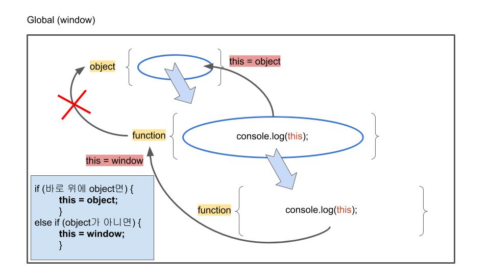
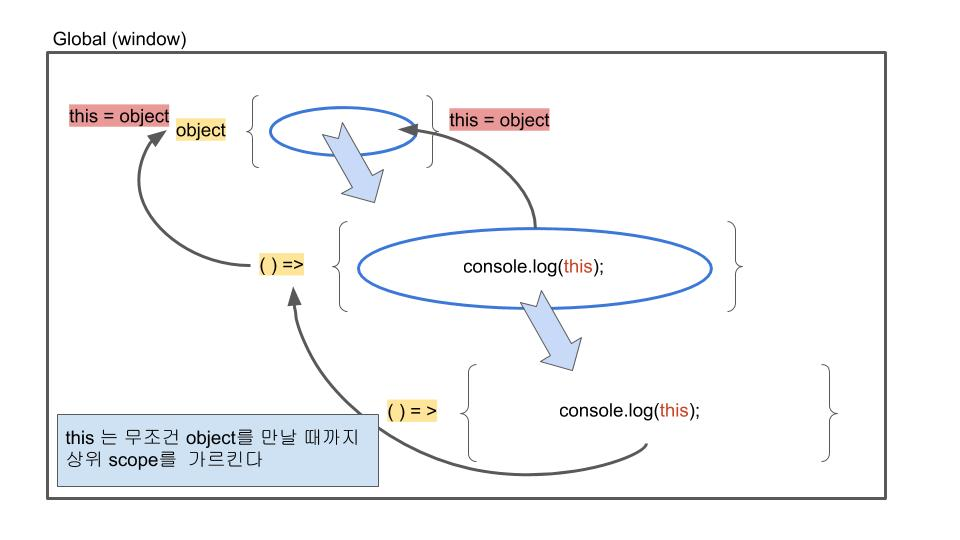

# 탐색범위, Scope (+This란)

## Scope와 This

우리는 변수를 사용하기 위해서 탐색범위(scope)에 대해서 제대로 알고 있어야 합니다. 객체지향언어인 자바스크립트에서는 더더욱 그렇죠. **객체는 외부와 독립되어 변수들이 계산되거나 선언되기 때문에 변수를 외부에서도 사용할 것인지, 내부에서만 사용할 것인지가 중요합니다.** 현재 스코프를 표시하는 것이 `this`입니다. 그리고 `this`는 시스템 전역변수인 `window`를 항상 가르키고 있습니다. **이 `window`를 가르키고 있는 `this`를 바꿔주기 위해서는 메서드를 사용해야합니다.** 메서드는 객체 안에 선언되는 함수를 말합니다. 

먼저 정말 `this`가 `window`를 가르키고 있는지 확인 해보겠습니다.

``` javascript
const a = function(){
    const num = 10;	//앞에 const없이 선언하면 항상 전역변수에서 선언
    console.log(this);
}
a();
```

함수 a를 실행하면 this의 정보가 나옵니다. this는 window를 가르키고 있는 것을 확인할 수 있습니다. `const num = 10;` 앞에 const를 빼면 "항상 window에 선언"하기 때문에 const를 빼고 실행하면 window 속성에 num : 10이 추가되어 있는 것을 확인할 수 있습니다.

함수안에 함수에서 this를 출력하면 직전 함수가 선언했던 변수들을 가르키지 않을까요? 그렇지 않습니다. 메서드로 this를 출력하지 않는 이상 무조건 this는 window입니다. 

그래서 생성자 함수를 실행해서 객체를 만들 때, 꼭 `new`를 붙여줘야 합니다. `new`를 붙여주지 않으면 생성자 함수 안에 속성을 정의하는 `this`는 모두 `window`를 가르키게 됩니다.

```javascript
function ObjectMaker(name, age){
    this.name = name;
    this.age = age;
}

park = ObjectMaker('park', '26');			//window.name = park, window.age = 26
park = new ObjectMaker('park', '26');		//park.name = park, park.age = 26
```

이제 `함수로 this를 불러올 때`와 `메서드로 this를 불러올 때`의 차이점을 확인해보겠습니다.

```javascript
const a = function(){
    const num = 10;
    const b = function(){
        const num2 = 20;
        console.log(this);		//함수안에 함수
    }
    b();
}
a();	//this는 window를 가르킨다.
```

왜 함수로 this를 호출할 때와 메서드로 호출할 때가 다를까요? **함수로만 호출한다면 독립된 객체를 새롭게 만들지 않았기 때문에 항상 작업환경은 window입니다.** 이제 `place`라는 객체를 만들어서 안쪽에서 this를 선언해보겠습니다.

```javascript
const place = {
	num : 10,
    b : function(){console.log(this)}	//메서드
}
place.b();	//메서드로 this 호출, num과 b가 들어있는 place의 객체를 가르킨다.
```

메서드는 유효범위가 객체 안쪽이기 때문에 객체 안에서의 this는 window가 아닌 해당 객체 `place`를 가르키고 있습니다.

그렇다면 메서드 안의 함수가 this를 호출한다면 어떨까요?

```javascript
const place = {
    num : 10,
    b : function(){
        const num_2 : 20;
        const c = function(){
            console.log(this);
        }
        c();
    }
}
place.b();	//place 객체를 빠져나와 다시 window를 가르킨다...
```

다시 `window`를 가르킵니다. ~~이런 점들이 사람들을 미치게 만드는거죠.~~ 이것은 **메서드**가 실행될 때, `this`가 `place`를 "내부적으로만"가르키게 만들고 그 이후 안에 있는 `c함수`를 실행시키기 전에 this를 다시 명시하지 않았기 때문입니다. 쉽게 말해서 `b함수` 혼자만 알고 `c함수`는 몰랐던거죠. `c함수`가 실행될 때는 다시 `this`의 역할인 `window`를 가르키게 되는 겁니다. 

**즉, this가 메서드안에서 사용될 때는 scope가 해당 객체로 바뀌고(메서드는 객체 안에 함수가 있다는걸 가정하고 있죠.) 그냥 함수로 실행될 때는 무조건 window를 가르키고 있습니다. 그래서 this가 메서드에서 실행되느냐 그냥 함수에서 실행되느냐가 중요합니다. 그림으로 보겠습니다.**



바로 위에 있는 예시 코드를 그림으로 표현했습니다. **기존의 function은 `scope binding`을 하기 때문에 this를 포함하는 함수가 Object(객체)에 포함되어 있지 않으면 this가 window를 가르킵니다.**

다음과 같은 문제는 두가지로 해결 가능합니다. (더 많지만 두가지만 다루겠습니다.)

* 명시적으로 `this`를 받아서 `c함수`도 알게 해줍니다. 통상적으로 `that`으로 받습니다.

* ```javascript
  const place = {
      num : 10,
      b : function(){
          that = this;	//this를 that으로 받아놓는다.
          const c = function(){
              console.log(that);
          }
          c();
      }
  }
  place.b();	//num가 포함된 place객체를 가르킨다.
  ```

* `Arrow function`을 사용합니다. Arrow function의 this는 window가 아닌 상위 객체를 가르킵니다.

  ```javascript
  const place = {
      num : 10,
      b : function(){
          const c = ()=>{
              console.log(this);
          }	//arrow function을 사용한다.
          c();
      }
  }
  place.b();	//num가 포함된 place객체를 가르킨다.
  ```



`객체 안의 객체`가 있다면 `객체 안의 객체의 메서드의 this`는 `객체 안의 객체`를 가르킵니다. ~~래퍼 아닙니다.~~ 직접 실행해보면 더 감이 올 겁니다.

```javascript
const a = {
    num : 10,
    b :	{
        num2: 20,
        c : function(){
            console.log(this);
        }
    }
}
a.b.c();	//b객체를 가르키고 b에 num2가 저정되어 있는 것을 확인할 수 있다.
```

**헷갈린다면 두가지만 기억하면 됩니다. 함수가 어떤 객체 안에서 실행되는지, 그리고 메서드 안에 함수를 실행할 때 this를 제대로 명시하고 있는지(그렇지 않은지).**

마지막으로 변수를 선언할 때, const / let을 붙이느냐 그렇지 않느냐도 굉장히 중요합니다. 


## 스코프 체인, Scope Chain

내부함수에서 외부함수의 변수에 접근 가능하지만 외부함수에서 내부함수의 변수에는 접근이 불가능합니다. 그 이유는 스코프 체인을 가지고 있기 때문인데요. **스코프 체인은 내부에서 변수를 찾지 못하면 외부에서 찾고, 외부에서도 찾지 못하면 그 바깥쪽에서 변수를 찾아가는 관계를 의미합니다.**


## 렉시컬 스코핑, Lexical Scoping

**렉시컬 스코핑은 스코프는 함수가 실행될 때 생기는 것이 아닌 함수를 선언할 때 생기는 것을 의미합니다.** 

```javascript
var name = "park";
function log(){
    console.log(name);
}
function log_2(){
    var name = "lee";
	log();
}
log_2();
```

`log_2` 함수 안에 `log` 함수가 실행될 때, `log_2` 안에 있는 `var name = "lee"`를 가르킬 것 같지만 그렇지 않습니다. 스코프는 함수를 "선언"할 때 생깁니다. 그래서 위에 있는 `var name = "park";`을 가르키고 있습니다.


## 즉시호출함수(IIFE)

**변수의 이름이 겹쳐서 객체 안에 속성으로 넣어두는 경우가 있습니다. 이것을 네임스페이스,namespace라고 부릅니다.** 하지만 이런 경우에는 스크립트만으로 정보가 바뀔 위험이 있습니다. 

```javascript
obj = {
    id : 'jsstar522',
    pw : '123456789',
}

obj.id = 'hello';
```

이렇게 단순하게 아이디가 바뀌는 상황이 나올 수 있으므로 다음과 같이 `비공개 변수`로 만드는게 좋습니다.

```javascript
var obj = (function(){
    var pw = '123456789';
    return {id : 'jsstar522'};
})();

obj.id;		//jsstar522
obj.pw;		//undefined
```

obj를 선언하는 순간 id를 return하기 때문에 pw는 볼 수 없습니다. 이것을 즉시호출함수라고 부릅니다.

`(function(){})()`의 형태로 사용합니다.

