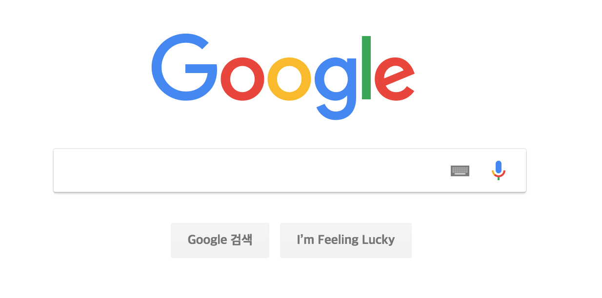

# 이벤트 리스너와 콜백, Event Listener & Callback

## 이벤트 리스너, Event Listener

### 이벤트 리스너, Event Listener

**이벤트 리스너는 특정 이벤트를 기다리고 있습니다.** 그리고 이벤트가 발생하면 동작을 미리 정해준 이벤트 리스너가 실행됩니다. 이벤트 리스너는 항상  `on`+`이벤트 이름`으로 선언합니다.

```javascript
window.onload = function(){
    alert('event loaded');
}
```

`window.onload`로 함수를 정의하면 `window`에 이벤트를 설정하고 `window`가 생성됐을 때 함수를 실행합니다. **`window`는 HTML 문서가 로드될 때 생성되므로 페이지가 열릴 때 함수가 실행됩니다.** 대표적으로 또 사용되는 이벤트 리스너는 `onclick`이 있습니다. 버튼을 만들어 `onclick`이라는 이벤트 리스너를 등록해놓으면, 버튼을 눌렀을 때 동작하는 내용을 설정할 수 있습니다.

구글 홈페이지에서 이벤트 리스너를 통해 동작내용을 바꿔보겠습니다.



키보드 모양 버튼은 원래 입력 키보드가 뜨게 하는 이벤트 리스너를 포함하고 있습니다.

```javascript
document.querySelector('.xPnqmf').onclick = function(){
    alert('This is Google');
}
```

위의 코드를 브라우저 콘솔에 입력합니다. doument는 DOM을 가르키고 `querySelector`를 통해 `.xPnqmf`(xPnqmf라는 클래스)라는 element를 찾아서 onclick 이벤트 리스너를 등록합니다. 이제 키보드 모양 버튼을 누르면 'This is Google'이 알람으로 뜹니다.

이벤트 리스너는 `onload`,` onclick`말고도 다양한 이벤트가 많습니다.

### 이벤트 객체, Event Object

이벤트 객체에는 다양한 메서드가 존재합니다. DOM에서 이 이벤트 객체의 메서드를 매개변수로 사용할 수 있습니다.

```javascript
document.onclick = function(event){
    event.preventDefault();
    event.stopPropagation();
    event.stopImmediatePropagation();
    event.target();
    event.pageX();
    event.pageY();
    event.key();
}
```

`perventDefault`는 HTML 태그의 동작을 막아주는 역할을 합니다.

`stopPropagation`은 태그 클릭시 이벤트가 부모태그에게 전달되지 않게합니다.

`stopImmediatePropagation`은 이벤트가 부모태그에게 전달되지 않고 다른 이벤트 리스너도 실행되지 않게 합니다.

`pageX`와 `pageY`는 클릭한 위치좌표를 표시합니다.

`key`는 어떤 키가 눌렸는지 반환합니다.


## 콜백, Callback

**위의 이벤트 리스너처럼 특정 이벤트를 기다렸다가 함수를 실행시킬 때, 실행시키는 함수를 콜백함수라고 합니다.** 특정 조건이나 시간에 정해둔 동작(함수)를 "다시" 불러오는 겁니다. 이벤트 리스너는 **비동기 방식으로 작동하고** 이러한 비동기 콜백함수의 특징을 잘 이용했습니다. 이벤트가 아닌 `setTimeout`함수도 비동기 방식의 콜백함수로 자주 사용됩니다.

```javascript
//함수선언
var cbExample = function(num, callback){
	setTimeout(function(){
    	var sum = 0;
    	for (var i=num; i>0; i--){
        	sum += i;
    	}
        callback(sum);
	}, 2000);
};
//함수1
cbExample(10, function(result){
    console.log(result);
});
//함수2
console.log('first');
```

콜백함수로 `result`를 2초 뒤에 출력하는 함수가 들어갔습니다. 순서 상으로는 함수 1이 먼저 실행되지만 2초 뒤에 함수 1을 다시 불러오므로 함수2, 함수1 순서대로 실행됩니다. **콜백함수는 함수스택에 곧바로 쌓이지 않고 Background로 이동되어 시스템 내부에서 호출을 기다린 뒤에 함수를 실행시킵니다. 이러한 방식을 `비동기 방식`이라고 합니다.** 콜백함수는 함수스택에 곧바로 올라가지 않는다고 했습니다. 그렇다면 2000(2초)를 0으로 바꾸면 어떨까요? 마찬가지로 함수2가 실행된 뒤에 함수1이 실행됩니다. 

