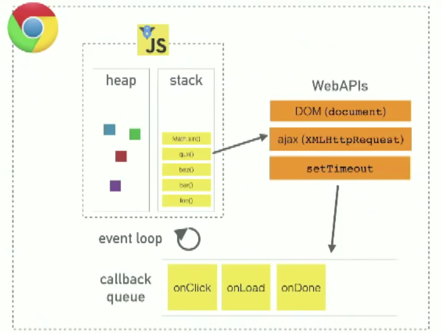

# 호출스택과 이벤트루프, Call stack & Event loop

## 호출스택, Call stack

호출스택은 실행 컨텍스트의 원리를 따릅니다. **실행 컨텍스트는 전역 컨텍스트와 함수 컨텍스트가 생긴 뒤, 함수가 실행되는 규칙을 따르고 있습니다.** 함수가 실행되기 전에 함수는 컨텍스트로 선언됩니다. (https://github.com/jsstar522/javascript_basic/blob/master/02_Object/04_context.md)

```javascript
function first(){
    second();
    console.log('첫번째');
}
function second(){
    third();
    console.log('두번째');
}
function third(){
    console.log('세번째');
}
first();
third();
```

* 가장먼저 전역 컨텍스트가 생성됩니다. 전역컨텍스트의 변수객체에는 '{first : function}'와 '{second: function}', '{third: function}'가 들어갑니다.
* 함수 컨텍스트들이 생성됩니다.  변수는 없으므로 변수객체는 생기지 않습니다.
* 함수들이 실행됩니다. first()를 먼저 호출하면 `first() - second() - third()`  의 순서로 함수가 쌓이게 됩니다. 이를 `호출스택`이라고 부릅니다. **실행은 반대순서로 이루어집니다.**

first()를 호출한 이후 `first() - second() - third()` 로 호출스택이 쌓이고 third()까지 실행되면 전역 컨텍스트를 제외한 앞선 모든 함수 컨텍스트는 지워집니다. 이후 남아 있는 third()가 실행되고 마지막 함수 컨텍스트까지 사라집니다. **이 호출스택은 자바스크립트 코드가 동작하는 가장 기본적인 원리입니다.** 


## 이벤트 루프, Event loop

노드는 싱글스레드 방식입니다. 싱글스레드라 함은 이벤트 루프가 하나라는 의미입니다. 이벤트 루프는 다음과 같이 생겼습니다.



* 함수를 호출하면 호출스택에 함수들이 차례대로 들어갑니다. (함수 안에서 다시 함수를 부르지 않는 이상 호출스택에 올라가자마자 실행되고 종료된 뒤에 다음 함수가 올라옵니다.)
* `setTimeout`과 같은 API(Application Programming Interface)를 필요로 하는 함수들은 Background로 빠집니다. 
* 시스템 내부에서 제어(판단)나 계산이 끝난다면 테스크 큐(callback queue)로 넘어갑니다.
* **호출스택이 비어있을 경우에만** 호출스택으로 올라가 함수가 실행됩니다.

이벤트루프를 활용하는 것은 싱글스레드에서는 굉장히 유리한 점이 많습니다. 싱글스레드를 사용하기 때문에 재귀함수와 같은 많은 함수를 한번에 호출 스택에 쌓는 경우 `Maximum call stack size exceeded`라는 경고 메세지를 받을 수 있습니다. 이런 경우에는 `setTimeout(callback,0)`을 이용해 함수를 background로 빼면 호출스택이 넘치는 현상을 막을 수 있습니다.

```javascript
function run(){
    console.log('중간');
}
console.log('시작');
setTimeout(run, 3000);
console.log('끝');
```

이 코드를 실행하면 다음과 같은 과정을 거칩니다.

* 전역 컨텍스트에 {run : function} 변수객체 생성
* `console.log('시작')`가 함수스택으로 올라가고 곧바로 실행 후 종료
* 다음 함수인 `setTimeout(run, 3000)`이 함수스택에 올라가고 곧바로 백그라운드로 빠진 뒤 API에서 3초를 계산
* **함수스택이 비어 있으므로** 다음 함수인 `console.log('끝')`가 함수스택으로 올라가고 곧바로 실행 후 종료
* 3초 후, `run()` 이 테스크 큐를 거쳐 **함수스택이 비어 있으므로** 함수스택으로 올라간 뒤 실행 후 종료

