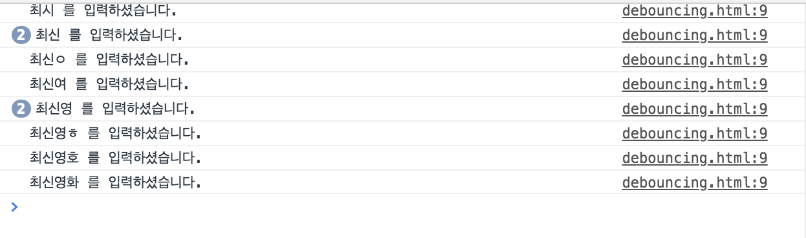

# Throttling & Debouncing

# Debouncing

**디바운싱은 연달아 호출되는 함수 중에서 마지막 함수만 호출하도록 하는 것입니다.** 예를들어 검색어 창에 단어를 넣을 때 한단어 한단어를 넣을 때마다 이벤트가 발생해 매번 요청을 보내는 일을 막아줍니다. 검색창에 검색어를 적을 때, 아래에 어떤 글을 적었는지 보여주는 코드는 엄청난 비용을 발생시킵니다. (jQuery는 API를 통해 HTML등을 검색하고 조작할 수 있으므로 쿼리가 발생합니다) 먼저 디바운싱이 적용되지 않은 코드를 작성해보겠습니다.

```html
<!DOCTYPE html>
<html>
  <head>
  </head>
  <body>
    <input id = "search" />
    <script>
    document.querySelector('#search').addEventListener('input', function(e) {
  console.log(e.target.value, '를 입력하셨습니다.');
});
  </script>
  </body>
  
</html>
```

이제 input 창에 글을 적으면 콘솔에 바로바로 글이 올라옵니다. 



콘솔에 결과값이 찍히는 부분에 타이머를 걸어주면 매번 이벤트가 발생할 때마다 쿼리를 보내지 않습니다. 자바스크립트 부분을 다음과 같이 바꿔주면 됩니다.

```javascript
var timer;
document.querySelector('#search').addEventListener('input', function(e) {
    if(timer){
		clearTimeout(timer);        
    }
    timer = setTimeout(function(){
		console.log(e.target.value, '를 입력하셨습니다.');
    }, 200);

});
```

이제 0.2초에 한번씩 입력값이 콘솔에 찍히게 됩니다. 이런 작업을 디바운싱이라고 합니다.


## Throttling

디바운싱이 비용문제로 사용된다면 스로틀링은 성능문제로 사용됩니다. 예를들어 스크롤을 올리거나 내릴 때 많은 이벤트가 발생하기 때문에 걸리는 렉 문제를 없애줍니다. **한번에 작업을 많이 수행할 수 없도록 제한을 걸어두는 것을 스로틀링이라고 합니다.** 

```javascript
var timer;
document.querySelector('#search').addEventListener('input', function(e) {
    if(!timer){
        timer = setTimeout(function(){
            timer = null;
            console.log(e.target.value, '를 입력하셨습니다.');
        }, 2000);
    }
});
```

setTimeout옵션을 2초로 뒀습니다. 이제 요청을 보내면 2초 뒤에 콘솔에 결과값을 출력합니다. **현재 이 모든 기능은 npm의 underscore 모듈에서 제공하고 있습니다.** (`_.debounce`, `_.throttle`)