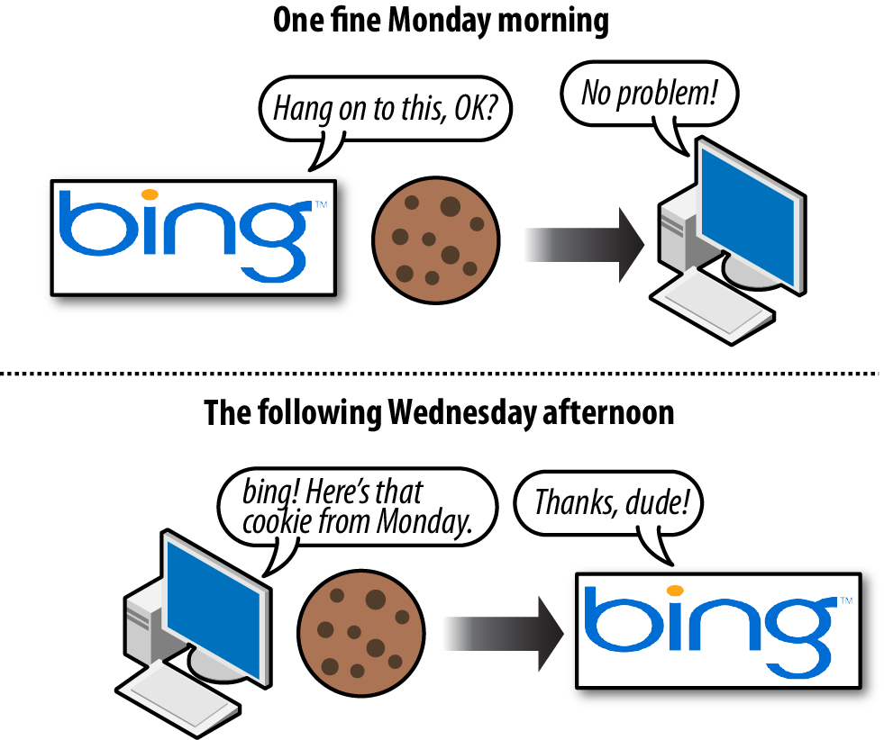
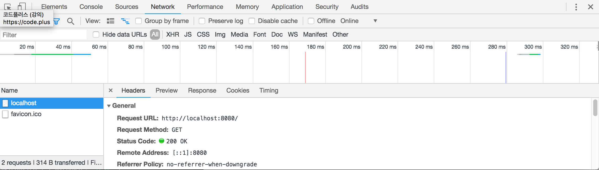
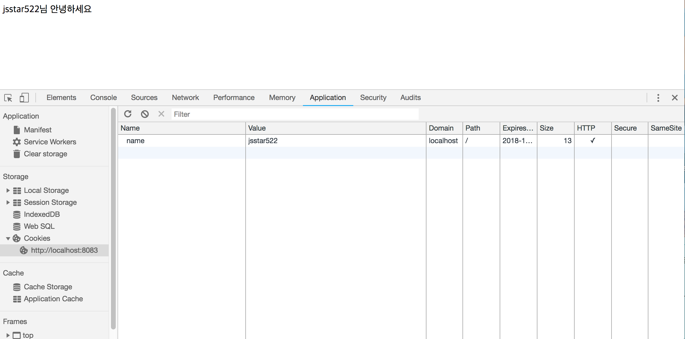
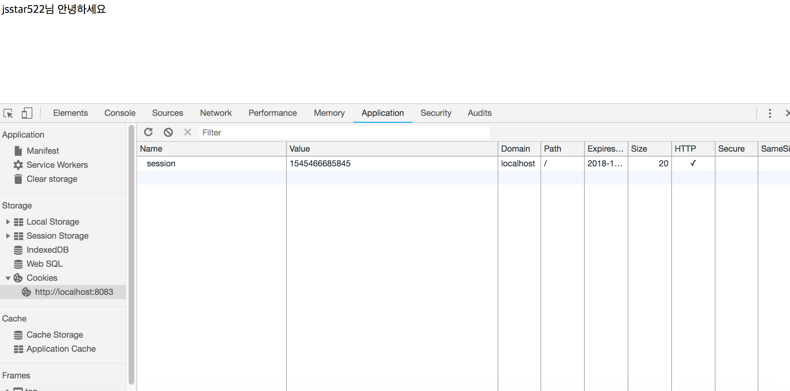

# 쿠키와 세션, Cookie & Session

## 쿠키, Cookie

쿠키는 요청을 보내는 사람이 누구인지 알기 위한 key-value 형태로 되어 있는 데이터입니다. 



처음 클라이언트가 서버에 요청을 보낼 때, 서버는 `쿠키`와 함께 응답합니다. 그리고 **클라이언트는 쿠키라는, 일종의 `방문증`을 들고 있는 겁니다. 그리고 다시 서버에 요청을 보낼 때, 서버는 방문증을 확인하고 이미 방문했던 클라이언트라는 것을 알 수 있죠.** 예를들어 우리가 페이지에서 로그인을 한 뒤, 새로고침을 눌러도 로그아웃 되지 않는 이유는 이러한 쿠키가 존재하기 때문입니다. 하지만 개인정보 유출이 염려된다면 쿠키를 자주 삭제해줘야 합니다. 쿠키를 만들어서 브라우저가 잘 가지고 있는지 확인해보겠습니다.

```javascript
const http = require('http');

//쿠키분해
const parseCookies = (cookie = '') => 
	cookie
	.split(';')
    .map(v => v.split('='))
    .map(([k, ...vs]) => [k, vs.join('=')])
    .reduce((acc, [k, v]) => {
      acc[k.trim()] = decodeURIComponent(v);
      return acc;
    }, {});

http.createServer((req,res) => {
  const cookies = parseCookies(req.headers.cookie);
  console.log(req.url, cookies);
  res.writeHead(200, {'Set-Cookie': 'mycookie=test'});	//서버에서 보내는 쿠키
  res.end('Hello Cookie')
}).listen(8080, () => {
  console.log('8080번 포트에서 대기중');
})
```

쿠키는 요청의 헤더인 `req.headers`안에 들어있습니다.

* 쿠키의 원형(raw cookies)은 `name=park;age=26;year=1992`와 같은 형식으로 되어 있습니다. `parseCookies`에서 쿠키를 따로 분리해 객체로 바꿔줍니다.
*  **`res.writeHead`는 헤더에 내용을 넣으라고 명령(응답)하는 메서드입니다.** 첫번째 인자는 상태코드(200:성공), 두번째 인자에는 헤더의 내용을 넣습니다. 헤더 중에서도 , `Set-Cookie`로 쿠키를 넣어두는 겁니다.

```
출력

cookie :  / + { '': '' }
cookie :  /favicon.ico + { mycookie: 'test' }
```

서버로부터 두개의 쿠키가 왔습니다. 요청을 보낼 때 요청 헤더 중 쿠키의 내용을 표시한 부분입니다(`req.headers.cookie`로 출력). 첫번째 요청에서는 쿠키정보가 없다고 나옵니다. 그리고 두번째 요청에서는 `/favicon.ico`가 출력됐습니다. **`파비콘(favicon)`은 브라우저 탭에서 보여지는 이미지를 의미하는데 이미지가 없으므로 클라이언트에서는 파비콘 이미지를 요청하는 겁니다.** 실제로 파비콘을 가지고 있는 `웹페이지/favicon.ico`로 요청을 보내면 파비콘 이미지를 볼 수 있습니다. (예시 https://www.google.com/favicon.ico)

### 요청과 응답을 브라우저에서 보는 방법

브라우저에서 개발자모드의 Network화면입니다.



`General`은 공통된 헤더, 아래로 내리면 `Response Headers`와 `Request Headers`를 볼 수 있습니다. 

* `Response Headers`에서 Set-Cookie라는 클라이언트(브라우저)에게 쿠키를 저장하라는 명령을 내리는 부분이 있습니다.
* `Request Headers`에서 Cookie는 쿠키를 저장한 내용이 들어있고, 저장한 이후 요청을 보낼 때 쿠키와 함께 헤더의 내용을 보냅니다.

### 로그인 여부 쿠키로 확인하기

```html
<!DOCTYPE html>
<html>
    <head>
        <meta charset = "utf-8"/>
        <title>Node js</title>
    </head>
    <body>
        <form action = "/login">
            <input id = "name" name ="name" placeholder="ID를 입력하세요">
            <button id "login">
                로그인
            </button>
        </form>
    </body>
</html>
```

```javascript
//login.js
const http = require('http');
const fs = require('fs');
const url = require('url');         
const qs = require('querystring');


const parseCookies = (cookie = '') => 
	cookie
    .split(';')
    .map(v => v.split('='))
    .map(([k, ...vs]) => [k, vs.join('=')])
    .reduce((acc, [k, v]) => {
      acc[k.trim()] = decodeURIComponent(v);
      return acc;
    }, {});

http.createServer((req,res) => {
    const cookies = parseCookies(req.headers.cookie);
//(1)
    if(req.url.startsWith('/login')){
        const {query} = url.parse(req.url);
        const { name } = qs.parse(query);
        const expires = new Date();
        expires.setMinutes(expires.getMinutes() + 5);
        res.writeHead(302, {
            Location: '/',
            'Set-Cookie' : `name=${encodeURIComponent(name)};Expires=${expires.toGMTString()};HttpOnly;Path=/`,
        });
        res.end();
//(2)
    }else if(cookies.name){
        res.writeHead(200, {'Content-Type': 'text/html; charset=utf-8'});
        res.end(`${cookies.name}님 안녕하세요`);
//(3)
    }else{
        fs.readFile('./login.html', (err, data) => {
            if(err){
                throw err;
            }
            res.end(data);
        });
    }
})
    .listen(8083, () => {
    console.log('8083번 포트에서 대기 중');
})
```

주석 (1), (2), (3)으로 나누어서 보겠습니다.

* (1) : `req.url.startsWith('/login')`은 요청한 URL이 '/login'으로 시작하는지의 여부입니다. 즉, url이 '/login'으로 시작한다면 먼저 url의 query를 분석합니다. 그리고 쿠키에 querystring으로 빼낸 이름과 쿠키 만료기간(5분)을 담아서 응답 헤더(`res.writeHead`)에 적습니다. 302 응답코드는 리다이렉트 주소입니다. `Location: '/'` 으로 이동한다고 설정했습니다. **이제 querystring을 가지고 '/login' path로 들어온 유저들은 querystring에 있는 name변수를 담은 쿠키를 저장하게 됩니다.** (이 동작은 (3)번이 이뤄진 뒤의 동작입니다.) 
  1. `Expires = 날짜` : 만료기한, 기본값은 클라이언트 종료
  2. `Max-age = 초` : Expires와 같습니다. 초단위로 설정할 수 있습니다.
  3. `Domain = 도메인명` : 쿠키가 전송될 도메인을 정할 수 있습니다.
  4. `Path = URL` : 쿠키가 전송될 URL을 특정할 수 있습니다. 기본값은 '/'
  5. `Secure` : HTTPS일 경우에만 쿠키 전송
  6. `HttpOnly` : 자바스크립트에서 쿠키에 접근할 수 없습니다. (쿠키조작 방지)
* (2) : 요청 쿠키에 name이라는 변수가 있다면 다음과 같은 화면을 보여줍니다. 그리고 성공코드(200)과 함께 인코딩 명시를 보냅니다. 즉, 쿠키가 있다면 '~님 안녕하세요' 라는 화면이 나옵니다.
* (3) : '/login'도 아니고 쿠키도 없는, 처음 `localhost:8083`에 들어갔을 때 나오는 화면입니다. html 파일을 읽어와서 보여주고 있습니다. 잠시 html 파일을 보면 버튼을 눌렀을 때 다음과 같은 동작을 합니다. **`<form action = "/login">`를 보시죠. 이는 버튼을 누르면 `name`이라는 querystring과 함께 '/login' path로 요청을 보냅니다. 정확히 말하면 `/login?name=...`과 같은 경로를 요청합니다.**

전체적인 흐름을 봤을 때, `(3) => (1) => (2)`의 순서로 진행되고 있습니다. 하지만 쿠키가 있는 한(로그인이 되어 있는 한) 계속 (2)의 내용을 보여줍니다. 

쿠키를 잘 가지고 있는지 확인하려면 개발자 모드에서 Application을 보면 됩니다.




## 세션, Session

위의 그림과 같이 쿠키가 노출되어 있으면 조작 가능성도 있고 개인정보 유출 가능성도 있습니다. 그래서 **`session`이라는 객체에 저장합니다. Id와 만료기한을 session 객체에 담아서 번호를 새기고 서버와 정보를 주고 받습니다.** 위의 코드에서 주석 (1) 안쪽에, session 객체를 만들어 안쪽에 id와 만료기한을 넣어주면 됩니다.

```javascript
//login.js
const http = require('http');
const fs = require('fs');
const url = require('url');         
const qs = require('querystring');


const parseCookies = (cookie = '') => 
	cookie
    .split(';')
    .map(v => v.split('='))
    .map(([k, ...vs]) => [k, vs.join('=')])
    .reduce((acc, [k, v]) => {
      acc[k.trim()] = decodeURIComponent(v);
      return acc;
    }, {});

http.createServer((req,res) => {
    const cookies = parseCookies(req.headers.cookie);
//(1)
    if(req.url.startsWith('/login')){
        const {query} = url.parse(req.url);
        const { name } = qs.parse(query);
        const expires = new Date();
        expires.setMinutes(expires.getMinutes() + 5);
        
        //*세션
        const randomInt = +new Date();
        session[randomInt] = {
            name,
            expires,
        };
        *//
        
        res.writeHead(302, {
            Location: '/',
            'Set-Cookie' : `session=${randomInt};name=${encodeURIComponent(name)};Expires=${expires.toGMTString()};HttpOnly;Path=/`,
        });
        res.end();
//(2)
    }else if(cookies.session && session[cookies.session].expires > new Date()){
        res.writeHead(200, {'Content-Type': 'text/html; charset=utf-8'});
        res.end(`${session[cookies.session].name}님 안녕하세요`);
//(3)
    }else{
        fs.readFile('./login.html', (err, data) => {
            if(err){
                throw err;
            }
            res.end(data);
        });
    }
})
    .listen(8083, () => {
    console.log('8083번 포트에서 대기 중');
})
```

이제 쿠키를 보면 다음과 같이 나옵니다.

