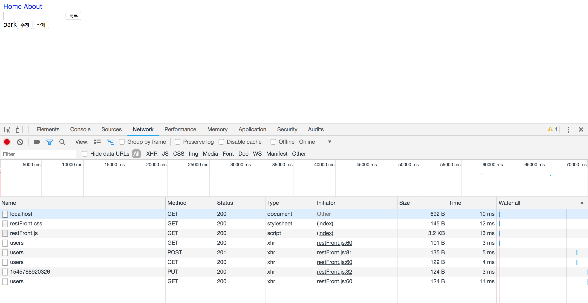

# REST API와 라우팅

## REST API

REST는 Representational State Transfer의 약자입니다. 우리가 서버에 요청을 보낼 때는 `path(경로, 주소)`를 통해 요청을 보냅니다. `/home`을 통해 홈화면을 요청하거나 `/image.jpg`을 통해 사진을 요구하기도 하죠. **REST API는 웹페이지 모든 자원에 URL(주소)을 부여해 활용하는 구조를 의미합니다. 그리고 주소가 부여된 자원은 HTTP 요청 메서드를 이용해서 행위를 정의합니다.** 자주 사용되는 HTTP 요청 메서드는 다음과 같습니다.

* GET : 서버의 자원을 가져옵니다. 자원을 수정하거나 정보를 추가하지 않습니다. 정보를 보내고자 한다면 `querystring`을 통해 기존 URL에 포함시켜서 정보를 보냅니다.
* POST : 자원을 새로 등록할 때 사용됩니다. 보내고자 하는 정보를 본문에 넣어 보냅니다.
* PUT : 서버의 자원을 수정할 경우에 사용합니다. 이러한 경우를 "치환"한다고 얘기합니다.
* PATCH : 서버의 자원을 수정하되 일부만 수정할 때 사용합니다.
* DELETE : 서버의 자원을 삭제할 때 사용합니다.

예를들어 `/user`라는 경로에 있는 사용자 정보를 가져오려면 `GET`을 사용하면 되고, `/user`라는 경로에 새로운 사용자를 추가하려면 `POST`를 사용하면 됩니다.(`GET`으로 추가할 수도 있지만 querystring은 보안에 취약하므로 사용자 정보에는 사용되지 않습니다.) 이제 RESTful 페이지를 만들어 보겠습니다. 먼저 프런트엔드 파일을 작성합니다.

```css
//restFront.css
a {
    color: blue;
    text-decoration: none;
}
```

```html
//restFront.html
<!DOCTYPE html>
<html>
    <head>
        <meta charset="utf-8"/>
        <title>RESTful SERVER</title>
		<link rel="stylesheet" href="./restFront.css"/>
    </head>
    <body>
        <nav>
            <a href="/">Home</a>
            <a href="/about">About</a>
        </nav>
        <div>
            <form id="form">
                <input type="text" id="username">
                <button type="submit">
                    등록
                </button>
            </form>
        </div>
        <div id ="list"></div>
		<script src = "./restFront.js"></script>
    </body>
</html>
```

css와 html 파일입니다. html 본문에 css의 내용과 javascript 내용을 넣었습니다. 이제 front에서 동작하는 javascript 파일을 작성하겠습니다.

```javascript
//restFront.js

//페이지 로딩시 동작하는 내용
function getUser(){
    var xhr = new XMLHttpRequest();
    xhr.onload = function(){		//이벤트리스너 등록
        if (xhr.status === 200){
            var users = JSON.parse(xhr.responseText);
            var list = document.getElementById('list');
            list.innerHTML = '';
            Object.keys(users).map(function(key){
                var userDiv = document.createElement('div');
                var span = document.createElement('span');
                span.textContent = users.[key];
                
                //수정버튼 생성 및 클릭 이벤트리스너
                var edit = document.createElement('button');
                edit.textContent = '수정';
                edit.addEventListener('click', function(){
                    var name = prompt('바꿀 이름을 입력하세요');
                    if(!name){
                        return alert('이름을 반드시 입력하세요');
                    }
                    var xhr = new XMLHttpRequest();
                    xhr.onload = function(){
                        if (xhr.status === 200){
                            console.log(xhr.responseText);
                            getUser();
                        }else{
                            console.error(xhr.responseText);
                        }
                    };
                    xhr.open('PUT', '/users/' + key);
                    xhr.setRequestHeader('Content-Type', 'application/json');
                    xhr.send(JSON.stringify({name:name}));
                });
                
                //삭제버튼 생성 및 삭제 이벤트리스너
                var remove = document.createElement('button');
                remove.textContent = '삭제'ㅣ
                remove.addEventListenter('remove', function(){
                    var xhr = new XMLHttpRequest();
                    xhr.onload = function(){
                        if(xhr.status === 200){
                            console.log(xhr.responseText);
                            getUser();
                        }else{
                            console.error(xhr.responseText);
                        }
                    };
                    xhr.open('DELETE', '/users/' + key);
                    xhr.send();
                });
                userDiv.appendChild(span);
                userDiv.appendChild(edit);
                userDiv.appendChild(remove);
                list.appendChild(userDiv);
            });
        }else{
            console.error(xhr.responseText);
        }
    };
    xhr.open('GET', '/users');
    xhr.send();
}
window.onload = getUser;		//로딩 시 getUser 호출
//폼 제출
document.getElementById('form').addEventListener('submit', function(e){
    e.preventDefault();
    var name = e.target.username.value;
    if(!name){
        return alert('이름을 입력하세요');
    }
    var xhr = new XMLHttpRequest();
    xhr.onload = function(){
        if(xhr.status === 200){
            console.log(xhr.responseText);
            getUser();
        }else{
            console.error(xhr.responseText);
        }
    };
    xhr.open('POST', '/users');
    xhr.setRequestHeader('Content-Type', 'application/json');
    xhr.send(JSON.stringify({name:name}));
    e.target.username.value = '';
});
```

브라우저에서 동적으로 보여줄 정보를 javascript입니다.(프런트앤드) **버튼을 누르면 서버에 요청(GET, POST, PUT, DELETE...)을 보내는 코드를 작성했습니다.** 두개의 페이지를 보여주기 위해 About 페이지도 만들어보죠.

```html
//about.html
<!DOCTYPE html>
<html>
    <head>
        <meta charset = "utf-8" />
        <title>RESTful SERVER</title>
        <link rel = "stylesheet" href="./restServer.css" />
    </head>
    <body>
        <nav>
            <a href="/">Home</a>
            <a href="/about">About</a>
        </nav>
        <div>
            <h2>
                소개 페이지
            </h2>
            <p>
                사용자의 이름을 등록하세요
            </p>
        </div>
    </body>
</html>
```

이제 브라우저에서 동작하는 모든 내용을 css, html, javascript로 작성했습니다. 이제 위와 같은 내용을 제공할 수 있는 서버를 만들어야겠죠. 그리고 버튼을 통해 클라이언트가 요청하는 것들을 어떻게 처리해주는지 동작을 정의해놔야합니다. 그 동작들은 서버가 하는 역할이죠. nodejs로 서버를 구현하겠습니다.

```javascript
// restServer.js
const http = require('http');
const fs = require('fs');

const users ={};

http.createServer((req, res) => {
    // GET
    if(req.method == 'GET'){
        if(req.url ==='/'){
            return fs.readFile('./restFront.html', (err, data) =>{
                if(err){
                    throw err;
                }
                res.end(data);
            });
        }else if(req.url === '/about'){
                 return fs.readFile('./about.html', (err, data) => {
            if(err){
            throw err;
            }
            res.end(data);
                 });
        }else if(req.url === '/users'){
            return res.end(JSON.stringify(users));
        }
        return fs.readFile(`.${req.url}`, (err,data) =>{
            if(err){
                res.writeHead(404, 'NOT FOUND');
                return res.end('NOT FOUND');
            }
            return res.end(data);
        });
    // POST
    }else if(req.method === 'POST'){
        if (req.url === '/users'){
            let body = '';
            req.on('data', (data) => {
                body += data;
            });
            return req.on('end', () =>{
                console.log('POST 본문(Body): ', body);
                const {name} = JSON.parse(body);
                const id = +new Date();
                users[id] = name;
                res.writeHead(201);
                res.end('등록성공');
            });
        }
    }else if(req.method === 'PUT'){
        if(req.url.startsWith('/users/')){
            const key = req.url.split('/')[2];
            let body = '';
            req.on('data', (data) => {
                body += data;
            });
            return req.on('end', () => {
                console.log('PUT 본문(Body):', body);
                users[key] = JSON.parse(body).name;
                return res.end(JSON.stringify(users));
            });
        }
    }else if(req.method === 'DELETE'){
        if(req.url.startsWith('/users/')){
            const key = req.url.split('/')[2];
            delete users[key];
            return res.end(JSON.stringify(users));
        }
    }
    res.writeHead(404, 'NOT FOUND');
    return res.end('NOT FOUND');
})
    .listen(8085, () => {
    console.log('8085포트에서 서버 대기 중');
});

```

* `req.on('data', callback)`은 data라는 이벤트(파일을 읽기 시작)가 발생하면 callback을 실행합니다.
* `req.on('end', callbac)`은 data를 모두 읽고 end(읽기 끝) 이벤트가 발생하면 callback을 실행합니다.

이제 **`프런트 자바스크립트 코드`에서 버튼과 같은 이벤트리스너로 서버에 요청(request)을 보내면 `백앤드 자바스크립트 코드`가 요청에 맞게 작업을 수행하고 응답(response)합니다.** 프런트 자바스크립트 코드는 `xhr.open('GET')`, `xhr.open('POST')`과 같은 형태로 `HttpRequest 객체에 있는 요청`을 보냅니다. 그리고 백엔드 자바스크립트는 `req` 객체의 요청 method가 GET인지 POST인지 PUT인지 DELETE인지 판단하고 동작합니다. 버튼에 따라 어떤 요청을 보내는지 브라우저의 개발자모드-Network에서 확인할 수 있습니다.



요청은 가장 위에서부터 기록됩니다.

* `1번째 줄 ~ 4번째 줄` : 페이지에 처음 접근했을 때 서버에 요청한 내용입니다. 먼저 `GET`을 통해 페이지의 외형정보를 가지고 있는 html파일(`localhost`가 `restFront.html`)을 불러옵니다. 이후 html파일 안에서 css와 javascript를 불러오죠. (`restFront.css`, `restFront.js`) 그리고 자바스크립트(`restFront.js`)에서 `/users` 경로의 정보를 요청하고 있습니다.(restFront.js 60번째 줄 - `xhr.open('GET', '/users');`) 이 4개의 요청이 첫번째 페이지를 만들고 있습니다.
* `5번째 줄` : `등록`버튼을 눌렀습니다. 등록버튼을 누르면 동작하는 내용은 `resFront.js`의 81번째 줄 -  `xhr.send(JSON.stringify({name:name}));`에 있습니다. POST로 `/users ` 경로에 새로운 정보와 함께 요청을 보냅니다. 그 정보는 JSON 형태로 저장됩니다.
* `6번째 줄` : 새로 들어온 명단을 홈 화면에서 보여주기 위해 다시 /users 를 요청합니다. (이벤트리스너 안에서 getUsers을 다시 콜백으로 호출하고 있습니다.)
* `7번째 줄 ~ 8번째 줄` : 명단에서 수정버튼을 눌렀습니다. PUT으로 해당주소(해당key) 정보를 수정합니다. 수정한 내용을 다시 불러옵니다. (이벤트리스너 안에서 getUsers를 다시 콜백으로 호출하고 있습니다.)

이러한 방식으로 만든 페이지는 서버가 종료되면 모든 명단이 사라집니다. 명단을 보존하고 싶다면 데이터베이스에 저장해야 합니다.


## Https

Https 모듈은 http모듈에서 추가적으로 SSL 암호화를 제공합니다. GET이나 POST로 서버에 요청을 보내는 과정 중 암호화를 통해 데이터를 안전하게 보호합니다. 

```javascript
const https = require('https');
const fs = require('fs');

https.createServer({
    cert: fs.readFileSync('도메인 인증서 경로'),
    key: fs.readFileSync('도메인 비밀키 경로'),
    ca: [
        fs.readFileSync('상위 인증서 경로'),
        fs.readFileSync('상위 인증서 경로'),
    ],
}, (req,res) => {
    res.write('<h1> Https Page </h1>');
    res.end('<p>Hello</p>');
}).listen(443, () => {
   console.log('443 포트에서 서버 대기중') 
});
```

보안과 속도측면에서 더 개선된 모듈인 http2 모듈은 http에서 사용하던 http/1.1 프로토콜이 아닌 http/2 프로토콜을 제공합니다.

```javascript
const http2 = require('http2');
const fs = require('fs');

http2.createSecureServer({...https와 이하 동일})
```

http2는 `createServer`가 아닌 `createSecureServer`를 사용합니다. 


## Cluster

Cluster 모듈은 싱글스레드를 사용하는 노드의 단점을 보완합니다. **여러개의 CPU코어를 사용(멀티 프로세스)해서 수많은 요청이 들어왔을 때, `싱글프로세스-싱글스레드`의 과부화를 막아줍니다.** 하지만 세션을 공유하지 못하는 단점이 있습니다. 

```javascript
const cluster = require('cluster');
const http = require('http');
const numCPUs = require('os').cpus().length;

if(cluster.isMaster){
    console.log(`마스터 프로세스 아이디: ${process.pid}, 코어개수: ${numCPUs}`);
    //CPU 개수만큼 작업공간(woker) 생산
    for(let i=0; i<numCPUs; i+=1){
        cluster.fork();
    }
    //워커 종료
    cluster.on('exit', (worker, code, signal) => {
        console.log(`${worker.process.pid}번 워커가 종료되었습니다`);
    });
}else{
    //워커가 포트에서 대기
    http.createServer((req, res) => {
        res.write('<h1>Hello Node!</h1>');
        res.end('<p>Hello Cluster!</p>');
        //워커 종료시키기(확인용)
        setTimeout(()=>{
            process.exit(1);
        }, 1000);
    }).listen(8085);
    
    console.log(`${process.pid}번 워커 실행`);
}
```

코어개수에 따라 워커가 생성되는 것을 확인할 수 있습니다. **클러스터에서 마스터 프로세스가 CPU개수만큼 워커 프로세스를 만들고 포트에서 대기합니다.** localhost:8085에 요청을 보낼때 마다(새로고침) 워커가 종료됩니다. 이렇게 되면 워커가 중단됐을 때, 새로운 워커를 만들어서 서버를 유지할 수 있습니다. 

```javascript
const cluster = require('cluster');
const http = require('http');
const numCPUs = require('os').cpus().length;

if(cluster.isMaster){
    console.log(`마스터 프로세스 아이디: ${process.pid}, 코어개수: ${numCPUs}`);
    //CPU 개수만큼 작업공간(woker) 생산
    for(let i=0; i<numCPUs; i+=1){
        cluster.fork();
    }
    //워커 종료
    cluster.on('exit', (worker, code, signal) => {
        console.log(`${worker.process.pid}번 워커가 종료되었습니다`);
        //워커가 종료되면 새로운 워커 생성
        cluster.fork();
        //
    });
}else{
    //워커가 포트에서 대기
    http.createServer((req, res) => {
        res.write('<h1>Hello Node!</h1>');
        res.end('<p>Hello Cluster!</p>');
        //워커 종료시키기(확인용)
        setTimeout(()=>{
            process.exit(1);
        }, 1000);
    }).listen(8085);
    
    console.log(`${process.pid}번 워커 실행`);
}
```

클러스터는 예기치 못한 에러가 서버를 다운시키는 일을 방지합니다.


