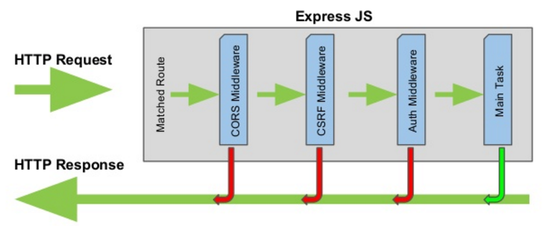

# 미들웨어

**익스프레스 프레임워크는 RESTful 서버에서 일일이 `if~else` 구문으로 복잡하게 메서드와 주소를 구별하는 불편함을 덜어줍니다. 이 불편함을 덜어주는 핵심적인 개념이 바로 `미들웨어` 입니다.** 메서드와 주소를 구별하는 라우터와 에러에 따라 동작을 선언하는 에러 핸들러 또한 미들웨어에 속합니다. 



`app.use()`로 가장 먼저 장착한 미들웨어부터 차례대로 거쳐가면서 클라이언트에게 응답합니다. `app.js` 파일에 새로운 미들웨어를 추가해보겠습니다.

```javascript
//app.js

var createError = require('http-errors');
var express = require('express');
var path = require('path');
var cookieParser = require('cookie-parser');
var logger = require('morgan');

var indexRouter = require('./routes/index');
var usersRouter = require('./routes/users');

var app = express();

// view engine setup
app.set('views', path.join(__dirname, 'views'));
app.set('view engine', 'pug');

app.use(function(req,res,next){
    console.log(req.url, '추가된 미들웨어 입니다.');
    next();
});
// 모듈을 미들웨어에 장착해서 사용
app.use(logger('dev'));
app.use(express.json());
app.use(express.urlencoded({ extended: false }));
app.use(cookieParser());
app.use(express.static(path.join(__dirname, 'public')));

app.use('/', indexRouter);
app.use('/users', usersRouter);

// catch 404 and forward to error handler
app.use(function(req, res, next) {
  next(createError(404));
});

// error handler
app.use(function(err, req, res, next) {
  // set locals, only providing error in development
  res.locals.message = err.message;
  res.locals.error = req.app.get('env') === 'development' ? err : {};

  // render the error page
  res.status(err.status || 500);
  res.render('error');
});

module.exports = app;
```

다음과 같은 미들웨어가 추가 되었습니다.

```javascript
app.use(function(req,res,next){
    console.log(req.url, '추가된 미들웨어 입니다.');
    next();
});
```

`localhost:3000`의 주소로 접속하면 `/`을 요청합니다. 앞에 있는 미들웨어를 거쳐 `/`에 해당하는 라우터에 도달합니다. **미들웨어에는 항상 `next()`가 있어야 다음 미들웨어로 넘어갑니다.** 자주 사용되는 `logger`나 `express.static()`과 같은 함수는 내부에 `next()`를 포함하고 있습니다. `next()`에는 'route'이나 'error' 인자를 넣어줄 수 있습니다. **기본적으로 에러 핸들링 미들웨어는 가장 아래에 위치합니다.** 요청이 라우터에서 처리되지 않으면 요청은 그대로 에러 핸들링 미들웨어까지 내려오고 페이지에는 404 에러를 띄웁니다. (라우터에 요청이 걸리면 `next('route')`로 인해 에러 핸들링 미들웨어로 이동하지 않습니다.)  


### Morgan

요청에 대한 로그를 띄워주는 모듈입니다. 인자가 'dev'일 경우, http 요청메서드와 URL, 상태코드, 응답속도, 응답 바이트가 찍힙니다. 'dev'가 아닌 'short', 'common', 'combined'를 사용할 수 있습니다.

### Body-parser

요청의 본문을 해석해주는 모듈입니다. 익스프레스 4.16.0 버전 이후에는 모듈을 따로 불러오지 않아도 내장된 body-parser를 사용할 수 있습니다. 다만 text 파일과 같은 본문을 읽을 때 body-parser 모듈을 따로 사용합니다. body-parser를 이용하면 req.on('data')와 같은 스트림 방식으로 본문을 전달받지 않아도 됩니다.

### Cookie-parser

요청과 함께 오는 쿠키를 해석하는 모듈입니다. 쿠키는 `req.cookies`에 저장됩니다. 

### Static

정적인 파일(이미지...)을 제공하는 모듈입니다. Static도 body-parser와 같이 내장된 모듈입니다. Static 함수의 인자로 정적인 파일이 담겨 있는 폴더를 지정하면 됩니다. 

```javascript
app.use(express.static(path.join(__dirname, 'public')));
```

서버주소로만 존재하는 `public`폴더를 요청주소로(라우팅을 이용해) 설정할 수도 있습니다. 클라이언트가 정적인 파일을 모아둔 폴더에 접근할 수 있게 됩니다.

```javascript
app.use('/public', express.static(path.join(__dirname, 'public')));
```

### Express-session

세션을 구현할 때 사용되는 모듈입니다. 세션 모듈은 express-generatord에서 제공하지 않으므로 설치해야합니다.

```bash
$ npm i express-session
```

```javascript
var session = require('express-session');

app.use(session({
  resave: false,				//요청을 받았을 때, 수정된 사항이 없더라도 다시 저장할지의 여부
  saveUninitialized: false,		//저장할 내용이 없더라도 세션을 저장할 것인지의 여부
  secret: 'login key',	//서명란(쿠키와 같은 키여야 한다)
  cookie: {				//쿠키설정
    httpOnly: true,		///클라이언트 확인불가
    secure: false,		///https가 아니어도 사용가능
  },
}));
```

세션은 쿠키 미들웨어 다음에 위치시키는 걸 권장합니다. 

### Connect-flash

일회성 메세지를 내보낼 때 사용하는 모듈입니다. 

```bash
$ npm i connect-flash
```

```javascript
var flash = require('connect-flash');

app.use(flash());
```

위와 같이 미들웨어에 모듈을 장착시킵니다. 이제 일회성 메세지를 내보낼 페이지 라우터에 플래시를 추가합니다.

```javascript
//users.js

var express = require('express');
var router = express.Router();

/* GET users listing. */
router.get('/', function(req, res, next) {
  res.send('respond with a resource');
});

router.get('/flash', function(req,res){
    req.session.message = '세션 메세지';
    req.flash('message', 'flash 메세지');
    res.redirect('/users/flash/result');
});
router.get('/flash/result', function(req,res){
    res.send(`${req.session.message} ${req.flash('message')}`);
});

module.exports = router;
```

`users/flash`로 요청을 보내면 `flash 메세지`와 함께 요청을 보내고 `users/flash/result`로 리다이렉트해서 메세지의 내용이 보이게 됩니다. 하지만 그냥 `/users/flash/result`로 요청을 보내면 flash 메세지가 보내지지 않습니다. 곧바로 사라져버리기 때문에 일회성 메세지라고 합니다.


