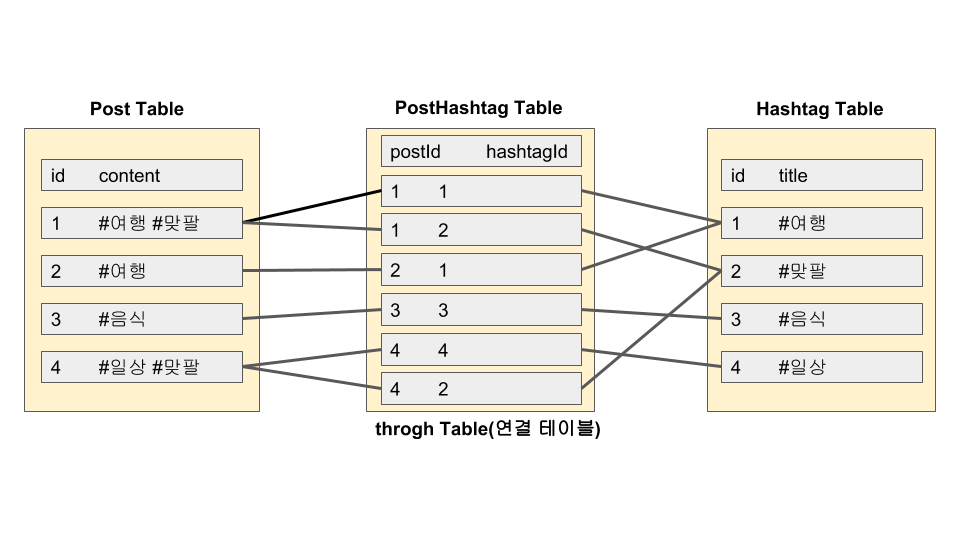
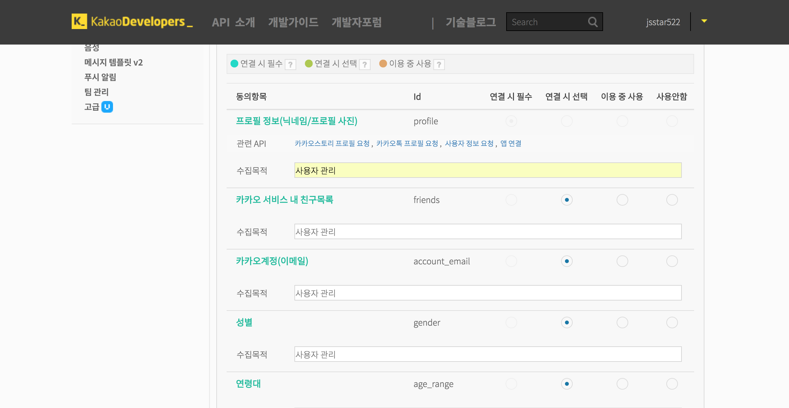

# SNS Application 만들기

## 구현할 기능

* 로그인
* 게시글 등록
* 이미지 업로드
* 해시태그 검색
* 팔로잉

## 서버 구축

`npm start`로 가장 먼저 실행되는 파일인 서버파일 `App.js`에 다음과 같은 내용을 추가합니다. **cookieParser와 express-session에서 비밀키를 .env에 모아두기 위해 `dotenv` 패키지를 사용합니다.**

```bash
$ npm i dotenv
```

이제 `.env` 파일을 만들어서 비밀키를 넣어둡니다.

```text
COOKIE_SECRET=SNSappsecret
```

이제 서버가 시작되면 `.env` 파일에 있는 `COOKIE_SECRET`을 `process.env`에 넣어서 `process.env.COOKIE_SECRET`로 비밀키를 사용할 수 있습니다. 이는 보안상의 문제로 반드시 사용해야합니다. `.env` 파일에는 쿠키 비밀키 뿐만 아니라 데이터베이스 계정 비밀번호를 숨겨둘 수도 있습니다.

```javascript
// app.js

const express = require('express');
const cookieParser = require('cookie-parser');
const morgan = require('morgan');
const path = require('path');
const session = require('express-session');
const flash = require('connect-flash');
require('dotenv').config();

const pageRouter = require('./routes/page');
const {sequelize} = require('./models');

const app = express();
sequelize.sync();

app.set('views', path.join(__dirname, 'views'));
app.set('view engine', 'pug');
app.set('port', process.env.PORT || 8001);

app.use(morgan('dev'));
app.use(express.static(path.join(__dirname, 'public')));
app.use(express.json());
app.use(express.urlencoded({extended:false}));
app.use(cookieParser(process.env.COOKIE_SECRET));
app.use(session({
  resave: false,
  saveUninitialized: false,
  secret: process.env.COOKIE_SECRET,
  cookie: {
    httpOnly: true,
    secure: false,
  },
}));

app.use(flash());
app.use('/', pageRouter);
app.use((req,res,next) => {
  const err = new Error('Not Found');
  err.status = 404;
  next(err);
});

app.use((err, req, res, next) => {
  res.locals.message = err.message;
  res.locals.error = req.app.get('env') === 'development' ? err : {};
  res.status(err.status || 500);
  res.render('error');
});

app.listen(app.set('port'), () => {
  console.log(app.get('port'), '번 포트에서 대기중')
});
```

이제 프론트 역할을 하는 템플릿 엔진을 작성하겠습니다. 먼저 로그인이 되어 있으면 회원정보를 보여주고 그렇지 않으면 로그인 화면을 보여주는 템플릿 엔진입니다. 먼저 layout을 extends 하기 위해 `layout.pug`을 작성합니다.

```jade
<!-- views/layout.pug -->

doctype
html
  head
    meta(charset='UTF-8')
    title= title
    meta(name='viewport' content='width=device-width, user-scalable=no')
    meta(http-equiv='X-UA-Compatible' content='IE=edge')
    link(rel='stylesheet' href='/main.css')
  body
    .container
      .profile-wrap
        .profile
          if user && user.id
            .user-name= '안녕하세요! ' + user.nick + '님'
            .half
              div 팔로잉
              .count.following-count= user.Followings && user.Followings.length || 0
            .half
              div 팔로워
              .count.follower-count= user.Followers && user.Followers.length || 0
            input#my-id(type='hidden' value=user.id)
            a#my-profile.btn(href='/profile') 내 프로필
            a#logout.btn(href='/auth/logout') 로그아웃
          else
            form#login-form(action='/auth/login' method='post')
              .input-group
                label(for='email') 이메일
                input#email(type='email' name='email' required autofocus)
              .input-group
                label(for='password') 비밀번호
                input#password(type='password' name='password' required)
              if loginError
                .error-message= loginError
              a#join.btn(href='/join') 회원가입
              button#login.btn(type='submit') 로그인
              a#kakao.btn(href='/auth/kakao') 카카오톡
        footer
          | Made by&nbsp;
          a(href='https://www.github.com/jsstar522' target='_blank') jsstar522 Github
      block content

```

layout을 extends한 `profile` 템플릿 엔진을 작성합니다. 팔로잉과 팔로워 목록을 볼 수 있는 `/profile` 페이지에 렌더링 됩니다.

```jade
<!-- views/profile.pug -->

extends layout

block content
  .timeline
    .followings.half
      h2 팔로잉 목록
      if user.Followings
        for following in user.Followings
          div= following.nick
    .followers.half
      h2 팔로워 목록
      if user.Followers
        for follower in user.Followers
          div= follower.nick
```

이제 `/`에 렌더링 되는  `main.pug`를 작성하겠습니다.

```jade
<!-- /views/main.pug -->

extends layout

block content
  .timeline
    if user
      div
        form#twit-form(action='/post' method='post' enctype='multipart/form-data')
          .input-group
            textarea#twit(name='content' maxlength=140)
          .img-preview
            img#img-preview(src='' style='display: none;' width='250' alt='미리보기')
            input#img-url(type='hidden' name='url')
          div
            label#img-label(for='img') 사진 업로드
            input#img(type='file' accept='image/*')
            button#twit-btn.btn(type='submit') 짹짹
    .twits
      form#hashtag-form(action='/post/hashtag')
        input(type='text' name='hashtag' placeholder='태그 검색')
        button.btn 검색
      for twit in twits
        .twit
          input.twit-user-id(type='hidden' value=twit.user.id)
          input.twit-id(type='hidden' value=twit.id)
          .twit-author= twit.user.nick
          -const follow = user && user.Followings.map(f => f.id).includes(twit.user.id);
          if user && user.id !== twit.user.id && !follow
            button.twit-follow 팔로우하기
          .twit-content= twit.content
          if twit.img
            .twit-img
              img(src=twit.img alt='섬네일')
  script.
    if (document.getElementById('img')) {
      document.getElementById('img').addEventListener('change', function (e) {
        var formData = new FormData();
        console.log(this, this.files);
        formData.append('img', this.files[0]);
        var xhr = new XMLHttpRequest();
        xhr.onload = function () {
          if (xhr.status === 200) {
            var url = JSON.parse(xhr.responseText).url;
            document.getElementById('img-url').value = url;
            document.getElementById('img-preview').src = url;
            document.getElementById('img-preview').style.display = 'inline';
          } else {
            console.error(xhr.responseText);
          }
        };
        xhr.open('POST', '/post/img');
        xhr.send(formData);
      });
    }
    document.querySelectorAll('.twit-follow').forEach(function (tag) {
      tag.addEventListener('click', function () {
        var isLoggedIn = document.querySelector('#my-id');
        if (isLoggedIn) {
          var userId = tag.parentNode.querySelector('.twit-user-id').value;
          var myId = isLoggedIn.value;
          if (userId !== myId) {
            if (confirm('팔로잉하시겠습니까?')) {
              var xhr = new XMLHttpRequest();
              xhr.onload = function () {
                if (xhr.status === 200) {
                  location.reload();
                } else {
                  console.error(xhr.responseText);
                }
              };
              xhr.open('POST', '/user/' + userId + '/follow');
              xhr.send();
            }
          }
        }
      });
    });
```

`/` 페이지는 로그인이 되면(`if user`) `twit-from`의 id를 가진 업로드 form을 보여줍니다. 로그인을 해야 업로드를 할 수 있는거죠. 

#### Error Note

- `No default engine was specified and no extension was provided.` : `App.js` 파일에서 템플릿 엔진 세팅시 `app.use('view engine', 'pug');`를 `app.use('views engine', 'pug');` 로 작성.


## 데이터베이스

사용자 정보와 게시글, 해쉬태그를 저장할 테이블을 MySQL을 통해 만들겠습니다. 먼저 모델을 만들어야 합니다.

```javascript
// models/user.js

module.exports = (sequelize, DataTypes) => (
  sequelize.define('user', {
    email: {
      type: DataTypes.STRING(40),
      allowNull: false,
      unique: true,
    },
    nick: {
      type: DataTypes.STRING(15),
      allowNull: false,
    },
    password: {
      type: DataTypes.STRING(100),
      allowNull: true,
    },
    provider: {
      type: DataTypes.STRING(10),
      allowNull: false,
      defaultValue: 'local',
    },
    snsId: {
      type: DataTypes.STRING(30),
      allowNull: true,
    },
  }, {
    timestamps: true,
    paranoid: true,
  })
);
```

* `provider`와 `snsID`는 sns로 로그인 했을 때 생성되는 값입니다. `provider`가 'local'이면 로컬 로그인입니다.

게시글에 대한 모델도 작성합니다.

```javascript
// models/post.js

module.exports = (sequelize, DataTypes) => (
  sequelize.define('post', {
    content: {
      type: DataTypes.STRING(140),
      allowNull: false,
    },
    img: {
      type: DataTypes.STRING(200),
      allowNull: true,
    },
  }, {
    timestamps: true,
    paranoid: true,
  })
);
```

해쉬태그에 대한 모델도 작성합니다.

```javascript
// models/hashtag.js

module.exports = (sequelize, DataTypes) => (
  sequelize.define('hashtag', {
    title: {
      type: DataTypes.STRING(15),
      allowNull: false,
      unique: true,
    },
  }, {
    timestamps: true,
    paranoid: true,
  })
);
```

이제 `index.js`에서 관계정의를 작성합니다. 

```javascript
// models/index.js

const Sequelize = require('sequelize');
const env = process.env.NODE_ENV || 'development';
const config = require('../config/config')[env];
const db = {};

const sequelize = new Sequelize(config.database, config.username, config.password, config);

db.sequelize = sequelize;
db.Sequelize = Sequelize;
db.User = require('./user')(sequelize, Sequelize);
db.Post = require('./post')(sequelize, Sequelize);
db.Hashtag = require('./hashtag')(sequelize, Sequelize);

//관계정의(User-Post)
db.User.hasMany(db.Post);
db.Post.belongsTo(db.User);
//관계정의(Post-Hashtag)
db.Post.belongsToMany(db.Hashtag, {through: 'PostHashtag'});
db.Hashtag.belongsToMany(db.Post, {through: 'PostHashtag'});
//관계정의(Following-Follower)
db.User.belongsToMany(db.User, {
  foreignKey: 'followingId',
  as: 'Followers',
  through: 'Follow',
});
db.User.belongsToMany(db.User, {
  foreignKey: 'followerId',
  as: 'Followings',
  through: 'Follow',
});

module.exports = db;
```

* User - Post는 1:N 관계입니다.
* Post - Hashtag는 N:M 관계입니다. 시퀄라이즈는 id를 자동으로 생성하므로 foreignKey도 자동으로 생성합니다.

* Following-Follower도 마찬가지로 N:M 관계입니다. Post와 Hashtag 테이블은 앞서 Models에서 컬럼이름을 부여했지만 Following과 Follower는 부여하지 않았으므로 foreignKey로 누가 팔로워고 누가 팔로잉하는지 구별하도록 합니다. as는 JOIN 작업시 사용되는 이름입니다.


시퀄라이저가 `config.json`을 참고하여 데이터베이스를 생성하도록 합니다. model은 서버가 실행되면서 `models`를 참고해 스키마를 작성하게 됩니다. 저는 데이터베이스 이름을 'sns'로 했습니다.

 ```bash
$ sequelize db:create
Database sns created.
 ```


## 로그인 (Passport)

쿠키와 세션을 통해 로그인을 구현할 수 있지만 **`Passport`라는 모듈을 통해 더 효과적이고 확실한 로그인 기능을 구현할 수 있습니다. 또한 SNS 로그인도 구현할 수 있습니다.** 로컬과 카카오 로그인을 사용하기 위해서 전용 passport 모듈을 함께 설치합니다.

```bash
$ npm i passport passport-local passport-kakao bcrypt
```

위와 같이 Passport를 설치합니다. 먼저 서버에 Passport를 연결합니다. 

```javascript
// app.js
// ...
// 모듈불러오기
const passport = require('passport');
// 폴더설정
const passportConfig = require('./passport');
// 미들웨어 설정
// initialze: 요청에 passport 정보를 심는다
app.use(passport.initialize());
// session에 passport 정보 저장
app.use(passport.session());
// ...
```

이제 passport 폴더에서 `index.js` 파일을 만듭니다.

```javascript
// passport/index.js

const local = require('./localStrategy');
const kakao = require('./kakaoStrategy');
const { User } = require('../models');

module.exports = (passport) => {
  passport.serializeUser((user, done) => {
    done(null, user.id);
  });
  passport.deserializeUser((id, done) => {
    User.find({ where: { id } })
      .then(user => done(null, user))
      .catch(err => done(err));
  });

  local(passport);
  kakao(passport);
}
```

`serializeUser`은 `req.session` 객체에 어떤 데이터를 저장할지 설정할 수 있습니다. `done` 함수를 인자로 받아서 사용합니다. `done` 함수의 첫번째 인자는 에러 발생시 사용하는 인자입니다. **두번째 인자는 저장할 내용을 설정합니다.** user의 정보를 모두 저장하면 용량문제와 일관성에 문제가 생기므로 `id`만 저장했습니다. **`deserializeUser`은 `serializeUser`에서 저장한 정보(id)를 첫번째 인자로 받고 두번째 인자로 done 함수를 받아옵니다.** `deserializeUser`은 user의 id를 조회합니다. **그리고 다시 user정보를 `req.user`에 저장하므로 이제 `req.user`로 로그인한 사용자의 정보만 가져올 수 있습니다.** 

**즉, `serializeUser` 함수로 세션에 id를 저장하고 `deserializeUser` 함수로 데이터베이스에 존재하는 id일 경우에만 `req.user`에 user정보를 저장하는 것입니다.** 

이제 로그인, 회원가입, 로그아웃 요청을 처리하는 라우터를 로컬로그인과 카카오로그인 두가지로 나눠서 구현해보겠습니다.

### 로컬로그인

이미 로그인한 user는 로그인과 회원가입 라우터에 접근하지 못합니다. 이러한 접근 제한을 걸어주기 위한 미들웨어가 필요합니다. 

```javascript
// routes/middlewares.js

exports.isLoggedIn = (req, res, next) => {
    if(req.isAuthenticated()){
        next();
    }else{
        res.status(403).send('로그인 필요');
    }
};

exports.isNotLoggedIn = (req, res, next) => {
    if(!req.isAuthenticated()){
        next();
    }else{
        res.redirect('/');
    }
};
```

`Passport`는 요청에 `isAuthenticated` 메서드를 추가합니다. 로그인이 되어 있다면 `isAuthenticated`가 True고 아니면 False입니다. 이 메서드를 통해 `isLoggedIn`과 `isNotLoggedIn` 두개의 변수를 추출하는 미들웨어를 만들었습니다. **이제 이 미들웨어로 로그인이 되어있는지 되어있지 않은지 판별할 수 있습니다.** `page.js`에서 이 변수들을 사용하겠습니다.

```javascript
// routes/page.js

const express = require('express');
const { isLoggedIn, isNotLoggedIn } = require('./middlewares');
const router = express.Router();

router.get('/profile', isLoggedIn, (req, res) => {
  res.render('profile', {title: '내 정보', user: req.user});
})

router.get('/join', isNotLoggedIn, (req, res) => {
  res.render('join', {
    title: '회원가입',
    user: req.user,
    joinError: req.flash('joinError')
  });
});

router.get('/', (req, res, next) => {
  res.render('main', {
    title: 'NodeBird',
    twits: [],
    user: req.user,
    loginError: req.flash('loginError'),
  });
});

module.exports = router;
```

* `/profile`경로는 `isAuthenticated`가 true면  `next()`가 호출되어 다음 `res.render('profile', {title: '내 정보', user: req.user});`가 실행됩니다. false면 로그인 정보가 없다는 error을 보여줍니다. 
* `/join`은 `isAuthenticated`가 false일 때 `next()`가 호출되어 회원가입으로 넘어가고 true일 때는 회원가입 창이 보이면 안되므로 `/`으로 리다이렉트합니다. 

이제 회원가입, 로그인, 로그아웃 요청을 받는 라우터를 작성합니다.

```javascript
// routes/auth.js

const express = require('express');
const passport = require('passport');
const bcrypt = require('bcrypt');
const { isLoggedIn, isNotLoggedIn } = require('./middlewares');
const { User } = require('../models');

const router = express.Router();

//회원가입
router.post('./join', isNotLoggedIn, async(req, res, next) => {
  const { email, nick, password } = req.body;
  try{
    const exUser = await User.find({ where: {email} });
    if(exUser){
      req.flash('joinError', '이미 가입되어 있는 메일입니다.');
      return res.redirect('/join');
    }
    const hash = await bcrypt.hash(password, 12);
    await User.create({
      email,
      nick,
      password: hash,
    });
    return res.redirect('/');
  }catch(error){
    console.error(error);
    return next(error);
  }
});
//로그인
router.post('login', isNotLoggedIn, (req, res, next) => {
  passport.authenticate('local', (authError, user, info) => {
    if(authError){
      console.error(authError);
      return next(authError);
    }
    if(!user){
      req.flash('loginError', info.message);
      return res.redirect('/');
    }
    return req.login(user, (loginError) => {
      if(loginError){
        console.error(loginError);
        return next(loginError);
      }
      return res.redirect('/');
    });
  })(req, res, next);
});
//로그아웃
router.get('/logout', isLoggedIn, (req,res) => {
  req.logout();
  req.session.destroy();
  res.redirect('/');
});
module.exports = router;
```

* 회원가입: `User.find`로 이메일이 중복되는지 조사합니다. 중복되지 않다면 요청에 담긴 이메일 주소와 `bcrypt`로 암호화된 비밀번호, 닉네임을 받아서 `User.create`합니다.
* 로그인: `passport.authenticate`이 로컬로그인 전략을 사용해서 user의 정보를 가져옵니다. 이후 `authenticate` 메서드안의 콜백함수가 실행됩니다.
* 로그아웃: req 객체 안의 `logout` 메서드는 `req.user`객체를 제거합니다. `req.session.destroy` 메서드는 세션 정보를 지웁니다.

이제 `passport/index.js`에서 사용하고 있는 로컬로그인 전략을 작성합니다. 

```javascript
// passport/localStrategy.js

const LocalStrategy = require('passport-local').Strategy;
const bcrypt = require('bcrypt');

const { User } = require('../models');

module.exports = (passport) => {
  passport.use(new LocalStrategy({
    usernameField: 'email',
    passwordField: 'password',
  }, async(email, password, done) => {
    try{
      const exUser = await User.find({ where: {email} });
      if (exUser) {
        const result = await bcrypt.compare(password, exUser.password);
        if(result){
          done(null, exUser);
        }else{
          done(null, false, {message: '비밀번호가 일치하지 않습니다'});
        }
      }else{
        done(null, false, {message: '가입되지 않은 회원입니다'});
      }
    }catch(error){
      console.error(error);
      done(error);
    }
  }));
};
```

* `passport-local`에 있는 `Strategy` 생성자를 불러옵니다. `usernameField`와 `passwordField`는 `req.body.-`을 대입시킵니다.
* `exUser`가 존재하고 데이터베이스의 비밀번호와 `req.body.password`가 일치한다면 `done`함수로 exUser을 저장합니다.

`passport.use`로 미들웨어를 등록하고 done으로 데이터를 저장했습니다.

* 로그인 성공: `done(null, exUser)`가 실행됩니다.
* 로그인 실패: `done(null, false, {message: '비밀번호가 일치하지 않습니다'})` or `done(null, false, {message: '가입되지 않은 회원입니다'})`가 실행됩니다.
* 서버 에러: `done(error)`가 실행됩니다.

`localStrategy.js`의 미들웨어에서 `done`으로 저장된 데이터는 `auth.js`의 로그인 부분 `passport.authenticate`의 두번째 인자로 전달됩니다. 그래서 `auth.js`의 미들웨어 안의 미들웨어는 다음과 같이 표현했습니다.

```javascript
// routes/auth.js
//...
//로그인
router.post('login', isNotLoggedIn, (req, res, next) => {
  passport.authenticate('local', (authError, user, info) => {
    if(authError){
      console.error(authError);
      return next(authError);
    }
    if(!user){
      req.flash('loginError', info.message);
      return res.redirect('/');
    }
    return req.login(user, (loginError) => {
      if(loginError){
        console.error(loginError);
        return next(loginError);
      }
      return res.redirect('/');
    });
  })(req, res, next);
});
//...
```

### 카카오 로그인

카카오톡으로 로그인을 구현합니다. 먼저 `auth.js`에 인자를 전달할 수 있는 생성자를 만듭니다. 

```javascript
// passport/kakaoStrategy.js

const KaKaoStrategy = require('passport-kakao').Strategy;

const { User } = require('../models');

module.exports = (passport) => {
  passport.use(new KaKaoStrategy({
    clientID: process.env.KAKAO_ID,
    callbackURL: '/auth/kakao/callback',
  }, async (accessToken, refreshToken, profile, done) => {
    try{
      const exUser = await User.find({ where: {snsId: profile.id, provider: 'kakao'} });
      if(exUser){
        done(null, exUser);
      }else{
        const newUser = await User.create({
          email: profile._json && profile._json.kaccount_email,
          nick: profile.displayName,
          snsId: profile.id,
          provider: 'kakao',
        });
        done(null, newUser);
      }
    }catch(error){
      console.error(error);
      done(error);
    }
  }));
};
```

* clientID는 카카오에서 발급해주는 ID입니다. callbackURL은 카카오로부터 인증결과를 받을 주소입니다.

카카오 로그인은 회원가입을 `kakaoStrategy.js`안에서 정의했으므로 `/kakao` 하나의 경로에 처리합니다.

```javascript
// routes/auth.js
// ...
//카카오로그인
router.get('/kakao', passport.authenticate('kakao'));
router.get('/kakao/callback', passport.authenticate('kakao', {
  failureRedirect: '/',
}), (req, res) => {
  res.redirect('/');
});
// ...
```

이제 `app.js`에 `auth.js` 라우터를 붙여줍니다.

```javascript
// app.js
// ...
const authRouter = require('./routes/auth');

app.use('/auth', authRouter);
// ...
```

여기까지만 하면 `kakaoStrategy.js`에서 `clientID`가 없기 때문에 다음과 같은 오류가 뜹니다.

```bash
OAuth2Strategy requires a clientID option
    at Strategy.OAuth2Strategy (/Users/jongseokpark/Desktop/infinite_learn/javascript_basic/node_modules/passport-oauth2/lib/strategy.js:83:34)
```

카카오 개발자 계정을 다운받기 위해서  https://developers.kakao.com에 들어가서 회원가입을 하고 카카오용 앱을 만듭니다. 앱을 만들면 REST API 키를 발급받을 수 있습니다. **카카오 계정의 이메일을 사용하기 위해서 사용자 관리에서 `개인정보 보호항목 동의`를 설정해줍니다. 그리고 다음과 같이 `.env` 파일에 API 키를 넣습니다.**

```text
//.env

COOKIE_SECRET=SNSappsecret
KAKAO_ID=20c045579f750e913bda9c846b5f5f6d
```

**이제 카카오 버튼을 누르면 `개인정보 사용 동의` 버튼이 나오고 동의하면 카카오 계정이 데이터베이스에 저장됩니다.**


### Error Note

* `notNull Violation: user.email cannot be null`: kakao 로그인할 때 user.email로 데이터가 옮겨가지 않는 듯하다. 스키마에서 user.email을 default 설정해주면 문제없이 db에 들어가는 걸 보니 `profile._json`이 이상한 것 같다. => 해결: API키 생성시 개인정보인 이메일 사용에 동의하도록 `개인정보 보호항목`을 선택 가능하도록 한다. 그리고 최초 동의할 때 선택항목인 `이메일 사용 동의`를 선택해야만 `profile._json.kaccount_email`을 사용할 수 있다. 