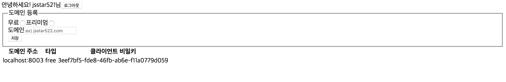
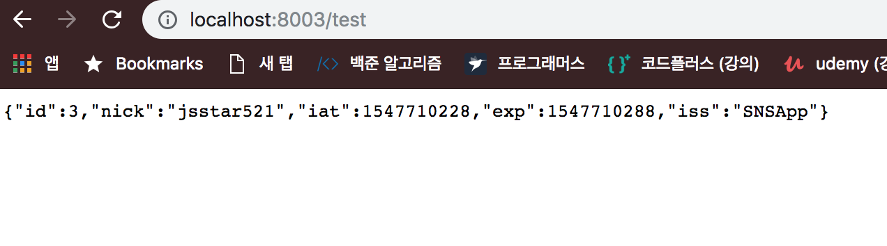
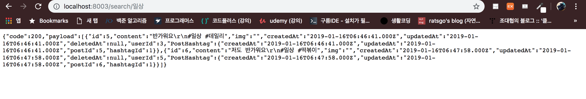
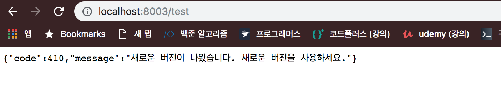
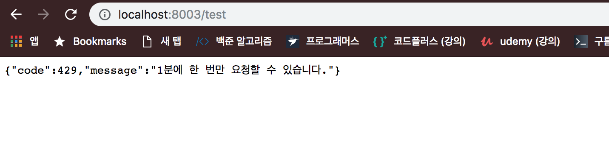

# API

**API(Application Programming Interface)는 다른 어플리케이션에서 현재 프로그램의 기능을 사용할 수 있게 해줍니다.** 특히 `웹 API`는 다른 웹 서비스의 기능을 사용하거나 자원을 가져올 수 있게 해줍니다. 자신이 만든 웹페이지에서 카카오 계정으로 로그인을 할 수 있게 만드는건  카카오API가 존재하기 때문입니다. API는 특정 기능만 사용할 수 있도록 열어놓을 수도 있고 특정 사람들만 정보를 가져가게 열어둘 수도 있습니다. 

## API 만들기

여기서 만들 API 서버는 토큰 인증을 통해서 JSON파일 형태로 데이터베이스에 있는 내용을 전달할 예정입니다. 설치해야할 모듈을 `package.json`에 넣고 `npm i`로 한번에 설치합니다.

```json
{
  "name": "sns_app-api",
  "version": "0.0.1",
  "description": "sns_app API 서버",
  "main": "app.js",
  "scripts": {
    "start": "nodemon app",
    "test": "echo \"Error: no test specified\" && exit 1"
  },
  "author": "jsstar522",
  "license": "ISC",
  "dependencies": {
    "bcrypt": "^2.0.1",
    "connect-flash": "^0.1.1",
    "cookie-parser": "^1.4.3",
    "dotenv": "^5.0.1",
    "express": "^4.16.2",
    "express-session": "^1.15.6",
    "morgan": "^1.9.0",
    "mysql2": "^1.5.1",
    "passport": "^0.4.0",
    "passport-kakao": "0.0.5",
    "passport-local": "^1.0.0",
    "pug": "^2.0.1",
    "sequelize": "^4.31.2",
    "uuid": "^3.1.0"
  },
  "devDependencies": {
    "nodemon": "^1.14.11"
  }
}
```

SNSApp을 만들었던 config, models, passport 폴더를 모두 복사해서 옮겨옵니다. routes폴더에는 `auth.js`와 `middlewares.js`만 복사해서 옮겨옵니다. 그리고 `.env`파일도 복사해서 옮겨옵니다. 이제 views 폴더를 만들고 에러를 띄우는 `error.pug` 를 생성합니다.

```jade
const express = require('express');
const path = require('path');
const cookieParser = require('cookie-parser');
const passport = require('passport');
const morgan = require('morgan');
const session = require('express-session');
const flash = require('connect-flash');
require('dotenv').config();

const { sequelize } = require('./models');
const passportConfig = require('./passport');
const authRouter = require('./routes/auth');
const indexRouter = require('./routes');

const app = express();
sequelize.sync();
passportConfig(passport);

app.set('views', path.join(__dirname, 'views'));
app.set('view engine', 'pug');
app.set('port', process.env.PORT || 8002);

app.use(morgan('dev'));
app.use(express.static(path.join(__dirname, 'public')));
app.use(express.json());
app.use(express.urlencoded({ extended: false }));
app.use(cookieParser(process.env.COOKE_SECRET));
app.use(session({
  resave: false,
  saveUninitialized: false,
  secret: process.env.COOKE_SECRET,
  cookie: {
    httpOnly: true,
    secure: false,
  },
}));
app.use(flash());
app.use(passport.initialize());
app.use(passport.session());

app.use('/auth', authRouter);
app.use('/', indexRouter);

app.use((req, res, next) => {
  const err = new Error('Not Found');
  err.status = 404;
  next(err);
});

app.use((err, req, res) => {
  res.locals.message = err.message;
  res.locals.error = req.app.get('env') === 'development' ? err : {};
  res.status(err.status || 500);
  res.render('error');
});

app.listen(app.get('port'), () => {
  console.log(app.get('port'), '번 포트에서 대기 중');
});
```

이제 도메인 주소를 받아서 저장하는 시퀄라이즈를 작성하겠습니다. **도메인을 사용하는 이유는 등록한 도메인에서만 API를 사용할 수 있게 하기 위해서 입니다.**

```javascript
// models/domain.js

module.exports = (sequelize, DataTypes) => (
  sequelize.define('domain', {
    host: {
      type: DataTypes.STRING(80),
      allowNull: false,
    },
    type: {
      type: DataTypes.STRING(10),
      allowNull: false,
    },
    clientSecret: {
      type: DataTypes.STRING(40),
      allowNull: false,
    },
  }, {
    validate: {
      unknownType() {
        console.log(this.type, this.type !== 'free', this.type !== 'premium');
        if(this.type !== 'free' && this.type !== 'premium'){
          throw new Error('type 컬럼은 free나 premium이어야 합니다.');
        }
      },
    },
    timestamps: true,
    paranoid: true,
  })
);
```

도메인의 모델을 정의했습니다. `validation`은 데이터를 검증하는 속성입니다. unknownType이라는 함수를 만들어서 Type이 지정되어 있지 않을 때 오류를 띄웁니다. 이제 모델을 정리하는 `models/index.js`에 도메인 모델을 추가합니다.

```javascript
// models/index.js

const Sequelize = require('sequelize');
const env = process.env.NODE_ENV || 'development';
const config = require('../config/config')[env];
const db = {};

const sequelize = new Sequelize(config.database, config.username, config.password, config);

db.sequelize = sequelize;
db.Sequelize = Sequelize;
db.User = require('./user')(sequelize, Sequelize);
db.Post = require('./post')(sequelize, Sequelize);
db.Hashtag = require('./hashtag')(sequelize, Sequelize);
db.Domain = require('./domain')(sequelize, Sequelize);

//관계정의(User-Post)
db.User.hasMany(db.Post);
db.Post.belongsTo(db.User);
//관계정의(Post-Hashtag)
db.Post.belongsToMany(db.Hashtag, {through: 'PostHashtag'});
db.Hashtag.belongsToMany(db.Post, {through: 'PostHashtag'});
//관계정의(Following-Follower) N:M
db.User.belongsToMany(db.User, {
  foreignKey: 'followingId',
  as: 'Followers',
  through: 'Follow',
});
db.User.belongsToMany(db.User, {
  foreignKey: 'followerId',
  as: 'Followings',
  through: 'Follow',
});

//관계정의(도메인)
db.User.hasMany(db.Domain);
db.Domain.belongsTo(db.User);

module.exports = db;
```

사용자 한명이 많은 도메인을 갖을 수 있으므로 일대다 관계를 갖습니다. 이제 로그인 창을 템플릿 엔진으로 만듭니다.

```jade
<!--views/login-->
doctype
html
  head
    meta(charset='utf-8')
    title SNS APP 로그인
    style.
      .input-group label {
        width: 200px;
        display: inline-block;
      }
  body
    if user && user.id
      span.user-name= '안녕하세요! ' + user.nick + '님'
      a(href='/auth/logout'): button 로그아웃
      fieldset
        legend 도메인 등록
        form(action='/domain' method='post')
          div
            label(for='type-free') 무료
            input#type-free(type='radio' name='type' value='free')
            label(for='type-premium') 프리미엄
            input#type-premium(type='radio' name='type' value='premium')
          div
            label(for='host') 도메인
            input#host(name='host' placeholder="ex) zerocho.com")
          button 저장
      table
        tr
          th 도메인 주소
          th 타입
          th 클라이언트 비밀키
        for domain in user.domains
          tr
            td= domain.host
            td= domain.type
            td= domain.clientSecret

    else
      form#login-form(action='/auth/login' method='post')
        h2 SNS APP 계정으로 로그인하세요.
        .input-group
          label(for='email') 이메일
          input#email(type='email' name='email' required autofocus)
        .input-group
          label(for='password') 비밀번호
          input#password(type='password' name='password' required)
        if loginError
          .error-message= loginError
        a(href='/auth/join'): button#join(type='button') 회원가입
        button#login(type='submit') 로그인
```

이어서 요청을 처리하는 라우터를 만들겠습니다.

```javascript
// routes/index.js

const express = require('express');
const uuidv4 = require('uuid/v4');
const { User, Domain } = require('../models');

const router = express.Router();

router.get('/', (req, res, next) => {
  User.find({
    where: { id: req.user & req.user.id },
    include: { model: Domain },
  })
    .then((user) => {
      res.render('login', {
        user,
        loginError: req.flash('loginError'),
        domain: user && user.domains,
      });
    })
    .catch((error) => {
      next(error);
    });
});

router.post('/domain', (req, res, next) => {
  Domain.create({
    userId: req.user.id,
    host: req.body.host,
    type: req.body.type,
    clientSecret: uuidv4(),
  })
    .then(() => {
      res.redirect('/');
    })
    .catch((error) => {
      next(error);
    });
});

module.exports = router;
```

메인페이지(`/`)를 보여주는 라우터와 도메인을 받는(POST) 라우터까지 설정했습니다. **`uuid` 모듈은 `범용 고유 식별자`로  고유한 문자열을 만들어 줍니다. 이제 서버를 실행하고 로그인 한 후 도메인을 부여받으면 됩니다.** 로그인을 하면 다음과 같은 창이 뜹니다.




무료 도메인과 프리미엄 도메인은 나중에 사용량 제한을 구현할 때 사용됩니다. 위와 같이 로그인 이후에 `localhost:8003`을 도메인으로 등록합니다.

## 토큰 인증

**데이터베이스의 데이터를 다른 클라이언트(API)에서 가져가기 때문에 별도의 인증이 필요합니다.** JSON Web Token, `JWT토큰`을 이용합니다. JWT는 각각 다른 내용을 담고 있는 `헤더(토큰 종류와 해쉬 알고리즘)`, `페이로드(인코딩 된 토큰의 내용물)`, `시그니처(변조 여부를 확인할 수 있는 일련의 문자열)`로 나뉩니다. JWT 토큰은 비밀키로 되어 있습니다. https://jwt.io에서 비밀키로 되어 있는 JWT 토큰의 내용을 볼 수 있습니다. 매 요청시 데이터베이스를 매번 조회할 필요 없이, JWT토큰을 통해 권한, 사용자 이름 등을 조회합니다. **하지만 매번 random string을 부여해서 데이터베이스를 매번 조회하는 것이 때때로 효과적일 때도 있습니다.** 

```bash
$ npm i jsonwebtoken
```

`./env`에 JWT토큰 내용을 추가합니다.

```text
COOKIE_SECRET=SNSappsecret
KAKAO_ID=0b334c621057bdd690dda7c02d49a795
JWT_SECRET=jwtSecret
```

이제 사용자가 API를 사용하려면 JWT토큰을 발급받아야 합니다. **모든 사용자가 미들웨어를 거쳐 토큰을 발급받도록 합니다.**

```javascript
// routes/middlewares.js

const jwt = require('jsonwebtoken');

exports.isLoggedIn = (req, res, next) => {
  if(req.isAuthenticated()){
      next();
  }else{
      res.status(403).send('로그인 필요');
  }
};

exports.isNotLoggedIn = (req, res, next) => {
  if(!req.isAuthenticated()){
      next();
  }else{
      res.redirect('/');
  }
};

exports.verifyToken = (req, res, next) => {
    try{
        req.decoded = jwt.verify(req.headers.authorization, process.env.JWT_SECRET);
        return next();
    } catch(error){
        if(error.name === 'TokenExpiredError'){ //유효기간 초과
            return res.status(419).json({
                code: 419,
                message: '토큰 만료',
            });
        }
        return res.status(401).json({
            code: 401,
            message: '유효하지 않은 토큰입니다',
        });
    }
};
```

`jwt.verify`는 토큰을 검증하는 메서드입니다. 해쉬화된 토큰을 decoding 해줍니다. 첫번째 인자는 토큰정보, 두번째 인자는 토큰의 비밀키입니다. **토큰 비밀키는 API서버 `.env`에 `SNSappsecret`라고 저장했습니다. `SNSappsecret`의 방식으로만 토큰을 decoding하는겁니다. 이는 API 서버만 알고 있어야 합니다.**

```javascript
// routes/v1.js

const express = require('express');
const jwt = require('jsonwebtoken');

const { verifyToken } = require('./middlewares');
const { Domain, User, Post, Hashtag } = require('../models');

const router = express.Router();

router.post('/token', async (req, res) => {
  const { clientSecret } = req.body;
  try{
    const domain = await Domain.find({		//도메인 등록 확인
      where: { clientSecret },
      include: {
        model: User,
        attribute: ['nick', 'id'],
      },
    });
    if(!domain){
      return res.status(401).json({
        code: 401,
        message: '등록되지 않은 도메인입니다. 도메인을 등록하세요.',
      });
    }
    const token = jwt.sign({		//토큰발급
      id: domain.user.id,
      nick: domain.user.nick,
    }, process.env.JWT_SECRET, {
      expiresIn: '1m',  //1분
      issuer: 'SNSApp',
    });
    return res.json({
      code: 200,
      message: '토큰발급이 완료되었습니다.',
      token,
    });
  } catch(error){
    console.error(error);
    return res.status(500).json({
      code: 500,
      message: '서버 에러',
    });
  }
});

router.get('/test', verifyToken, (req, res) => {
  res.json(req.decoded);
});

module.exports = router;
```

라우터에 버전을 붙여서 기존에 API를 사용하고 있는 유저들에게 오작동을 일으키지 않도록 합니다. 

* 외부사용자가 보낸 클라이언트 비밀키를 통해 등록된 API서버 데이터베이스에 도메인이 존재하는지 확인합니다.(`Domain.find()`)
* 등록된 도메인이라면 토큰을 발급합니다(`jwt.sign()`)
  * 첫번째 인자: 토큰의 내용
  * 두번째 인자: 토큰의 비밀키
  * 세번째 인자: 토큰 설정 (만료일, 발급자)

* **나중에 외부인이 접근할 수 있는 라우터 두개를 만들었습니다.** `v1/token`은 토큰을 발급해주는 라우터고, `v1/test`는 토큰을 확인하는 라우터입니다.

이제 서버에 연결합니다.

```javascript
// app.js
//...
//추가

const v1 = require('./routes/v1');

app.use('v1', v1);

//...
```


## 호출서버

API를 사용하는 호출서버를 만듭니다. 호출서버는 위에서 만들어 놓은 API를 이용해서 데이터를 가져오는 역할을 합니다(가상의 사용자를 만드는 것입니다). 아래의 `package.json`을 저장하고 `npm i`로 설치합니다.

```json
{
  "name": "sns_app-call",
  "version": "0.0.1",
  "description": "",
  "main": "app.js",
  "scripts": {
    "start": "nodemon app",
    "test": "echo \"Error: no test specified\" && exit 1"
  },
  "author": "jsstar522",
  "license": "ISC",
  "dependencies": {
    "axios": "^0.17.1",
    "cookie-parser": "^1.4.3",
    "dotenv": "^5.0.1",
    "express": "^4.16.2",
    "express-session": "^1.15.6",
    "morgan": "^1.9.0",
    "pug": "^2.0.0-rc.4"
  },
  "devDependencies": {
    "nodemon": "^1.14.11"
  }
}
```

서버를 만듭니다.

```javascript
// sns_app-call/app.js

const express = require('express');
const cookieParser = require('cookie-parser');
const session = require('express-session');
require('dotenv').config();

const indexRouter = require('./routes');

const app = express();

//포트설정
app.set('port', process.env.PORT || 8003);

//session 심기
app.use(cookieParser(process.env.COOKIE_SECRET));
app.use(session({
  resave: false,
  saveUninitialized: false,
  secret: process.env.COOKIE_SECRET,
  cookie: {
    httpOnly: true,
    secure: false,
  },
}));

app.use('/', indexRouter);

app.listen(app.get('port'), () => {
  console.log(app.get('port'), '번 포트에서 대기 중');
});
```

에러를 표시할 템플릿 엔진을 만듭니다.

```jade
<!-- views/error.pug -->
h1= message
h2= error.status
pre #{error.stack}
```

비밀키를 넣어두는 `.env` 파일에 위에서 발급 받은 clientSecret을 넣습니다. 

```text
COOKIE_SECRET=SNSappsecret
CLIENT_SECRET=3eef7bf5-fde8-46fb-ab6e-f11a0779d059
```

**이렇게 내가 만드는 웹 페이지에서 다른 웹 페이지의 API를 사용할 수 있고 데이터도 가져올 수 있습니다.** 이제 토큰이 정상적으로 발급되는지 확인하기 위해서 라우터를 작성하겠습니다. **서버API에서 외부인을 위해 만들어놓은 라우터(`v1/token`, `v1/test`)에 접근하겠습니다.**

```javascript
// sns_app-call/routes/index.js

const express = require('express');
//axios: 다른주소로 요청을 보내는 모듈
const axios = require('axios');

const router = express.Router();

router.get('/test', async (req, res, next) => {
  try {
    if (!req.session.jwt) {    //현재 요청의 세션에 토큰이 없으면 발급
      const tokenResult = await axios.post('http://localhost:8002/v1/token', {
        clientSecret: process.env.CLIENT_SECRET,
      });
      console.log(tokenResult.data);;                //토큰이 발급되었는지 확인
      if (tokenResult.data && tokenResult.data.code === 200) {
        req.session.jwt = tokenResult.data.token;   //현재 요청 session.jwt에 토큰 내용 저장
        console.log(req.session);                   //세션에 토큰이 들어갔는지 확인
      } else {
        return res.json(tokenResult.data);  //에러 내용도 토큰 데이터에 저장된다.
      }
    }
    const result = await axios.get('http://localhost:8002/v1/test', {
      headers: { authorization: req.session.jwt },
    });
    console.log(result.data);               //암호화된 토큰이 API서버를 통해 decoding 됐는지 확인
    return res.json(result.data);
  }catch(error){
    return next(error);
  }
})

module.exports = router;
```

* `axios`는 다른 서버로 요청을 보내는 모듈입니다.
* `/test` 경로 요청 라우터입니다. 첫번째는 세션에 토큰을 찾지 못하면 `http://localhost:8002/v1/token` 경로로 `POST` 요청을 보내고 결과값을 `tokenResult`에 저장합니다. `axios.post(경로, { 데이터 })`는 경로에 POST 요청을 보내면서 본문에 데이터를 함께 보냅니다. 이 경우는 **발급받은 clientSecret을 함께 보내면서 API 서버의 `v1.js`에서 해당 도메인이 있는지 clientSecret으로 확인합니다.**

* 세션에서 토큰을 찾아냈다면 `http://localhost:8002/v1/test`경로로 `GET` 요청을 보내고 결과값을 반환합니다. `axios.get(경로, { 헤더 })`는 경로에 GET 요청을 보내면서 헤더와 함께 보냅니다. 이 경우는 **헤더에 세션의 토큰을 담아서 요청하는 것입니다.** 

이제 서버를 실행시키고 `localhost:8003/test`으로 접근하면 토큰이 발급된 것을 확인할 수 있습니다.



1분 뒤에 새로고침을 하면 토큰이 사라진 것을 볼 수 있습니다. 이제 API 호출서버(외부인)를 이용해서 내가 올린 게시글과 해쉬태그를 받아오도록 하겠습니다. 다시 API 서버로 이동해서 외부인에게 데이터를 제공해주는 라우터를 추가하겠습니다.

```javascript
// sns_app-api/routes/v1.js
//...
//추가

router.get('/posts/my', verifyToken, async (req, res) => {
  try {
    const post = await Post.findAll({ where: { userId: req.decoded.id } });
    if (!post) {
      return res.status(404).json({
        code: 404,
        message: '검색 결과가 없습니다',
      });
    }
    return res.json({
      code: 200,
      payload: post,
    });
  } catch (error) {
    console.error(error);
    return res.status(500).json({
      code: 500,
      message: '서버 에러',
    });
  }
});

router.get('/posts/hashtag/:title', verifyToken, async (req, res) => {
  try {
    const hashtag = await Hashtag.find({ where: { title: req.params.title } });
    if (!hashtag) {
      return res.status(404).json({
        code: 404,
        message: '검색 결과가 없습니다',
      });
    }
    const posts = await hashtag.getPosts();
    return res.json({
      code: 200,
      payload: posts,
    });
  } catch (error) {
    console.error(error);
    return res.status(500).json({
      code: 500,
      message: '서버 에러',
    });
  }
});
```

`localhost:8002/posts/my`와 `localhost:8002/posts/hashtag/:title`에서 제공하는 게시글과 해쉬태그의 데이터를 `localhost:8003/mypost`와 `localhost:8003/search/[해쉬태그이름]`으로 각각 접근하면 데이터를 가져올 수 있도록 서버를 다시 설정합니다. **외부인을 위한 라우터를 만들었으니 외부인은 다시 이 라우터를 사용하기 위해서 `axios`를 사용해서 요청을 간접적으로 보내야합니다. 위에서 만들었던  `sns_app-call/routes/index.js`에는 `/test` 경로에만 접근했을 경우 토큰을 발행했습니다. 이제 게시글 조회, 해쉬태그 조회를 할 때마다 토큰을 발행해야하므로 토큰발행을 함수화 하겠습니다.**

```javascript
// sns_app-call/routes/index.js

const express = require('express');
//axios: 다른주소로 요청을 보내는 모듈
const axios = require('axios');

const router = express.Router();
const URL = 'http://localhost:8002/v1';

const request = async(req, api) => {
  try{
    if(!req.session.jwt){    //(1): 현재 요청의 세션에 토큰이 없으면 발급
      const tokenResult = await axios.post(`${URL}/token`, {
        clientSecret: process.env.CLIENT_SECRET,
      });
      req.session.jwt = tokenResult.data.token;   //세션에 토큰 저장
    }
    return await axios.get(`${URL}${api}`, {
      headers: { authorization: req.session.jwt },
    });     //(2): 토큰확인(test), 게시글확인(posts), 해쉬태그확인(posts/hashtag/:title)에 따라서 다른 경로 접근
  }catch(error){
    console.error(error);
    if(error.response.status < 500){
      return error.response;
    }
    throw error;
  }
};

router.get('/test', async(req, res, next) => {
  try{
    const result = await request(req, '/test');
    res.json(result.data);
  }catch(error){
    console.error(error);
    next(error);
  }
})

//게시글을 확인하는 라우터
router.get('/mypost', async (req, res, next) => {
  try {
    const result = await request(req, '/posts/my');
    res.json(result.data);
  } catch (error) {
    console.error(error);
    next(error);
  }
});

//해쉬태그를 확인하는 라우터
router.get('/search/:hashtag', async(req, res, next) => {
  try{
    const result = await request(req, `/posts/hashtag/${encodeURIComponent(req.params.hashtag)}`)   //(4): 요청중에서 쿼리스트링 중 hashtag에 해당하는 값을 포함해 요청을 보냄
    res.json(result.data);
  }catch(error) {
    if(error.code){
      console.log(error);
      next(error);
    }
  }
});

module.exports = router;
```

* (1): 토큰을 발행해주는 API서버 라우터는 `localhost:8002/v1/token`주소에 있습니다. 
* (2): 토큰확인(`/test`), 게시글확인(`/posts/my`), 해쉬태그확인(posts/hashtag/:title)에 따라서 다른 경로 접근하기 위해 `api`라는 변수를 인자로 받습니다.
* (3): 만들어둔 `request` 함수를 사용합니다. 위에서 설명했던 것처럼 이 함수는 인자를 두개를 받습니다. 첫번째는 요청, 두번째는 간접적으로 요청을 보낼 경로입니다. 이 라우터는 게시글을 확인하는 `/posts/my`로 요청을 보내야 하므로 두번째 인자에 넣어 줬습니다.
* (4): 쿼리스트링을 통해 hashtag를 검색합니다. 쿼리스트링 중 hashtag에 해당하는 값을 요청에 포함해 서버API로 보냅니다. 즉 `/search/일상`이라는 요청을 외부인이 보내면 API서버에서는 `/posts/hashtag/일상`으로 요청을 받고 데이터베이스 hashtag 중에서 value가 `일상`인 column를 모두 가져옵니다. 

이제 `localhost:8003/mypost`로 접근하거나 `localhost:8003/search/검색어`로 접근하면 다음과 같이 JSON으로 내가 쓴 게시글이 나오게 됩니다.



## 사용량 제한 설정

과도하게 API를 사용하지 못하도록 사용량에 제한을 둘 수 있습니다. 도메인 부여시 `일반`과 `프리미엄`으로 나누어 무료 이용자와 유료 이용자를 나눴습니다. 이를 구현하려면 `express-rate-limit` 패키지를 사용하는 것이 좋습니다.

```bash
$ npm i express-rate-limit
```

`RateLimiter` 미들웨어를 장착합니다.

```javascript
//sns_app-api/routes/middlewares/js
//...
//추가

exports.apiLimiter = new RateLimit({
  windowMs: 60 * 1000, // 1분
  max: 1,
  delayMs: 0,
  handler(req, res) {
    res.status(this.statusCode).json({
      code: this.statusCode, // 기본값 429
      message: '1분에 한 번만 요청할 수 있습니다.',
    });
  },
});

exports.deprecated = (req, res) => {
    res.status(410).json({
        code: 410,
        message: '새로운 버전이 나왔습니다. 새로운 버전을 사용하세요.'
    });
};
```

* windowMs: 기준시간
* max: 허용 횟수
* delayMs: 호출 간격
* handler: 제한시 호출하는 콜백함수

이제 요청을 받아들이는 라우터가 `apiLimiter` 미들웨어를 거치면 사용량에 제한이 생깁니다. `deprecated`는 이제 다른 버전의 라우터를 만들어보겠습니다. 기존에 만들었던 v1 버전의 라우터에 미들웨어만 장착해주면 됩니다.

```javascript
// sns_app-api/routes/v2.js

const express = require('express');
const jwt = require('jsonwebtoken');

const { verifyToken, apiLimiter } = require('./middlewares');
const { Domain, User, Post, Hashtag } = require('../models');

const router = express.Router();

router.post('/token', apiLimiter, async (req, res) => {
  const { clientSecret } = req.body;
  try {
    const domain = await Domain.find({
      where: { clientSecret },
      include: {
        model: User,
        attribute: ['nick', 'id'],
      },
    });
    if (!domain) {
      return res.status(401).json({
        code: 401,
        message: '등록되지 않은 도메인입니다. 먼저 도메인을 등록하세요',
      });
    }
    const token = jwt.sign({
      id: domain.user.id,
      nick: domain.user.nick,
    }, process.env.JWT_SECRET, {
      expiresIn: '5m', // 5분
      issuer: 'nodebird',
    });
    return res.json({
      code: 200,
      message: '토큰이 발급되었습니다',
      token,
    });
  } catch (error) {
    console.error(error);
    return res.status(500).json({
      code: 500,
      message: '서버 에러',
    });
  }
});

router.get('/test', verifyToken, apiLimiter,(req, res) => {
  res.json(req.decoded);
});

router.get('/posts/my', apiLimiter, verifyToken, async (req, res) => {
  try {
    const post = await Post.findAll({ where: { userId: req.decoded.id } });
    if (!post) {
      return res.status(404).json({
        code: 404,
        message: '검색 결과가 없습니다',
      });
    }
    return res.json({
      code: 200,
      payload: post,
    });
  } catch (error) {
    console.error(error);
    return res.status(500).json({
      code: 500,
      message: '서버 에러',
    });
  }
});

router.get('/posts/hashtag/:title', verifyToken, apiLimiter, async (req, res) => {
  try {
    const hashtag = await Hashtag.find({ where: { title: req.params.title } });
    if (!hashtag) {
      return res.status(404).json({
        code: 404,
        message: '검색 결과가 없습니다',
      });
    }
    const posts = await hashtag.getPosts();
    return res.json({
      code: 200,
      payload: posts,
    });
  } catch (error) {
    console.error(error);
    return res.status(500).json({
      code: 500,
      message: '서버 에러',
    });
  }
});

module.exports = router;
```

v2 버전이 나왔으니 v1을 사용할 시 경고메세지를 띄우기 위해 `deprecated` 미들웨어를 끼워줍니다.

```javascript
// sns_app-api/routes/v1.js
// 추가
const express = require('express');
const jwt = require('jsonwebtoken');

const { verifyToken, deprecated } = require('./middlewares');
const { Domain, User, Post, Hashtag } = require('../models');

const router = express.Router();

router.use(deprecated);
//...
```

**`deprecated`는 `router.use`를 통해 모든 요청이 이 미들웨어를 거치도록 했습니다. 위에서 `apiLimiter`도 모든 라우터가 `apiLimiter` 미들웨어를 거치면 `router.use`로 한줄만 추가해서 사용해도 됩니다.**

모든 요청에 대해 `deprecated`를 거치도록 해야하므로 `router.use(deprecated)`로 사용합니다. 이제 서버에 라우터를 붙여줍니다.

```javascript
// sns_app-api/app.js
// 추가
// ...
const v2 = require('./routes/v2');

app.use('/v2', v2);
//...
```

이제 API호출 서버로 다시 돌아와서 토큰이 발급되는지 확인해보겠습니다. 

아직 `sns_app-call`은 v1을 사용하고 있으므로 새로운 버전을 사용하라는 메세지를 보냅니다. 이제 v2로 바꿔보겠습니다.

```javascript
// sns_app-call/routes/index.js
//...
//변경

const URL = 'http://localhost:8002/v2';

//...
```

버전을 바꾸고 `localhost:8003/test`로 들어가면 전과 똑같이 토큰의 내용을 보여줍니다. 하지만 곧바로 다시 클릭하면 다음과 같은 메세지를 보냅니다.



### Error Note

* API 호출서버(sns_app-call)을 사용해서 토큰을 발급받지 못함. `Error: Request failed with status code 401`:  **매 요청마다 `console.log`를 찍어본 결과 토큰 발급과 세션에 넣는 코드까지 잘 동작. 하지만 요청 헤더에서 토큰을 찾지 못함. 알고보니 headers를 header로 썼다.**
* API 호출서버(sns_app-call)에서 게시글을 받아오는 라우터(`/posts/my`)를 promise 문으로 쓰니 잘 되지 않음. `Error: Request failed with status code 500`: **밑에 있는 hashtag 받아오기는 잘돼서 그대로 복사해 경로만 바꾸면서 만들었다. async/await로 사용 하니 해결**