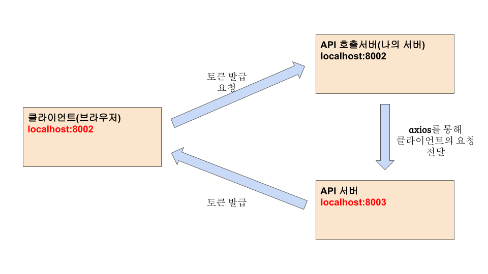
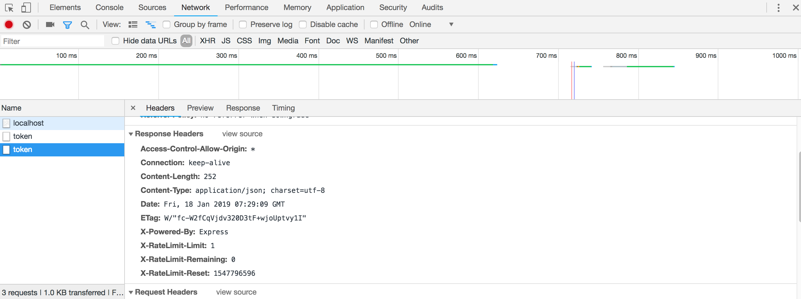
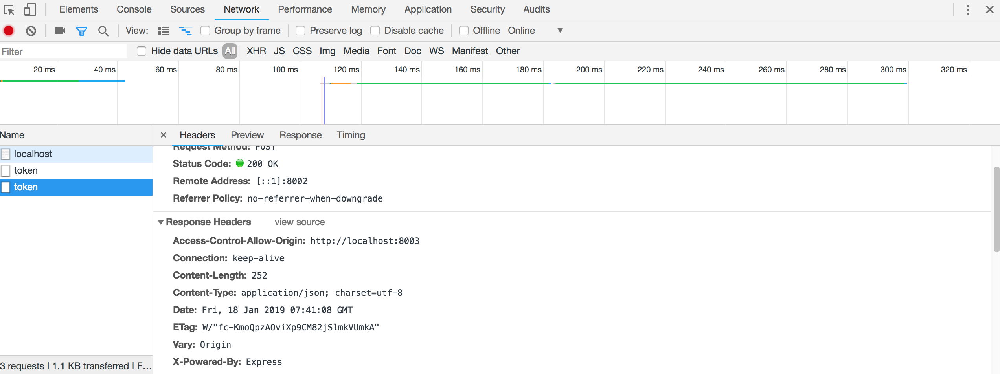

# CORS

CORS는 Cross-Origin Resource Sharing의 약자입니다. API서버와 API호출서버가 데이터를 주고 받았습니다. 이번에는 프런트엔드에서 API를 호출해 보겠습니다. 프런트(템플릿 엔진)을 사용하기 위해서 `app.js`에 모듈을 추가합니다.

```javascript
// app_sns-call/app.js
//...
//추가

const path = require('path');
app.set('views', path.join(__dirname, 'views'));
app.set('view engine', 'pug');

//...
```

`/` 경로로 가는 라우터를 만듭니다.

```javascript
// app_sns-call/routes/index.js
//...
//추가

router.get('/', (req, res) => {
  res.render('main', { key: process.env.CLIENT_SECRET });
});

module.exports = router;
```

```javascript
// app_sns-call/views/main.pug

doctype
html
  head
    title API 요청
  body
    #result
    script.
      var xhr = new XMLHttpRequest();
      xhr.onreadystatechange = function () {
        if (xhr.readyState === xhr.DONE) {
          if (xhr.status === 200) {
            document.querySelector('#result').textContent = xhr.responseText;
          } else {
            console.error(xhr.responseText);
          }
        }
      };
      xhr.open('POST', 'http://localhost:8002/v2/token');
      xhr.setRequestHeader('Content-Type', 'application/json');
      xhr.send(JSON.stringify({ clientSecret: '#{key}' }));
```

이제 `localhost:8003/test`에 접근합니다. 그러면 다음과 같은 오류가 나옵니다. `OPTIONS http://localhost:8002/v2/token net::ERR_CONNECTION_REFUSED`. 이렇게 되는 이유는 다음과 같습니다.



**클라이언트에서 서버로 요청을 보낼 때, 서버와 도메인이 일치하지 않으면 요청을 차단합니다. 이를 CORS Problem 이라고 부릅니다.** 이렇게 API서버까지 요청이 잘 전달 되더라도 클라이언트의 도메인(localhost:8002)과 서버의 도메인(localhost:8003)이 다르면 요청이 차단됩니다. 이는 요청의 `OPTION 메서드`로 확인합니다. 이 문제를 해결하기 위해서 요청 헤더에 Access-Control-Allow-Origin을 넣어줘야 하는데 `cors`라는 패키지가 이를 수행합니다.

```bash
$ npm i cors
```

```javascript
// sns_app-api/routes/v2.js
//...
//추가

const cors = require('cors');

router.use(cors());

//...
```

이제 `localhost:8003`에 접속하면 프런트에서 토큰이 발급됐다는 메세지를 받을 수 있습니다. 요청을 콘솔로 보면 다음과 같습니다.



`CORS`를 통해 헤더에 Access-Control-Allow-Origin을 넣어줬습니다. **하지만 *로 되어 있기 때문에 모든 클라이언트를 허용합니다. 이렇게 되면 `process.env.CLIENT_SECRET`이 모두에게 노출될 수 있습니다.** 허용된 도메인만 비밀키를 지급해주고 CORS를 사용할 수 있도록 바꿔줍니다. `router.use(cors());`를 없애고 조건을 걸겠습니다.

```javascript
// sns_app-api/routes/v2.js
//수정

const express = require('express');
const jwt = require('jsonwebtoken');
const cors = require('cors');
const url = require('url');

const { verifyToken, apiLimiter } = require('./middlewares');
const { Domain, User, Post, Hashtag } = require('../models');

const router = express.Router();

router.use(async(req, res, next) => {
  const domain = await Domain.find({
    where: { host: URL.parse(req.get('origin')).host },
  });
  if(domain){
    cors({ origin: req.get('origin') })(req, res, next);
  }else{
    next();
  }
});
//...
```

**이제 데이터베이스에서 등록된 도메인이 있는지 검사합니다. 그리고 현재 요청을 보낸 도메인이 데이터베이스에 등록되어 있는지 확인 후 CORS를 실행합니다.** 위에서 `router.use(cores())`로 함수를 실행하지 않고 원하는 조건을 걸어서 직접 미들웨어를 사용하고 있습니다. 다음과 같이 사용하고 있습니다.

```javascript
router.use(cors());						// (1)번 : 그냥 사용할 때

router.use((req, res, next) => {		// (2)번	: 커스터마이징해서 사용할 때
    cors()(req, res, next);
});
```

이제 Acess-Control-Allow-Origin은 요청을 보낸 도메인만 허용하는 것을 볼 수 있습니다.



