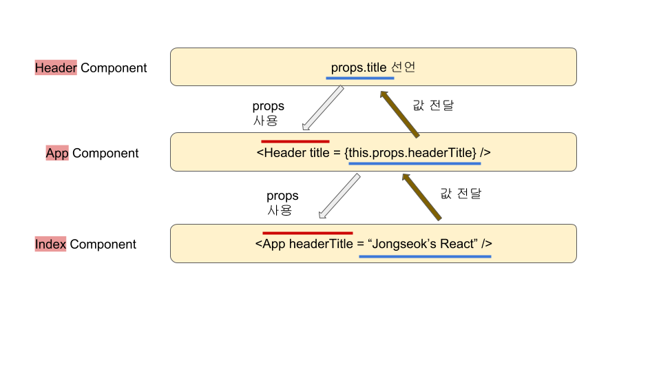

# Component

## Component의 모듈화

리엑트는 가상DOM을 사용하기 때문에 많은 컴포넌트를 생성해도 브라우저에 무리를 주지 않습니다. 많은 컴포넌트로 쪼갤수록 바꾸고자 하는 컴포넌트만 업데이트 해주기 때문에 굉장히 빠르죠. 그래서 페이지 하나를 만들더라도 많은 컴포넌트로 나눌수록 좋습니다. 다양한 내용을 표시하는 클래스를 각각 생성할 수 있습니다.

```javascript
// component/App.js
import React, { Component } from 'react';
import logo from '../logo.svg';
import '../App.css';

class App extends Component {
  render() {
    return (
      <div>
        <Header/>
        <Content/>
      </div>
    );
  }
}

class Header extends Component {
  render() {
    return (
      <h1>Header</h1>
    );
  }
}

class Content extends Component {
  sayHello() {
    alert('Hello');
  }
  render() {
    return (
      <div className="App">
        <header className="App-header">
          
          <p>
            Edit <code>src/App.js</code> and save to reload.
          </p>
          <a
            className="App-link"
            href="https://reactjs.org"
            target="_blank"
            rel="noopener noreferrer"
          >
            Learn React
          </a>
          <button onClick={this.sayHello}>Click Me</button>
          {console.log(this)}
        </header>
      </div>
    )
  }
}


export default App;

```

다음과 같이 3개의 컴포넌트로 나눌 수 있고 App 컴포넌트에서 `<Header/>`와 `<Content/>`로 두개의 컴포넌트를 불러오고 있습니다. 하지만 `App.js` 하나에 많은 컴포넌트를 몰아넣게 되면 유지보수가 힘들어집니다. 컴포넌트를 파일단위로 나눠서 관리하는게 편합니다.

```javascript
// component/App.js

import React, { Component } from 'react';
import Header from './Header';
import Content from './Content';

class App extends Component {
  render() {
    return (
      <div>
        <Header/>
        <Content/>
      </div>
    );
  }
}

export default App;
```

```javascript
// component/Header.js

import React, { Component } from 'react';

class Header extends Component {
  render() {
    return (
      <h1>Header</h1>
    );
  }
}

export default Header;
```

```javascript
// component/Content.js

import React, { Component } from 'react';
import logo from '../logo.svg';
import '../App.css';

class Content extends Component {
  sayHello() {
    alert('Hello');
  }
  render() {
    return (
      <div className="App">
        <header className="App-header">
          
          <p>
            Edit <code>src/App.js</code> and save to reload.
          </p>
          <a
            className="App-link"
            href="https://reactjs.org"
            target="_blank"
            rel="noopener noreferrer"
          >
            Learn React
          </a>
          <button onClick={this.sayHello}>Click Me</button>
          {console.log(this)}
        </header>
      </div>
    )
  }
}

export default Content;
```

위와 같이 비슷한 동작을 하는 것끼리 컴포넌트를 나눠놓으면 가독성이 좋아지고 관리하기가 편해집니다. 

## Component의 Props와 State

리엑트는 두가지 종류의 데이터를 다룹니다.

### Props

**props는 변하지 않는 데이터(속성)를 부모 컴포넌트로부터 전달할 때 사용됩니다. 즉, 전달만 해줄 뿐 값을 바꾸지는 않습니다.** `Header.js`와 `Content.js`에서 title을 props로 설정하고 부모 컴포넌트인 `App.js`로 속성을 전달해보겠습니다.

```javascript
// component/Header.js

import React, { Component } from 'react';

class Header extends Component {
  render() {
    return (
      <h1>{this.props.title}</h1>
    );
  }
}

export default Header;
```

```javascript
// component/Content.js

import React, { Component } from 'react';
import logo from '../logo.svg';
import '../App.css';

class Content extends Component {
  render() {
    return (
      <div>
        <h2>{this.props.title}</h2>
        <p>{this.props.body}</p>
        
      </div>
    )
  }
}

export default Content;
```

props를 설정했습니다. **자식 컴포넌트에서 `this.props.이름`으로 선언한 props는, 부모 컴퍼넌트에서 `<[children 컴퍼넌트이름] [props이름]=[값] />`으로 props 값을 전달시킬 수 있습니다.**  `App.js`에서 child component의 props를 전달받겠습니다(상속).

```javascript
// component/App.js

import React, { Component } from 'react';
import Header from './Header';
import Content from './Content';

class App extends Component {
  render() {
    return (
      <div>
        <Header title={this.props.headerTitle}/>
        <Content title={this.props.contentTitle} body={this.props.contentBody}/>
      </div>
    );
  }
}

export default App;
```

**다시 상위 컴포넌트인 `index.js` 컴포넌트에서 props의 값을 전달해주기 위해 다시 `App.js`의 props를 자식 컴포넌트의 props에 대입했습니다.** 이제 컴포넌트의 props에 값을 넣어보겠습니다. **최종적으로 렌더링되는 `index.js`에서 모든 컴포넌트의 props 값을 넣습니다.**

```javascript
// index.js

import React from 'react';
import ReactDOM from 'react-dom';
import './index.css';
import App from './component/App';
import * as serviceWorker from './serviceWorker';

ReactDOM.render(<App headTitle = "Jongseok's React" 
                      contentTitle = "content props" 
                        contentBody = "content body props"/>, document.getElementById('root'));

// If you want your app to work offline and load faster, you can change
// unregister() to register() below. Note this comes with some pitfalls.
// Learn more about service workers: http://bit.ly/CRA-PWA
serviceWorker.unregister();
```

위의 예시처럼 props를 통해 연쇄적으로 속성을 받아서 값을 전달시킬 수 있습니다. 위 예시에서 props를 통해 값을 전달받는 방식을 그려보면 다음과 같습니다.



#### defaultProps

**최종적으로 렌더링되기 전에 `App.js`에서 props의 defaul값으로 설정해줄 수 있습니다.** props로 전달되는 값이 없는 경우 기본값을 지정해두는 겁니다.

```javascript
// component/App.js

import React, { Component } from 'react';
import Header from './Header';
import Content from './Content';

class App extends Component {
  render() {
    return (
      <div>
        <Header title={this.props.headerTitle}/>
        <Content title={this.props.contentTitle} body={this.props.contentBody}/>
      </div>
    );
  }
}

App.defaultProps = {
    headerTitle: "Jongseok's React",
    contentTitle: "content props",
    contentBody: "content body props",
};

export default App;
```

#### Type Validation

Type Validation(타입 검증, `전달된 props`와 `컴포넌트에서 선언한 props`와 Type이 같은지 확인)을 하기 위해서는 `propTypes`를 설정해놓으면 됩니다. `import PropTypes from 'prop-types';`모듈을 불러와서 사용합니다.

```javascript
// component/Content.js

import React, { Component } from 'react';
import PropTypes from 'prop-types';
import logo from '../logo.svg';
import '../App.css';

class Content extends Component {
  render() {
    return (
      <div>
        <h2>{this.props.title}</h2>
        <p>{this.props.body}</p>
        
      </div>
    )
  }
}

Content.propTypes = {
  title: PropTypes.string,
  body: PropTypes.string.isRequired,
};

export default Content;
```

`isRequired`는 반드시 들어가야하는 값입니다. 이제 자료형이 다른 값을 전달하거나 `isRequired` 설정된 props에 값을 넣지 않으면 어떤오류가 발생하는지 확인해보겠습니다. 

### State

**state는 값을 전달하는 과정에서 값을 바꿀 수 있습니다.** state는 props와 다르게 컴포넌트마다 컴포넌트 내부에서 state를 선언해야 합니다. 다음과 같은 패턴으로 state를 정의합니다.

```javascript
// component/stateExample.js

import React, { Component } from 'react';

class stateExample extends Component {
  constructor(props){
    super(props);

    this.state = {
      header: "Header initial state",
      content: "Content initial state",
    };
  }

  updateHeader(text){
    this.setState({
      header: "Header is changed",
    });
  }

  render(){
    return(
      <div>
        <h1>{this.state.header}</h1>
        <h2>{this.state.content}</h2>
        <button onClick={this.updateHeader.bind(this)}>Update</button>
      </div>
    );
  }
}

export default stateExample;
```

* constructor는 state의 초기값을 설정하는 공간입니다. **state는 컴포넌트가 생성될 때 가장 먼저 설정되기 때문에 다음과 같이 constructor에서 설정해야 합니다.** 간단하게 constructor 함수를 사용하지 않고 간단하게 state class field(일반 객체로 초기화)로 선언해도 됩니다(아래 `/component/Counter.js` 예시). 다만 constructor를 사용하는 이유는 컴포넌트끼리 값을 전달받기 위해 다양한 컴포넌트를 상속했고 `super(props)`를 통해 기존의 클래스 생성자를 덮어씌울 수 있기 때문입니다. `super(props)`를 통해 상속된 기존에 있던 클래스 생성자를 불러온 후 state를 설정할 수 있는 겁니다.
* updateHeader라는 함수를 만들어서 안쪽에 setState 메서드를 사용하고 있습니다. setState는 바뀌는 내용을 설정하는 메서드로 `setState([state이름] : [바뀔 내용])`으로 사용합니다.
* state를 렌더링할 때는 `this.state.state이름`으로 사용합니다.
* **class 안쪽의 함수는 binding을 해줘야합니다.**

```javascript
//...
  updateHeader(text){
    this.setState({
      header: "Header is changed",
    });
  }
//...
//위 부분을 ES5 버전으로 바꾸면
//..
  updateHeader = function(text){
    this.setState({
      header: "Header is changed",
    });
  }
//...
```

**이 메서드는 `render()` 메서드 안에서 사용되는 메서드이기 때문에, 나중에 `내부함수`로 동작합니다. 함수 안의 함수(내부함수)는 바인딩을 해주지 않으면 this가 window를 가르키게 됩니다.** 표현하자면 다음과 같습니다.

```javascript
render = function(){
    updateHeader = function(text){
        console.log(this);
    }
}
```

이 문제를 해결하기 위해서는 바인딩을 해주던지, `updateHeader함수`를 arrow function으로 표현하면 됩니다(아래 `component/Counter.js` 예시에서 arrow function을 사용합니다.).

자, 이제 클릭할 때마다 숫자가 올라가는 코드를 작성해보겠습니다.

```javascript
// component/Counter.js

import React, { Component } from 'react';
import PropTypes from 'prop-types';
import logo from '../logo.svg';
import '../App.css';

class Counter extends Component {
  state = {
    num : 0,
  }

  numIncrease = () => {
    //(비구조화 할당 문법)this를 전달받아서 num 변수를 새로 선언
    const {num} = this.state;
    this.setState({
      num : num + 1
    });
  }

  numDecrease = () => {
    const {num} = this.state;
    this.setState({
      num : num - 1
    });
  }

  render() {
    return(
      <div>
      <h1>카운터</h1>
      <div>값: {this.state.num}</div>
      <button onClick={this.numIncrease}>+</button>
      <button onClick={this.numDecrease}>-</button>
    </div>
    ) 
  }
}

export default Counter;
```

* **html과 다르게 JSX에서 이벤트이름은 camelCase로 선언해야합니다(onClick).**
* **이벤트 안에는 함수를 넣어줘야합니다.** `()`를 포함시켜서 함수를 실행하면 렌더링 될때마다 함수가 실행되므로 무한루프에 빠집니다(this.handleIncrease**()** `X`)

이제 `App.js`에서 `<Counter />`를 추가해서 컴포넌트를 렌더링합니다.

```javascript
//App.js

import React, { Component } from 'react';
import Header from './Header';
import Content from './Content';
import Counter from './Counter';

class App extends Component {
  
  render() {
    return (
      <div>
        <Header title={this.props.headerTitle}/>
        <Content title={this.props.contentTitle} body={this.props.contentBody}/>
        <Counter />
      </div>
    );
  }
}

App.defaultProps = {
  headerTitle: "Jongseok's React",
  contentTitle: "content title props",
  contentBody : "content body props",
};

export default App;
```


