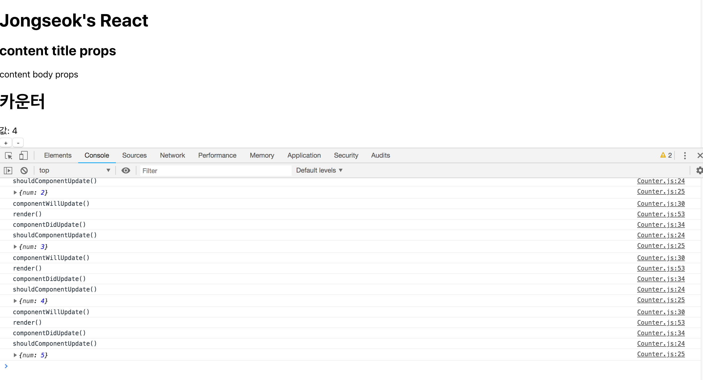

# LifeCycle API

**LifeCycle API는 컴포넌트가 브라우저에 나타나거나 사라질 때, 혹은 업데이트 될 때 호출되는 API입니다.** 컴포넌트가 처음 만들어지기 전부터, 만들어진 이후까지 LifeCycle API에서 어떤 함수가 호출되는지 알아보겠습니다.

## 컴포넌트 생성

### constructor

```javascript
constructor(props){
    super(props);
}
```

컴포넌트가 새롭게 생성될 때 가장 먼저 호출되는 생성자입니다.

### componentWillMount

```javascript
componentWillMount(){
    
}
```

렌더링돼서 화면에 나타나기 직전에 호출되는 함수입니다. 현재 리엑트 버전에서는 삭제된 함수입니다.

### componentDidMount

```javascript
componentDidMount(){
  // 외부 라이브러리 연동: D3, masonry, etc
  // 컴포넌트에서 필요한 데이터 요청: Ajax, GraphQL, etc
  // DOM 에 관련된 작업: 스크롤 설정, 크기 읽어오기 등    
}
```

컴포넌트가 화면에 나타나면 호출되는 함수입니다. 라이브러리 연동, 데이터 요청, DOM 설정을 이 함수를 통해 수행할 수 있습니다.

## 컴포넌트 업데이트

**props나 state가 변화하면 컴포넌트 업데이트 API가 호출됩니다.**

### componentWillReceiveProps

```javascript
componentWillReceiveProps(){
    
}
```

새로운 props를 받았을 때 호출되는 함수입니다. 하지만 새로운 버전의 리엑트에서는 삭제됐습니다.

### static getDerivedStateFromProps

```javascript
static getDerivedStateFromProps(){
  // 여기서는 setState 를 하는 것이 아니라
  // 특정 props 가 바뀔 때 설정하고 설정하고 싶은 state 값을 리턴하는 형태로
  // 사용됩니다.
  /*
  if (nextProps.value !== prevState.value) {
    return { value: nextProps.value };
  }
  return null; // null 을 리턴하면 따로 업데이트 할 것은 없다라는 의미
  */
}
```

### shouldComponentUpdate

```javascript
shouldComponentUpdate(nextProps, nextState) {
  // return false 하면 업데이트를 안함
  // return this.props.checked !== nextProps.checked
  return true;
}
```

현재 props는 `this.props`고 바뀔 props는 `nextProps`로 받아올 수 있습니다. 렌더링의 부하를 줄이기 위해 Virtual DOM에서 미리 렌더링하지만 바뀐 정보가 없다면 렌더링을 하지 않는 것이 유리합니다. `return false;`를 통해 `render`함수를 호출하지 않을 수 있습니다.

### componentWillUpdate

```javascript
componentWillUpdate(nextProps, nextState) {

}
```

`shouldComponentUpdate`함수가 `true`를 반환했을 때 호출되는 함수입니다. 최종적으로 `render`함수를 실행되기 직전에 호출됩니다. 애니메이션 효과를 초기화하거나 이벤트리스너를 없앨 때 사용됩니다.

### getSnapshotBeforeUpdate

```javascript
getSnapshotBeforeUpdate(prevProps, prevState) {
    // DOM 업데이트가 일어나기 직전의 시점입니다.
    // 새 데이터가 상단에 추가되어도 스크롤바를 유지해보겠습니다.
    // scrollHeight 는 전 후를 비교해서 스크롤 위치를 설정하기 위함이고,
    // scrollTop 은, 이 기능이 크롬에 이미 구현이 되어있는데, 
    // 이미 구현이 되어있다면 처리하지 않도록 하기 위함입니다.
    if (prevState.array !== this.state.array) {
      const {
        scrollTop, scrollHeight
      } = this.list;

      // 여기서 반환 하는 값은 componentDidMount 에서 snapshot 값으로 받아올 수 있습니다.
      return {
        scrollTop, scrollHeight
      };
    }
  }
```

`render`함수를 통해 렌더링이 된 직후 호출되는 함수입니다. 직전의 DOM의 props와 state를 가져올 수 있습니다.

### componentDidUpdate

```javascript
componentDidUpdate(prevProps, prevState, snapshot) {

}
```

역시 `render`함수 이후에 호출되는 함수입니다. 직전의 DOM의 props와 state를 가져올 수 있고 snapshot은 `getSnapshotBeforeUpdate`에서 반환된 값을 받아올 수 있습니다.

## 컴포넌트 삭제

### componentWillUnmount

```javascript
componentWillUnmount() {
  // 이벤트, setTimeout, 외부 라이브러리 인스턴스 제거
}
```


## 컴포넌트 사용

컴포넌트에서 LifeCycle API 함수를 사용해보겠습니다.

```javascript
import React, { Component } from 'react';
import PropTypes from 'prop-types';
import logo from '../logo.svg';
import '../App.css';

class Counter extends Component {
  state = {
    num : 0,
  }

  constructor(props) {
    super(props);
    console.log('constructor');
  }

  //LifeCycle API
  componentWillMount(){
    console.log('componentWillMount()');
  }
  componentDidMount(){
    console.log('componentDidMount()');
  }
  shouldComponentUpdate(nextProps, nextState) {
    console.log('shouldComponentUpdate()');
    console.log(nextState);
    if (nextState.num % 5 === 0) return false;
    return true;
  }
  componentWillUpdate(nextProps, nextState) {
    console.log('componentWillUpdate()');
  }
  
  componentDidUpdate(prevProps, prevState) {
    console.log('componentDidUpdate()');
  }

  numIncrease = () => {
    //(비구조화 할당 문법)this를 전달받아서 num 변수를 새로 선언
    const {num} = this.state;
    this.setState({
      num : num + 1
    });
  }

  numDecrease = () => {
    const {num} = this.state;
    this.setState({
      num : num - 1
    });
  }

  render() {
    console.log('render()');
    return(
      <div>
      <h1>카운터</h1>
      <div>값: {this.state.num}</div>
      <button onClick={this.numIncrease}>+</button>
      <button onClick={this.numDecrease}>-</button>
    </div>
    ) 
  }
}

export default Counter;
```

`shouldComponentUpdate`에서 `false`를 반환하면 렌더링하지 않습니다. 전달받는 `state.num`가 5의 배수면 `false`를 반환했습니다. 



Increase 버튼을 다섯번 눌렀지만 다섯번째는 5의 배수인 `state.num`을 반환하므로 렌더링하지 않습니다. 하지만 값은 변하죠.


## 컴포넌트 에러

컴포넌트 에러도 API를 통해 잡아낼 수 있습니다.

### componentDidCatch

```javascript
componentDidCatch(error, info) {
  this.setState({
    error: true
  });
}
```

state가 error을 반환하면 다음과 같은 API 함수를 실행시키면 됩니다. 먼저 오류가 발생하는 컴포넌트를 만들어 보겠습니다. 이번엔 `component/count.js`에서 state.num가 6이면 에러를 발생 시키겠습니다.

```javascript
// component/count.js

import React, { Component } from 'react';
import PropTypes from 'prop-types';
import logo from '../logo.svg';
import '../App.css';

//error function
const Errorfun = () => {
  throw (new Error('버그 발생!!'));
  return (
    <div>
    </div>
  );
};

class Counter extends Component {
  state = {
    num: 0,
  }

  constructor(props) {
    super(props);
    console.log('constructor');
  }

  //LifeCycle API
  componentWillMount() {
    console.log('componentWillMount()');
  }
  componentDidMount() {
    console.log('componentDidMount()');
  }
  shouldComponentUpdate(nextProps, nextState) {
    console.log('shouldComponentUpdate()');
    console.log(nextState);
    if (nextState.num % 5 === 0) return false;
    return true;
  }
  componentWillUpdate(nextProps, nextState) {
    console.log('componentWillUpdate()');
  }

  componentDidUpdate(prevProps, prevState) {
    console.log('componentDidUpdate()');
  }

  numIncrease = () => {
    //(비구조화 할당 문법)this를 전달받아서 num 변수를 새로 선언
    const { num } = this.state;
    this.setState({
      num: num + 1
    });
  }

  numDecrease = () => {
    const { num } = this.state;
    this.setState({
      num: num - 1
    });
  }

  render() {
    console.log('render()');
    return (
      <div>
        <h1>카운터</h1>
        <div>값: {this.state.num}</div>
        <button onClick={this.numIncrease}>+</button>
        <button onClick={this.numDecrease}>-</button>
        {this.state.num == 6 && <Errorfun />}
      </div>
    )
  }
}

export default Counter;
```

* 리엑트에서 `&&`을 조건문으로 사용할 수 있습니다. `{this.state.num == 6 && <Errorfun />}`은 this.state.num이 6이면 Errorfun 컴포넌트를 불러옵니다. 그렇지 않으면 무시합니다.

다음과 같이 에러를 발생시키면 어플리케이션이 완전이 망가지게 됩니다. 에러가 발생한 이후에 아무것도 동작하지 않죠. 이제 `componentDidCatch`를 사용하겠습니다.

```javascript
// component/count.js

import React, { Component } from 'react';
import PropTypes from 'prop-types';
import logo from '../logo.svg';
import '../App.css';

//error function
const Errorfun = () => {
  throw (new Error('버그 발생!!'));
  return (
    <div>
    </div>
  );
};

class Counter extends Component {
  state = {
    num: 0,
  }

  constructor(props) {
    super(props);
    console.log('constructor');
  }

  //LifeCycle API
  componentWillMount() {
    console.log('componentWillMount()');
  }
  componentDidMount() {
    console.log('componentDidMount()');
  }
  shouldComponentUpdate(nextProps, nextState) {
    console.log('shouldComponentUpdate()');
    console.log(nextState);
    if (nextState.num % 5 === 0) return false;
    return true;
  }
  componentWillUpdate(nextProps, nextState) {
    console.log('componentWillUpdate()');
  }

  componentDidUpdate(prevProps, prevState) {
    console.log('componentDidUpdate()');
  }

  componentDidCatch(error, info) {
    this.setState({
      error: true
    });
  }

  numIncrease = () => {
    //(비구조화 할당 문법)this를 전달받아서 num 변수를 새로 선언
    const { num } = this.state;
    this.setState({
      num: num + 1
    });
  }

  numDecrease = () => {
    const { num } = this.state;
    this.setState({
      num: num - 1
    });
  }

  render() {
    if (this.state.error) return (<h1>에러가 발생했습니다</h1>);
    console.log('render()');
    return (
      <div>
        <h1>카운터</h1>
        <div>값: {this.state.num}</div>
        <button onClick={this.numIncrease}>+</button>
        <button onClick={this.numDecrease}>-</button>
        {this.state.num == 6 && <Errorfun />}
      </div>
    )
  }
}

export default Counter;
```

이제 에러가 발생해도 어플리케이션이 완전히 망가지지 않습니다.