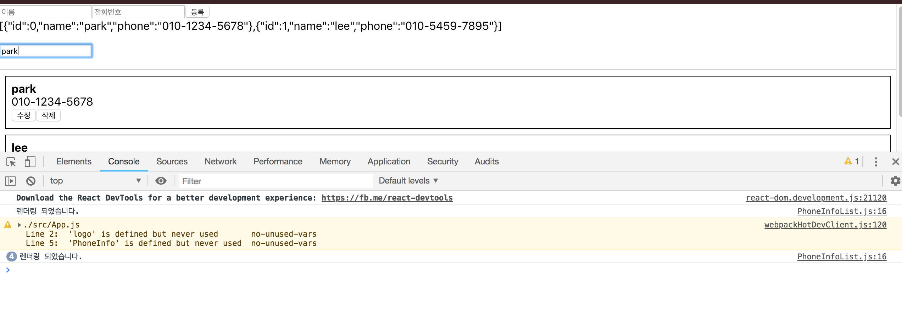

# 검색기능

## 전화번호 검색기능

**검색어를 다른 컴포넌트에게 전달하기 위해서 `state`에 `keyword`를 추가합니다.** 입력받는 검색어(`keyword`)는 바뀌므로 이벤트 핸들러도 필요합니다. 그리고 검색창까지 만들어서 `App.js`를 수정해보겠습니다.

```javascript
// App.js

import React, { Component } from 'react';
import logo from './logo.svg';
import './App.css';
import PhoneForm from './components/PhoneForm';
import PhoneInfo from './components/PhoneInfo';
import PhoneInfoList from './components/PhoneInfoList';

class App extends Component {
  id = 2
  state = {
    information: [
    {
      id: 0,
      name: 'park',
      phone: '010-1234-5678',
    },
    {
      id: 1,
      name: 'lee',
      phone: '010-5459-7895',
    }
    ],
    keyword: '',
  }

  handleChange = (e) => {
    this.setState({
      keyword: e.target.value,
    });
  }

  handleCreate = (data) => {
    const { information } = this.state;
    this.setState({
      information: information.concat({ id: this.id++, ...data })
    })
  }

  handleRemove = (id) => {
    const { information } = this.state;
    this.setState({
      information: information.filter(info => info.id !== id)
    })
  }

  handleUpdate = (id, data) => {
    const { information } = this.state;
    this.setState({
      information: information.map(info => id === info.id ? {...info, ...data} : info)
    })
  }
  
  render() {
    return (
      <div>
        <PhoneForm 
          onCreate={this.handleCreate}
        />
        <p>
          <input 
            placeholder="검색 할 이름을 입력하세요.." 
            onChange={this.handleChange}
            value={this.state.keyword}
          />
        </p>
        <hr />
        <PhoneInfoList 
          data = {this.state.information} 
          onRemove={this.handleRemove}
          onUpdate={this.handleUpdate}
        />
      </div>
    );
  }
}

export default App;
```

이제 입력받을 `keyword`를 state로 선언하고 검색창까지 만들었습니다. 하지만 이대로 사용하게 되면 `keyword`가 바뀔 때마다 rerendering 하므로 자원이 낭비됩니다. 즉, 검색창이 'park'이라고 적으면 'p', 'a', 'r', 'k'를 적을 때마다 virtual DOM이 렌더링 됩니다.



**이럴때 우리는 `LifeCycle API`를 사용할 수 있습니다. 함수 중에서 `shouldComponentUpdate`를 사용하겠습니다.**  다음으로 받아올 데이터가 현재 데이터와 같지 않다면 true를 반환하면 되고, 이때 렌더링을 하면 됩니다.

```javascript
// components/PhoneInfoList.js

import React, { Component } from 'react';
import PhoneInfo from './PhoneInfo';

class PhoneInfoList extends Component {
  static defaultProps = {
    data: [],
    onRemove: () => console.warn('onRemove not defined'),
    onUpdate: () => console.warn('onUpdate not defined'),
  }

  shouldComponentUpdate(nextProps, nextState) {
    return nextProps.data !== this.props.data;
  }

  render(){
    console.log('렌더링 되었습니다.');
    const { data, onRemove, onUpdate } = this.props;
    const list = data.map(
      info => (<PhoneInfo 
        key={info.id} 
        info={info} 
        onRemove={onRemove}
        onUpdate={onUpdate}
        />)
    );
    return(
      <div>
        {list}
      </div>
    );
  }
}

export default PhoneInfoList;
```

`data`의 변화가 없으므로(전화번호부 추가 or 제거 or 업데이트) 렌더링 하지 않습니다. **이렇게 props와 nextProps를 비교해서 데이터가 변했는지 알 수 있는 이유는 불변성을 유지하기 때문입니다.**

```javascript
const array = [1, 2, 3, 4, 5];
const newArray = array;
newArray.concat(6);

console.log(newArray);	//[1,2,3,4,5,6]
console.log(array);	//[1,2,3,4,5,6]

//대입은 값을 대입하는 것이 아닌 주소값을 대입하는 것이다.
```

이제 `App.js`에서 `array.filter`를 통해 검색기능을 구현하겠습니다.

```javascript
// App.js

import React, { Component } from 'react';
import logo from './logo.svg';
import './App.css';
import PhoneForm from './components/PhoneForm';
import PhoneInfo from './components/PhoneInfo';
import PhoneInfoList from './components/PhoneInfoList';

class App extends Component {
  id = 2
  state = {
    information: [
    {
      id: 0,
      name: 'park',
      phone: '010-1234-5678',
    },
    {
      id: 1,
      name: 'lee',
      phone: '010-5459-7895',
    }
    ],
    keyword: '',
  }

  handleChange = (e) => {
    this.setState({
      keyword: e.target.value,
    });
  }

  handleCreate = (data) => {
    const { information } = this.state;
    this.setState({
      information: information.concat({ id: this.id++, ...data })
    })
  }

  handleRemove = (id) => {
    const { information } = this.state;
    this.setState({
      information: information.filter(info => info.id !== id)
    })
  }

  handleUpdate = (id, data) => {
    const { information } = this.state;
    this.setState({
      information: information.map(info => id === info.id ? {...info, ...data} : info)
    })
  }
  
  render() {
    const filteredList = this.state.information.filter(info => info.name.indexOf(this.state.keyword) !== -1);
    return (
      <div>
        <PhoneForm 
          onCreate={this.handleCreate}
        />
        {JSON.stringify(this.state.information)}
        <p>
          <input 
            placeholder="검색 할 이름을 입력하세요.." 
            onChange={this.handleChange}
            value={this.state.keyword}
          />
        </p>
        <hr />
        <PhoneInfoList 
          data = {filteredList} 
          onRemove={this.handleRemove}
          onUpdate={this.handleUpdate}
        />
      </div>
    );
  }
}

export default App;
```

이제 검색어를 입력할때마다 `keword`가 다르므로 한글자 한글자 칠때마다 `shouldComponentUpdate`는 true를 반환하게 됩니다. 

### 더 최적화

하지만 예를들어 park을 검색한다면 'p','a','r','k'를 검색할 때, 검색결과가 모두 같아도 'park'의 `PhoneInfo`를 4번 모두 렌더링 하게됩니다. `PhoneInfo`에 가서 다음과 같은 조건으로 `shouldComponentUpdate`를 넣어줍니다.

```javascript
shouldComponentUpdate(nextProps, nextState) {
    // 수정 상태가 아니고, info 값이 같다면 리렌더링 안함
    if (!this.state.editing  
        && !nextState.editing
        && nextProps.info === this.props.info) {
      return false;
    }
    // 나머지 경우엔 리렌더링함
    return true;
  }
```

