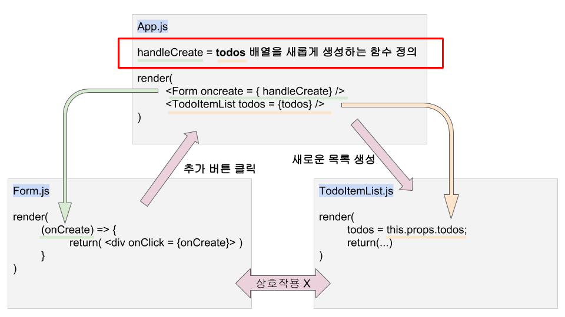
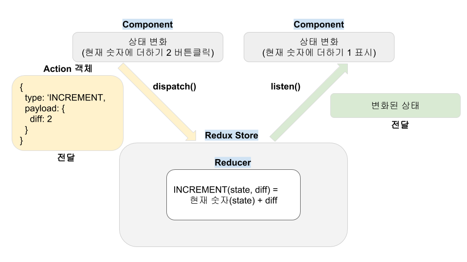

# Redux

## 컴포넌트의 상태관리, Redux가 나온 이유

**원래 컴포넌트끼리의 상호작용은 부모 컴포넌트(루트 컴포넌트)와 해야합니다.**



`Form.js`는 **비구조 할당으로 props를 받는 함수형 컴포넌트**입니다. `TodoItemList.js`는 **props.todos를 todos로 그대로 대입**시켜서 전달받은 데이터를 사용합니다. `Form.js`의 클릭버튼이 `TodoItemList.js`의 내용을 바꾸지만 이 두 컴포넌트는 직접 교류하지 않고 **`App.js`의 state를 거쳐서 props데이터를 주고 받습니다 (`Form.js`에서 state를 정의해 `TodoItemList.js`로 전달하지 않습니다).** 즉, `Form.js`에서 정적인 데이터(onCreate함수 실행 명령)를 받아서 `App.js `에서는 상태를 변화시킨 뒤 **새로운 정적인 데이터**를 만들고, `TodoItemList.js`로 전달하는거죠(props => state => props). 이는 굉장히 귀찮은 작업으로 보일수도 있습니다. 그냥 서로 참조해서 상태를 전달하면 될텐데... 하지만 그건 위 예시가 단 두개의 컴포넌트와의 상호작용이기 때문입니다. **컴포넌트의 개수가 많아지고 상호작용하는 컴포넌트가 많아지면 이를 연결시키는 작업이 굉장히 까다로워집니다.** 그렇기 때문에 부모 컴포넌트를 거쳐서 상호작용합니다. 하지만 컴포넌트의 **depth**가 깊어지면 위의 방법이 오히려 복잡해질 수 있습니다. 그래서 나온 것이 **Redux, 리덕스**입니다.


## Redux 란

**리덕스를 사용하면 상태를 컴포넌트 바깥에서 관리할 수 있습니다.** 즉, `App.js` 처럼 부모 컴포넌트를 쭉 따라올라가서 루트 컴포넌트에서 상태를 관리할 필요가 없어집니다. 상태의 변화를 받는 곳을 `리덕스 스토어(Redux Store)`라고 하고 상태의 변화를 전달받을 때, `액션(Action)`을 참조해서  `액션 객체`를 전달 받습니다. 그리고 리덕스 스토어는 이 `액션 객체`를 전달 받아서 원하는 대로 내용을 바꾸는 함수, `리듀서`로 계산합니다. 



**함수를 호출하는 컴포넌트**가 `dispatch 함수`를 통해 리덕스 스토어에게 액션객체(type과 diff를 포함)를 전달하면 **리듀서에서 정의된 로직**(해당 type 로직)에 의해 상태가 계산됩니다. 그리고 **리덕스 스토어를 listen하고 있던(구독) 컴포넌트**는 리덕스 스토어의 상태가 변화되면 `listen 함수`를 통해 변화된 상태를 가져옵니다. 이제 리덕스를 구현해보겠습니다.

## Redux 구현

리액트가 아닌 일반 자바스크립트에서 리덕스를 구현해보겠습니다. https://jsbin.com/?html,output 을 통해 쉽게 테스트해볼 수 있습니다. 더하기 버튼을 누르면 숫자가 올라가고 빼기 버튼을 누르면 숫자가 내려가는 페이지를 작성해보겠습니다.

```html
<!DOCTYPE html>
<html>
<head>
  <meta charset="utf-8">
  <meta name="viewport" content="width=device-width">
  <title>리덕스 테스트</title>
</head>
<body>
  <h1 id="number">0</h1>
  <button id="increment">+10</button>
  <button id="decrement">-1</button>
  <script src="https://cdnjs.cloudflare.com/ajax/libs/redux/3.6.0/redux.js"></script>
</body>
</html>                                                            
```

이제 숫자와 버튼이 생성되었습니다. 자바스크립트 코드를 작성합니다.

```javascript
// 각 element의 reference
const elNumber = document.getElementById('number');
const btnIncrement = document.getElementById('increment');
const btnDecrement = document.getElementById('decrement');

// action type
const INCREMENT = 'INCREMENT';
const DECREMENT = 'DECREMENT';

// action 객체 생성 함수
const increment = (diff) => ({ type: INCREMENT, diff: diff });
const decrement = () => ({ type: DECREMENT });

// initialize state
const initialState = {
  number: 0,
}

// Reducer (state, action)
const counter = (state = initialState, action) => {
  console.log(action);
  switch(action.type){
    case INCREMENT:
      // 불변성 유지 (state.number에서 변화된 값을 새로운 number에 넣음)
      return {
        number: state.number + action.diff
      };
    case DECREMENT:
      return {
        number: state.number - 1
      };
    default:
      return state;
  }
}

// Redux Store(스토어 생성 Redux.createStore)
const { createStore } = Redux;
// 리덕스 스토어에 리듀서 장착
const store = createStore(counter);

// listner 함수 (상태가 바뀔 때마다 실행)
const render = () => {
  elNumber.innerText = store.getState().number;
  console.log('실행');
}

// 리덕스 스토어 구독, 변화가 생길경우 render함수 실행
store.subscribe(render);

// 초기 렌더링
render();

// 버튼 이벤트
btnIncrement.addEventListener('click', () => {
  store.dispatch(increment(10));
})

btnDecrement.addEventListener('click', () => {
  store.dispatch(decrement());
})
```

이제 `+10`을 누르면 10이 늘어나고 `-1`을 누르면 1씩 줄어듭니다. 

### 주의사항

* 리덕스 역시 불변성을 유지해야합니다.
* 리듀서는 random 함수, new Date 함수와 같은 순수하지 않은 함수(같은 input값에 다른 결과를 반환하는 함수)를 포함시키면 안됩니다.


