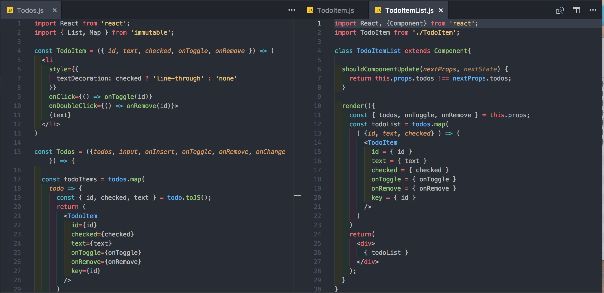
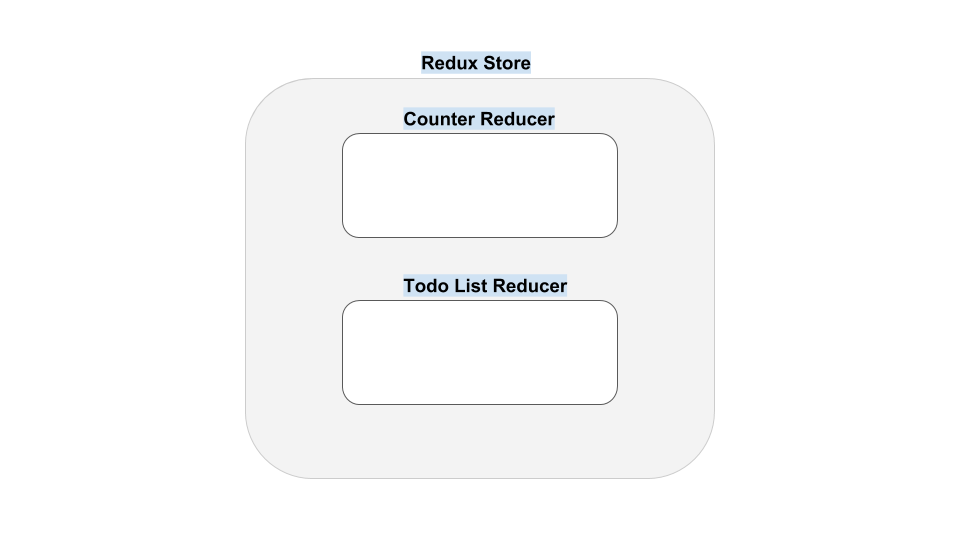

# Begin Redux

*https://velopert.com/3533을 참조하였습니다.*

## 컴포넌트 구성

- `Todos.js`, `Counter.js` : 할일목록과 카운터를 보여주는 컴포넌트
- `AppTemplate.js` : 위 두개의 컴포넌트를 반으로 나눠 한 화면에 표시해주는 컴포넌트
- `App.js`
- `Root.js` : **최상위 컴포넌트**

* `containers/CounterContainer.js` : 리덕스와 해당 컴포넌트를 연동해 줄 컴포넌트. 이러한 컴포넌트를 `컨테이너 컴포넌트`라고 합니다. 반대로 데이터를 받아서 렌더링만 수행하는 컴포넌트는 `프레젠테이셔널 컴포넌트`라고 합니다.
* `containers/TodosContainer.js` : 리덕스와 해당 컴포넌트를 연동해 줄 컴포넌트.

* `store/modules/..` : 스토어에 정의되는 리듀서를 모아놓는 곳. **이를 module이라고 하고 기능별로 분류해서 정리합니다.**
* `store/configure.js` : 스토어에 정의되는 리듀서를 모두 모듈화해서 내보내는 역할. 이는 **서버사이드에서 렌더링할 때**, 스토어를 생성하는 함수를 이 파일을 이용해서 수행합니다.
* `store/index.js` : 실제 Redux store입니다. 
* `store/actionCreators.js` : 스토어, 액션생성함수를 불러와서 dispatch, listen함수와 바인딩합니다. 


## 카운터

### Presentational Component (Counter.js)

버튼을 클릭하면 숫자가 올라가는 프레젠테이셔널 컴포넌트입니다. 

```javascript
// components/Counter.js
import React from 'react';

const Counter = ({
  number,
  onIncrement,
  onDecrement
}) => {
  return (
    <div>
      <h1>{number}</h1>
      <button onClick={onIncrement}>증가 (+)</button>
      <button onClick={onDecrement}>감소 (-)</button>
    </div>
  );
};

Counter.defaultProps = {
  number: 0
}

export default Counter;
```

이 컴포넌트는 `number`와 `onIncrement`, `onDecrement`를 props로 받아옵니다.

### Module (counter.js)

counter의 리듀서를 작성합니다.

```javascript
// store/modules/counter.js

// 액션타입
const INCREMENT = 'counter/INCREMENT';
const DECREMENT = 'counter/DECREMENT';

// 액션객체 생성함수
export const increment = () => ({ type: INCREMENT });
export const decrement = () => ({ type: DECREMENT });

// initialize
const initialState = {
  number: 0,
}

// 리듀서 만들기
export default function reducer(state = initialState, action){
  switch(action.type){
    case INCREMENT:
      return { number: state.number + 1 };
    case DECREMENT:
      return { number: state.number - 1 };
    default:
      return state;
  }
}
```

`액션타입을 정의`하고, `액션객체를 생성`했으며, `액션객체에 따른 동작을 정의하는 리듀서`까지 module에 만들었습니다. 이렇게 **module하나에 이 모든 것을 한번에 정리하는 것을 `Ducks 구조`라고 합니다.** 액션 하나가 추가되면 여러파일을 수정할 필요가 없이 하나의 파일에서 정리할 수 있습니다. 액션타입을 참조할 때는 도메인 형식으로 export하므로 다른 모듈에서도 같은 액션타입을 사용할 수 있습니다. 

조금더 편하게 액션객체 생성함수를 작성하기 위해 `createAction` 함수와 `handleActions` 함수를 사용해보겠습니다.

```javascript
// store/modules/counter.js
// (Ducks 구조)

// 액션생성 함수 정의
import { createAction, handleActions } from 'redux-actions';

// 액션타입
const INCREMENT = 'counter/INCREMENT';
const DECREMENT = 'counter/DECREMENT';

// 액션객체 생성함수
export const increment = createAction(INCREMENT);
export const decrement = createAction(DECREMENT);

// initialize
const initialState = {
  number: 0,
}

// 리듀서 만들기
export default handleActions({
  [INCREMENT]: (state, action) => {
    return { number: state.number + 1 };
  },
  //비구조화 할당으로 정의하는 방법
  [DECREMENT]: ({ number }) => ({ number: number - 1})
}, initialState);
```

### (참고) redux-actions 라이브러리 사용

`redux-actions`는 액션 생성자를 생성하고 각 액션객체를 받았을 때 실행되는 함수를 정의할 때 편하게 사용할 수 있습니다.

* `createAction` : 액션 생성자를 항상 다음과 같이 만들었죠.

* ```javascript
  export const increment = () => ({ type: INCREMENT });
  
  // index가 필요한 경우(몇번째 객체에 해당하는지 알 필요가 있을 때)에는 다음과 같이 만들었다.
  export const increment = (index) => ({ 
      type: DECREMENT, 
      index
  });
  ```

  이는 액션객체를 만들 때마다 복잡하고 속성종류가 많아질 때마다 더 번거로워지죠. 그래서 `createAction`을 사용합니다.

  ```javascript
  export const increment = createAction(INCREMENT);
  ```

  **`createAction`을 사용하면 전달하고자 하는 값(`diff`)을 payload 형태로 여러개 받을 수 있습니다.** 예를 들어보겠습니다.

  ```javascript
  const ANYVALUE = 'ANYVALUE'
  
  export const anyValue = createAction(ANYVALUE);
  
  anyValue({ first: 'apple', second: 'banana'});
  //{ type: 'ANYVALUE', payload: { first: 'apple', second: 'banana' } }
  ```

  `createAction` 함수는 총 3개의 인자를 받습니다. 첫번째는 `액션명`, 두번째는 `payload`, 세번째는 `meta` 입니다. 세번째 인자를 적지 않는다면 생략합니다.

* `handleActions` : 액션객체에 따라 실행할 함수를 정의할 때 `switch~case`문을 사용했습니다. **이 경우 `case`안에서  `const`와 `let`으로 변수를 선언해 사용할 경우 `scope(탐색범위)`가 리듀서이므로 변수가 중복되면 에러가 발생합니다.** `handleActions`은 이 문제를 해결해줍니다.

### Reducer combine (index.js)

이제 리듀서를 리덕스에 포함시켜야 합니다.

```javascript
// store/modules/index.js

import { combineReducers } from 'redux';
import counter from './counter'

export default combineReducers({
  counter,
})
```

`combineReducers`함수로 리듀서를 합쳤습니다. 이렇게 만들어진 리듀서를 **루트 리듀서**라고 합니다.

### Configure (configure.js)

이제 리듀서를 스토어에 연결해서 스토어를 새로 만듭니다.

```javascript
// store/configure.js

import { createStore } from 'redux';
import modules from './modules';

const configure = () => {
  const store = createStore(moduels);
  return store;
}

export default configure;
```

리덕스를 더 편하게 관리하고 사용하기 위한 크롬 `redux-devtools`라는 것이 있습니다. 이 툴을 사용하기 위해서는 크롬 웹스토어에서 익스텐션을 설치하고 다음과 같이 configure을 바꿔줍니다.

```javascript
// store/configure.js

import { createStore } from 'redux';
import modules from './modules';

const configure = () => {
  // const store = createStore(modules);
  const devTools = window.__REDUX_DEVTOOLS_EXTENSION__ && window.__REDUX_DEVTOOLS_EXTENSION__()
  const store = createStore(modules, devTools);

  return store;
}

export default configure;
```

### Export Redux Store (index.js)

이제 createStore 함수가 포함된 configure을 실행하고 내보내는 작업을 합니다.

```javascript
// store/index.js

import configure from './configure';
export default configure();
```

이제 리듀서를 정의하고 리덕스 스토어까지 생성하는데 성공했습니다. 이제 실제 리액트 앱에 리덕스를 적용시켜야 합니다. 각 컴포넌트가 이 리덕스 스토어를 구독(listen)하고 데이터를 보내도록(dispatch) 해야합니다.

---

**리덕스와 리액트는 컨테이너 컴포넌트를 통해 연결시킵니다.** 그 전에 루트 컴포넌트(Root.js)로 가서 리덕스를 사용하는 것을 명시해줘야합니다.

```javascript
// Root.js

import React from 'react';
import { Provider } from 'react-redux';
import store from './store';
import App from './components/App';

const Root = () => {
  return (
    <Provider store = { store }>
      <App />
    </Provider>
  );
};

export default Root;
```

`Provider`는 리액트에 리덕스를 적용시키는 역할을 합니다.

### Container Component(CounterContainer.js)

**컨테이너 컴포넌트는 리덕스와 리액트를 연결하는 창구입니다.** 그래서 컨테이너 컴포넌트에서 **`connect-dispatch`를 통해 리듀서를 가져오고** 그 **리듀서를 메서드로 정의**한 뒤, **프레젠테이셔널 컴포넌트에서 사용**합니다. `App.js`에서는 이 컨테이너 컴포넌트만 렌더링하면 되는 것입니다.

**이제 리덕스 스토어에 있는 리듀서를 props로 받아와서 `dispatch`로 presentational 컴포넌트와 연결하겠습니다(바인딩).**

```javascript
import React, { Component } from 'react';
import Counter from 'components/Counter';
import { connect } from 'react-redux';
import * as counterActions from 'store/modules/counter';

class CounterContainer extends Component {
  handleIncrement = () => {
    this.props.increment();
  }
  handleDecrement = () => {
    this.props.decrement();
  }

  render(){
    const { handleIncrement, handleDecrement } = this;
    const { number } = this.props;
    return(
      <Counter 
        onIncrement={handleIncrement}
        onDecrement={handleDecrement}
        number={number}
      />
    );
  }
}

// // props 값으로 상태 정의
// const mapStateToProps = (state) => ({
//   number: state.counter.number
// });

// // props 값으로 액션 함수 바인딩
// const mapDispatchToProps = (dispatch) => ({
//   increment: () => dispatch(counterActions.increment()),
//   decrement: () => dispatch(counterActions.decrement()),
// })

// // connect로 리액트, 리덕스 연동
// export default connect(mapStateToProps, mapDispatchToProps)(CounterContainer);

// 위의 세단계는 다음과 같이 깔끔하게 정리 가능
export default connect(
  (state) => ({
    number: state.counter.number
  }),
  (dispatch) => ({
    increment: () => dispatch(counterActions.increment()),
    decrement: () => dispatch(counterActions.decrement()),
  })
)(CounterContainer)
```

### App.js

`Counter 컴포넌트`와 `App.js`사이에 `Container`가 생겼으므로 `App.js`을 다음과 같이 변경합니다.

```javascript
// components/App.js

import React, { Component } from 'react';
import AppTemplate from './AppTemplate';
//import Counter from './Counter';
import Todos from './Todos';
import CounterContainer from 'containers/CounterContainer';

class App extends Component {
  render() {
    return (
      <AppTemplate
        counter={<CounterContainer />}
        todos={<Todos />}
      />
    );
  }
}

export default App;
```

이제 버튼을 누르면 숫자가 바뀌는 것을 확인할 수 있습니다.


## Todo List

이번엔 Todo List 어플리케이션을 리덕스에 적용시켜보겠습니다.

### Presentational Component (Todo.js)

input 값을 넣고 추가버튼을 누르면 새로운 배열 state를 생성하고 렌더링합니다. item 하나당 삭제가 가능하고 체크리스트 표시도 가능합니다. 먼저 view단의 컴포넌트를 작성합니다.

```javascript
// components/Todos.js

import React from 'react';
import { List, Map } from 'immutable';

const TodoItem = ({ id, text, checked, onToggle, onRemove }) => (
  <li 
    style={{
      textDecoration: checked ? 'line-through' : 'none'
    }} 
    onClick={() => onToggle(id)}
    onDoubleClick={() => onRemove(id)}>
    {text}
  </li>
)

const Todos = ({todos, input, onInsert, onToggle, onRemove, onChange }) => {
  
  const todoItems = todos.map(
    todo => {
      const { id, checked, text } = todo.toJS();
      return (
        <TodoItem
          id={id}
          checked={checked}
          text={text}
          onToggle={onToggle}
          onRemove={onRemove}
          key={id}
        />
      )
    }
  )
  return (
    <div>
      <h2>오늘 할 일</h2>
      <input value={input} onChange={onChange}/>
      <button onClick={onInsert}>추가</button>
      <ul>
        { todoItems }
      </ul>
    </div>
  );
};

Todos.defaultProps = {
  todos: List([
    Map({
      id: 0,
      text: '걷기',
      checked: false
    }),
    Map({
      id: 1,
      text: '코딩하기',
      checked: true
    })
  ]),
  input: ''
};

export default Todos;
```

리덕스 없이 만들었던 Todo list와 달리 하나의 컴포넌트에 두가지 기능을 넣었습니다.



### Module (todo.js)

Todo-list의 리듀서를 작성합니다.

```javascript
// store/modules/todo.js

import { createAction, handleActions } from 'redux-actions';
import { List } from 'immutable';

// 액션 정의
const CHANGE_INPUT = 'todo/CHANGE_INTPUT';
const INSERT = 'todo/INSERT';
const TOGGLE = 'todo/TOGGLE';
const REMOVE = 'todo/REMOVE';

// 액션객체 생성 함수
export const changeInput = createAction(CHANGE_INPUT, value => value);
export const insert = createAction(INSERT, text => text);
export const toggle = createAction(TOGGLE, id => id);
export const removet = createAction(REMOVE, id => id);

let id = 0;

const initialState = Map({
  input: '',
  todos: List(),
});

export default handleActions({
  [CHANGE_INPUT]: (state, action) => state.set('input', action.payload),
  // 글 추가, payload를 text로 지정
  [INSERT]: (state, { payload: text}) => {
    const item = Map({ id: id++, checked: false, text });
    return state.update('todos', todos => todos.push(item));
  },
  // 체크표시, id값을 찾아서 checked값 반전
  [TOGGLE]: (state, { payload: id }) => {
    const index = state.get('todos').findIndex(item => item.get('id') === id);
    return state.updateIn(['todos', index, 'checked'], checked => !checked);
  },
  // 삭제, id값을 찾아서 삭제
  [REMOVE]: (state, { payload: id }) => {
    const index = state.get('todos').findIndex(item => item.get('id') === id);
    return state.deleteIn(['todos', index]);
  }
}, initialState);
```

**여기서 사용된 `state.update`와 `state.updateIn`은 `immutable.js`입니다.** 새로운 list가 생성되면 `concat`와 같은 함수를 사용하면서 불변성을 유지했습니다. 하지만 `immutable.js`를 이용하면 더 쉽게 동작을 정의할 수 있습니다.

```javascript
//immutable.js

let nextState = null;
// input 값을 바꾼 새 객체를 만들기
nextState = state.set('input', '새로운 값');
// todos 에 항목 추가하기
nextState = state.update('todos', todos => todos.push(Map({ id:2, text: '새로운거', checked: false })));
// 0번째 항목 checked 값 반전하기
nextState = state.updateIn(['todos', 0, 'checked'], checked => !checked);
```

### Reducer combine (index.js)

리듀서를 연결합니다.

```javascript
// store/modules/index.js

import { combineReducers } from 'redux';
import counter from './counter'
import todo from './todo'

export default combineReducers({
  counter,
  todo,
})
```

이제 다음과 같이 리덕스 스토어가 만들어집니다.



### Configure (configure.js)

리듀서를 내보내기 위해서 옵션을 걸어주고 정의한뒤 스토어를 만듭니다. `index.js`로 통합시켰고, 위에서 `Counter` 작업에서 정의를 해뒀으니 따로 바꿀 것은 없습니다.

### Export Redux Store (index.js)

리듀서와 함께 스토어를 내보냅니다.. 역시 `Counter` 작업에서 실행했으므로 따로 바꿀 것이 없습니다.

---

**기존에 만들어 둔 리덕스 스토어에 리듀서를 연결하고 스토어를 생성했습니다.** 이제 리액트 앱에 리덕스를 연결하겠습니다. `Root.js`에서 `Provide`를 통해 스토어 앱에 적용시켰습니다. 이는 `Counter` 작업시에 해뒀기 때문에 따로 할 필요가 없습니다. 

### Container Component(TodosContainer.js)

**이제 리덕스 스토어에 있는 리듀서를 props로 받아와서 `dispatch`로 presentational 컴포넌트와 연결하겠습니다(바인딩).** 

```javascript
import React, { Component } from 'react';
import Todos from 'components/Todos';
import { connect } from 'react-redux';
import { bindActionCreators } from 'redux';
import * as todoActions from 'store/modules/todo';

class TodosContainer extends Component {
  handleChange = (e) => {
    // 인풋 값 변경
    const { todoActions } = this.props;
    todoActions.changeInput(e.target.value);
  }
  handleInsert = () => {
    // 목록추가
    const { input, todoActions } = this.props;
    todoActions.insert(input);
    // input값 다시 빈칸으로
    todoActions.changeInput('');
  }
  handleToggle = (id) => {
    // 체크
    const { todoActions } = this.props;
    todoActions.toggle(id);
  }
  handleRemove = (id) => {
    // 삭제
    const { todoActions } = this.props;
    todoActions.remove(id);
  }

  render(){
    const { handleChange, handleInsert, handleToggle, handleRemove } = this;
    const { input, todos } = this.props;
  
    return(
      <Todos
        input={input}
        todos={todos}
        onChange={handleChange}
        onInsert={handleInsert}
        onToggle={handleToggle}
        onRemove={handleRemove}
      />
    );
  }
}

// 액션함수 바인딩
export default connect(
  ({ todo }) => ({
    input: todo.get('input'),
    todos: todo.get('todos')
  }),
  (dispatch) => ({
    todoActions: bindActionCreators(todoActions, dispatch)
  })
)(TodosContainer);
```

### App.js

이제 마지막으로 Root 컴포넌트 바로 아래에 있는 `App.js`와 **presentational 컴포넌트** 사이에 **container 컴포넌트**가 생겼으므로 다음과 같이 변경합니다.

```0000javascript
// App.js

import React, { Component } from 'react';
import AppTemplate from './AppTemplate';
// import Counter from './Counter';
// import Todos from './Todos';
import CounterContainer from 'containers/CounterContainer';
import TodosContainer from 'containers/TodosContainer';

class App extends Component {
  render() {
    return (
      <AppTemplate
        counter={<CounterContainer />}
        todos={<TodosContainer />}
      />
    );
  }
}

export default App;
```


## Advanced

위에서는 container 컴포넌트 안에서 액션함수 바인딩, 리액트 리덕스 연동을 하나의 파일에서 진행했습니다.

```javascript
// containers/CounterContainer.js
//...

// props 값으로 상태 정의
const mapStateToProps = (state) => ({
  number: state.counter.number
});

//props 값으로 액션 함수 바인딩
const mapDispatchToProps = (dispatch) => ({
  increment: () => dispatch(counterActions.increment()),
  decrement: () => dispatch(counterActions.decrement()),
})

// connect로 리액트, 리덕스 연동
export default connect(mapStateToProps, mapDispatchToProps)(CounterContainer);
```

그리고 이 부분을 다음과 같이 간편하게 표현했습니다.

```javascript
// containers/CounterContainer.js
//...

export default connect(
  (state) => ({
    number: state.counter.number
  }),
  (dispatch) => ({
    increment: () => dispatch(counterActions.increment()),
    decrement: () => dispatch(counterActions.decrement()),
  })
)(CounterContainer)
```

이렇게 컨테이너 컴포넌트마다 액션함수를 일일이 바인딩했습니다. 하지만 **이렇게 사용하면 다른 컴포넌트를 만들어서 같은 액션함수를 사용할 경우, 사용할 때마다 일일이 바인딩을 시켜주기엔 불편함이 많습니다.** 그래서 액션함수 바인딩은 외부에서 따로 작업합니다. `bindActionCreators`함수로  `actionCreators.js` 파일에 정리합니다.

```javascript
// store/actionCreators.js

import { bindActionCreators } from 'redux';
import * as couterActions from './modules/counter';
import * as todoActions from './modules/todo';

import store from './index';

const { dispatch } = store;

export const CounterActions = bindActionCreators(counterActions, dispatch);
export const TodoActions = bindActionCreators(todoActions, dispatch);
```

그리고 `CounterContainer.js`와 `TodosContainer.js`에서 바인딩하는 부분을 빼줍니다. 그리고 `actionCreators`에서 **export한 내용을 그대로 사용합니다.**

```javascript
// containers/CounterContainer.js

import React, { Component } from 'react';
import Counter from 'components/Counter';
import { connect } from 'react-redux';
import { CounterActions } from 'store/actionCreators';

class CounterContainer extends Component {
  handleIncrement = () => {
    CounterActions.increment();
  }
  handleDecrement = () => {
    CounterActions.decrement();
  }

  render(){
    const { handleIncrement, handleDecrement } = this;
    const { number } = this.props;
    return(
      <Counter 
        onIncrement={handleIncrement}
        onDecrement={handleDecrement}
        number={number}
      />
    );
  }
}

// // props 값으로 상태 정의
// const mapStateToProps = (state) => ({
//   number: state.counter.number
// });

// // props 값으로 액션 함수 바인딩
// const mapDispatchToProps = (dispatch) => ({
//   increment: () => dispatch(counterActions.increment()),
//   decrement: () => dispatch(counterActions.decrement()),
// })

// // connect로 리액트, 리덕스 연동
// export default connect(mapStateToProps, mapDispatchToProps)(CounterContainer);

// 위의 세단계는 다음과 같이 깔끔하게 정리 가능
export default connect(
  (state) => ({
    number: state.counter.number
  }),
)(CounterContainer)
```

```javascript
// containers/TodosContainer.js

import React, { Component } from 'react';
import Todos from 'components/Todos';
import { connect } from 'react-redux';
import { TodoActions } from 'store/actionCreators';


class TodosContainer extends Component {
  handleChange = (e) => {
    // 인풋 값 변경
    TodoActions.changeInput(e.target.value);
  }
  handleInsert = () => {
    // 목록추가
    const { input } = this.props;
    TodoActions.insert(input);
    // input값 다시 빈칸으로
    TodoActions.changeInput('');
  }
  handleToggle = (id) => {
    // 체크
    TodoActions.toggle(id);
  }
  handleRemove = (id) => {
    // 삭제
    TodoActions.remove(id);
  }

  render(){
    const { handleChange, handleInsert, handleToggle, handleRemove } = this;
    const { input, todos } = this.props;
  
    return(
      <Todos
        input={input}
        todos={todos}
        onChange={handleChange}
        onInsert={handleInsert}
        onToggle={handleToggle}
        onRemove={handleRemove}
      />
    );
  }
}

// 액션함수 바인딩
export default connect(
  ({ todo }) => ({
    input: todo.get('input'),
    todos: todo.get('todos')
  }),
)(TodosContainer);
```

**이렇게 스토어 인스턴스를 모듈화하여 바깥에서 사용할 수 있으나 컴포넌트의 개수가 많아져서 리액트 앱을 분리해야할 경우에는 사용하기 힘들 수 있습니다.**

