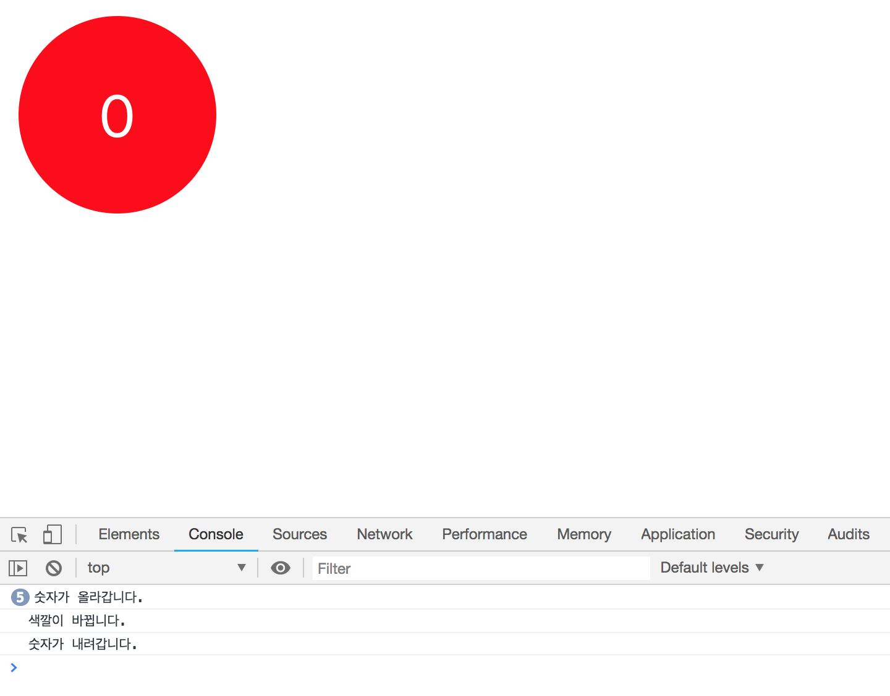

# Bubble Counter 만들기

이 앱은 `추가버튼`을 누르면 방울이 생기고 `제거버튼`을 누르면 방울이 없어집니다. 그리고 방울을 `클릭`하면 방울 안에 있는 숫자가 하나씩 올라가고 `오른쪽 마우스를 클릭`하면 숫자가 하나씩 내려갑니다. 먼저 리액트 환경을 설치합니다.

```bash
$ create-react-app bubble-counter
```

그리고 스토어를 더 편하게 사용하기 위해서 작업폴더 내에서 `react-redux 라이브러리`를 설치합니다. 스토어를 props로 받아오지 않아도 편하게 사용할 수 있습니다.

```bash
$ yarn add redux react-redux
```


큰 틀의 개발흐름은 다음과 같습니다.

* 기본적인 텍스트가 리액트 앱에서 띄워지는지 테스트
* 방울 **한개**를 만들고 클릭하면 숫자가 올라가고, 오른쪽 마우스를 클릭하면 내려가도록 구현
* `생성` `제거` 버튼
* 방울 여러개를 렌더링


## 테스트

리액트 환경을 설치한 뒤, 대부분의 파일을 지우고 다시 생성합니다. `components/App.js`를 만들고 화면에 잘 표시되는지 확인합니다.

```javascript
// components/App.js

import React, { Component } from 'react';

class App extends Component {
  render() {
    return(
      <div>
        Hello
      </div>
    );
  }
}

export default App;
```

`App.js`을 reactDOM에 `src/index.js`도 수정합니다.

```javascript
// index.js

import React from 'react';
import ReactDOM from 'react-dom';
import './index.css';
import App from './components/App';

ReactDOM.render(
  <App />, document.getElementById('root')
);
```


## 방울 한개 만들기

Presentational 컴포넌트는 `components` 폴더에 정리합니다. **`더하기`, `빼기`, `숫자`, `색상변경 함수`, `색상값`을 받아서 각 이벤트에 달아줍니다.**

```javascript
// component/Counter.js

import React from 'react';
import PropTypes from 'prop-types';
import './Counter.css';

const Counter = ({ number, color, onIncrement, onDecrement, onSetColor }) => {
  return (
    <div
      className="Counter"
      // 왼쪽클릭
      onClick={onIncrement}
      // 오른쪽클릭시 나오는 메뉴
      onContextMenu={
        (e) => { 
          e.preventDefault(); // 그 메뉴를 없애주는 함수
          onDecrement();
      }
      }
      onDoubleClick={onSetColor}
      style={{backgroundColor: color}}>
    {number}
    </div>
  );
};

// 타입설정
Counter.propTypes = {
  number: PropTypes.number,
  color: PropTypes.string,
  onIncrement: PropTypes.func,
  onDecrement: PropTypes.func,
  onSetColor: PropTypes.func
};

// 초기값 설정
Counter.defaultProps = {
  number: 0,
  color: 'red',
  onIncrement: () => console.log('숫자가 올라갑니다.'),
  onDecrement: () => console.log('숫자가 내려갑니다.'),
  onSetColor: () => console.log('색깔이 바뀝니다.'),
}

export default Counter;
```

`App.js`에 `Counter.js`를 연결합니다.

```javascript
// App.js
//...
  render() {
    return(
      <div>
        <Counter />
      </div>
    );
//...
```

이제 앱에서 뜨는 숫자(<div> 빨간줄)를 `클릭`하거나 `더블클릭`, `오른쪽 마우스 버튼`을 누르면 콘솔에 해당 텍스트가 뜹니다. 이제 **<div>줄을 방울로 만들어보겠습니다.**

```css
/* Counter.css */
.Counter {
  /* 레이아웃 */
  width: 10rem;
  height: 10rem;
  display: flex;
  align-items: center;
  justify-content: center;
  margin: 1rem;

   /* 색상 */
  color: white;

  /* 폰트 */
  font-size: 3rem;

  /* 기타 */
  border-radius: 100%;
  cursor: pointer;
  user-select: none;
  transition: background-color 0.75s;
}
```



이제 프레젠테이셔널 컴포넌트는 모두 완성됐습니다. 

## 액션타입 정의하기

**컨테이너 컴포넌트를 만들기 전에 연결시킬 `리덕스 스토어`와 포함된 `리듀서`를 만들어야 합니다. 리듀서를 만드려면 `액션타입`을 정의하고 `액션생성 함수`를 만들어야합니다.** 액션타입과 액션 생성 함수는 컨테이너 컴포넌트(modules)에 정의하지만 나중을 생각해서 모듈화합니다.

```javascript
// actions/ActionTypes.js

export const INCREMENT = 'INCREMENT';
export const DECREMENT = 'DECREMENT';
export const SET_COLOR = 'SET_COLOR';
```

```javascript
// actions/index.js

import * as types from './ActionTypes';

// payload로 다양한 값을 받아올 필요가 없으므로 createAction을 사용하지 않음
export const increment = () => ({ type: types.INCREMENT });
export const decrement = () => ({ type: types.DECREMENT });
export const setColor = (color) => ({ 
  type: types.SET_COLOR,
  color
});
```

액션타입과 액션객체 생성함수를 모두 정의했으니 이제 리듀서를 만듭니다.

## 리듀서 만들기

```javascript
// reducers/index.js

import * as types from '../actions/ActionTypes'

const initialState = {
  number: 0,
  color: 'black',
}

// 리듀서 함수
function counter(state = initialState, action) {
  switch (action.type) {
    case types.INCREMENT:
      return {
        ...state,
        number: state.number + 1
      };
    case types.DECREMENT:
      return {
        ...state,
        number: state.number - 1
      };
    case types.SET_COLOR:
      return {
        ...state,
        color: action.color
      };
    default:
      return state;
  }
};

export default counter;
```

각 액션타입에 따라서 리듀서 함수를 만들었습니다. 이제 이 리듀서가 들어갈 스토어를 만들겠습니다.

## 스토어 만들기

리듀서가 하나밖에 없으므로 바로 `src/index.js`에서 스토어를 만들겠습니다. 

```javascript
// src/index.js

import React from 'react';
import ReactDOM from 'react-dom';
import './index.css';
import App from './components/App';

// 리덕스스토어 연결
import { createStore } from 'redux';
import reducers from './reducers'

// 스토어 생성
const store = createStore(reducers);

ReactDOM.render(
  <App />, document.getElementById('root')
);
```

간단하게 리듀서를 스토어에 포함시켜서 스토어를 생성했습니다. 이제 리액트 앱에 리덕스를 연결하겠습니다.

## 리액트-리덕스 연결

**리액트 앱에 리덕스를 연결하기 위해서 `src/index.js`파일에 `react-redux`에서 제공해주는 `<Provider>` 컴포넌트를 이용하면 됩니다.**

```javascript
import React from 'react';
import ReactDOM from 'react-dom';
import './index.css';
import App from './components/App';

// 리덕스스토어 연결
import { createStore } from 'redux';
import reducers from './reducers'

// 리액트-리덕스 연결
import { Provider } from 'react-redux';

// 스토어 생성
const store = createStore(reducers);

ReactDOM.render(
  <Provider store = {store}>
    <App />
  </Provider>,
  document.getElementById('root')
);
```

이제 모든 준비가 끝났습니다. 마지막으로 컨테이너 컴포넌트를 만들겠습니다.

## 색깔 정의

**컨테이너 컴포넌트를 만들기 전에, `더블클릭`으로 color state가 바뀌는 함수는 리덕스 원칙에 의해 순수함수여야 합니다.** 즉 랜덤으로 색이 바뀌고자 한다면 리덕스 안에서 랜덤함수를 사용할 수 없습니다. 즉, 색을 랜덤으로 반환하는 파일을 따로 만들어야 합니다.

```javascript
// utils/index.js

// 무작위 색상 반환
export function getRandomColor() {
  const colors = [
      '#495057',
      '#f03e3e',
      '#d6336c',
      '#ae3ec9',
      '#7048e8',
      '#4263eb',
      '#1c7cd6',
      '#1098ad',
      '#0ca678',
      '#37b24d',
      '#74b816',
      '#f59f00',
      '#f76707'
  ];

  // 0 부터 12까지 랜덤 숫자
  const random = Math.floor(Math.random() * 13);

  // 랜덤 색상 반환
  return colors[random];
}
```

## Container Component

**리덕스 스토어에 있는 리듀서 함수를 props로 받아와서 presentational 컴포넌트와 바인딩합니다.**

```javascript
// containers/CounterContainer.js

import Counter from '../components/Counter';
import * as actions from '../actions';
import { connect } from 'react-redux';

// store 내부에 있는 state 값을 props로 받아온다
const mapStateToProps = (state) => ({
  color: state.color,
  number: state.number,
});

// store 내부에 있는 리듀서를 props로 받아온다
const mapDispatchToProps = (dispatch) => ({
  onIncrement: () => dispatch(actions.increment()),
  onDecrement: () => dispatch(actions.decrement()),
  onSetColor: () => {
    const color = getRandomColor();
    dispatch(actions.setColor(color));
  }
});

// connect로 전달
const CounterContainer = connect(mapStateToProps, mapDispatchToProps)(Counter);

export default CounterContainer;
```

* store에 있는 state를 props로 받아오는 함수를 만듦.
* store에 있는 리듀서를 props로 받아오는 함수를 만듦.
* **위의 두 함수를 `react-redux` 라이브러리의 connect 함수로 presentational 컴포넌트와 연결.**

이제 Couter 프레젠테이셔널 컴포넌트와 `App.js` 사이에 컨터이너 컴포넌트가 생겼으므로 `App.js`를 다음과 같이 바꿉니다.

```javascript
// components/App.js

import React, { Component } from 'react';
import Counter from './Counter';
import CounterContainer from '../containers/CounterContainer';

class App extends Component {
  render() {
    return(
      <div>
        <CounterContainer />
      </div>
    );
  }
}

export default App;
```

## 리듀서 나누기

숫자 더하기, 빼기, 색 바꾸기 모두 하나의 리듀서에 정의되어 있습니다. 이를 나눈다음 `combineReducers`로 합쳐보겠습니다.

### 색변경 리듀서

```javascript
// reducers/color.js

import * as types from '../actions/ActionTypes'

const initialState = {
  color: 'black',
}

const color = (state = initialState, action) => {
  switch (action.type) {
    case types.SET_COLOR:
      return {
        color: action.color
      };
    default:
      return state;
  }
};

export default color;
```

### 숫자 더하기,빼기 리듀서

```javascript
// reducers/number.js

import * as types from '../actions/ActionTypes'

const initialState = {
  number: 0,
};

const number = (state = initialState, action) => {
  switch (action.type) {
    case types.INCREMENT:
      return {
        number: state.number + 1
      };
    case types.DECREMENT:
      return {
        number: state.number - 1
      };
    default:
      return state;
  }
};

export default number;
```

### 합치기

```javascript
// reducers/index.js

import number from './number';
import color from './color';

import { combineReducers } from 'redux';

const reducers = combineReducers({
  numberData: number,
  colorData: color
});

export default reducers;
```

`combineReducers`는 객체를 반환하기 때문에 위와 같이 props를 받아왔습니다. 이제 이 리듀서를 포함하고 있는 `CounterContainer.js`에서 데이터만 조금 바꿔주면 됩니다.

```javascript
// containers/CounterContainer.js
//...
// store 내부에 있는 state 값을 props로 받아온다
const mapStateToProps = (state) => ({
  color: state.colorData.color,
  number: state.numberData.number,
});
//...
```

