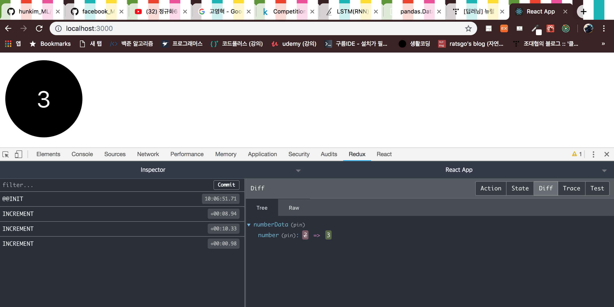

# Bubble Counter 만들기

이제 방울을 여러개 만들고 `추가`와 `삭제`버튼을 통해 방울을 추가, 제거 해보겠습니다.

## 방울 추가/삭제 액션객체 생성

`Counter.js`의 개수를 늘리기 위해서 카운터가 가지고 있는 값들을 각각의 객체로 만들어 추가, 제거하면 됩니다. 그전에 먼저 리덕스 확장프로그램을 사용하겠습니다. **액션객체와 리덕스 스토어를 쉽게 확인할 수 있는** 리덕스 확장프로그램을 크롬에 추가한 뒤, 스토어를 정의한 `src/index.js`에 다음과 같이 리덕스 확장프로그램을 추가합니다.

```javascript
// src/index.js
// ...
// 추가
// 리액트-리덕스 연결
import { Provider } from 'react-redux';

// "리덕스 확장프로그램 사용설정과 함께" 스토어 생성
const store = createStore(reducers, window.__REDUX_DEVTOOLS_EXTENSION__ && window.__REDUX_DEVTOOLS_EXTENSION__());

ReactDOM.render(
  <Provider store = {store}>
// ...
```



이제 **`추가`와 `제거`버튼을 만들어 액션객체로 전달하기 위해서 액션객체를 새롭게 정의해야합니다.** `actions/ActionTypes.js`에서 액션타입을 추가합니다.

```javascript
// actions/ActionTypes.js

export const CREATE = 'CREATE';
export const REMOVE = 'REMOVE';

export const INCREMENT = 'INCREMENT';
export const DECREMENT = 'DECREMENT';
export const SET_COLOR = 'SET_COLOR';
```

액션타입을 추가했으니 액션 생성자에도 `CREATE`와 `REMOVE`를 추가합니다.

```javascript
// actions/index.js

import * as types from './ActionTypes';

// payload로 다양한 값을 받아올 필요가 없으므로 createAction을 사용하지 않음

export const create = (color) => ({
  type: types.CREATE,
  color,
});

export const remove = () => ({
  type: types.REMOVE
});

export const increment = (index) => ({ 
  type: types.INCREMENT,
  index
});
export const decrement = (index) => ({ 
  type: types.DECREMENT,
  index
});
export const setColor = ({index, color}) => ({ 
  type: types.SET_COLOR,
  index,
  color
});
```

`숫자증가`, `숫자감소`, `색변경` 액션객체 생성자는 몇번째 방울인지 알 수 있게 `index`를 받아옵니다. 이제 **액션객체에 따라 실제로 값을 변경해주는 함수인 `리듀서`를 변경해줍니다.** 

## 방울 추가/삭제 리듀서 생성

기존에 나눠놓은 `reducer/color.js`, `reducer/number.js`를 없애고 `reducer/index.js`로 통합하겠습니다.

```javascript
// reducer/index.js

import * as types from '../actions/ActionTypes'

// 초기상태
const initialState = {
  counters: [
    {
      color: 'red',
      number: 0
    }
  ]
}

// 리듀서 함수
function counter(state = initialState, action){
  const { counters } = state;

  switch(action.type) {
    // 카운터 객체 추가
    case types.CREATE:
      return {
        counters: [
          ...counters,
          {
            color: action.color,
            number: 0
          }
        ]
      };
    // 카운터 객체 삭제 (배열형태로 쌓여있는 객체이므로 slice 이용)
    case types.REMOVE:
      return {
        counters: counters.slice(0, counters.length - 1)
      };
    // 해당 index를 가진 카운터 객체에서 숫자 증가  
    case types.INCREMENT:
      return {
        counters: [
          ...counters.slice(0, action.index),
          {
            ...counters[action.index],
            number: counters[action.index].number + 1
          },
          ...counters.slice(action.index + 1, counters.length)
        ]
      };
    case types.DECREMENT:
      return {
        counters: [
          ...counters.slice(0, action.index),
          {
            ...counters[action.index],
            number: counters[action.index].number - 1
          },
          ...counters.slice(action.index + 1, counters.length)
        ]
      };
    case types.SET_COLOR:
      return {
        counters: [
          ...counters.slice(0, action.index),
          {
            ...counters[action.index],
            color: action.color
          },
          ...counters.slice(action.index + 1, counters.length)
        ]
      };
    default:
      return state;
  }
};

export default counter;
```

방울을 생성하면 `counter` 배열에 카운터 객체가 하나씩 추가됩니다. **`CREATE` 액션객체를 보면 기존에 있던 counter 배열(`...counters`)에 새로운 객체를 추가했습니다. `INCREMENT` 액션객체를 보면 해당 index에 해당하는 카운터 배열요소를 slice로 나눈 뒤, number에 1을 더했습니다.** 스토어와 리듀서 연결은 모두 해놓은 상태이므로 이제 `CREATE`와 `REMOVE`에 해당하는 프리젠테이셔널을 만듭니다.

## Presentational Component

추가와 제거버튼을 통해 `onCreate`와 `onRemove` 함수를 props로 전달합니다.

```javascript
// components/Button.js

import React from 'react';
import PropTypes from 'prop-types';

import './Buttons.css';

const Buttons = ({ onCreate, onRemove }) => {
  return (
    <div className="Buttons">
      <div className="btn create" onClick={onCreate}>생성</div>
      <div className="btn remove" onClick={onRemove}>제거</div>
    </div>
  );
};

Buttons.propTypes = {
  onCreate: PropTypes.func,
  onRemove: PropTypes.func
};

Buttons.defaultProps = {
  onCreate: () => console.warn('onCreate not defined'),
  onRemove: () => console.warn('onRemove not defined')
};

export default Buttons;
```

```css
/* Buttons.css */

.Buttons {
  display: flex;
}

.Buttons .btn {
  flex: 1;
  display: flex;
  align-items: center;
  justify-content: center;
  height: 3rem;

  color: white;
  font-size: 1.5rem;
  cursor: pointer;
}

.Buttons .create {
  background: #37b24d;
}

.Buttons .create:hover {
  background: #40c057;
}

.Buttons .remove {
  background: #f03e3e;
}

.Buttons .remove:hover {
  background: #fa5252;
}
```

이제 카운터 객체를 포함하고 있는 배열(`counters`)을 렌더링 하는 프레젠테이셔널 컴포넌트를 작성합니다.

```javascript
// components/CounterList.js

import React from 'react';
import PropTypes from 'prop-types';
import Counter from './Counter';
import './CounterList.css';

const CounterList = ({ counters, onIncrement, onDecrement, onSetColor}) => {
  const counterList = counters.map(
    (counter, i) => (
      <Counter
        key={i}
        index={i}
        {...counter}
        onIncrement={onIncrement}
        onDecrement={onDecrement}
        onSetColor={onSetColor}
      />
    )
  );

  return (
    <div className="CounterList">
      {counterList}
    </div>
  );
};

CounterList.propTypes = {
  counters: PropTypes.arrayOf(PropTypes.shape({
    color: PropTypes.string,
    number: PropTypes.number
  })),
  onIncrement: PropTypes.func,
  onDecrement: PropTypes.func,
  onSetColor: PropTypes.func
};

CounterList.defaultProps = {
  counters: [],
  onIncrement: () => console.warn('onIncrement not defined'),
  onDecrement: () => console.warn('onDecrement not defined'),
  onSetColor: () => console.warn('onSetColor not defined'),
}

export default CounterList;
```

```css
/* CounterList.css */

.CounterList {
    margin-top: 2rem;
    display: flex;
    justify-content: center;
    flex-wrap: wrap;
}
```

이제 `Counter.js`가 추가로 index를 props로 받아와서 함수를 전달해야 하므로 다음과 같이 변경합니다.

```javascript
// components/Counter.js

import React from 'react';
import PropTypes from 'prop-types';
import './Counter.css';

const Counter = ({ number, color, index, onIncrement, onDecrement, onSetColor }) => {
  return (
    <div
      className="Counter"
      // 왼쪽클릭
      onClick={() => onIncrement(index)}
      // 오른쪽클릭시 나오는 메뉴
      onContextMenu={
        (e) => { 
          e.preventDefault(); // 그 메뉴를 없애주는 함수
          onDecrement(index);
      }
      }
      onDoubleClick={() => onSetColor(index)}
      style={{backgroundColor: color}}>
      {number}
    </div>
  );
};

// 타입설정
Counter.propTypes = {
  index: PropTypes.number,
  number: PropTypes.number,
  color: PropTypes.string,
  onIncrement: PropTypes.func,
  onDecrement: PropTypes.func,
  onSetColor: PropTypes.func
};

// 초기값 설정
Counter.defaultProps = {
  index: 0,
  number: 0,
  color: 'red',
  onIncrement: () => console.log('숫자가 올라갑니다.'),
  onDecrement: () => console.log('숫자가 내려갑니다.'),
  onSetColor: () => console.log('색깔이 바뀝니다.'),
}

export default Counter;
```

## Container Component

이제 `Counter.js`는 `CounterList.js`에서 전달되는 값에 의해 작동되므로 `containers/CounterContainer.js `를 사용하지 않고 `CounterList.js`(프레젠테이셔널 컴포넌트)를 `CounterListContainer.js`에 바인딩 합니다. 

```javascript
// containers/CounterListContainer.js

import CounterList from '../components/CounterList';
import * as actions from '../actions';
import { connect } from 'react-redux';
import { getRandomColor } from '../utils';

// store 내부에 있는 state 값을 props로 받아온다
const mapStateToProps = (state) => ({
  counters: state.counters
});

// store 내부에 있는 리듀서(액션함수)를 props로 받아온다
const mapDispatchToProps = (dispatch) => ({
  onIncrement: (index) => dispatch(actions.increment(index)),
  onDecrement: (index) => dispatch(actions.decrement(index)),
  onSetColor: (index) => {
    const color = getRandomColor();
    dispatch(actions.setColor({ index, color }));
  }
});

// connect로 전달
const CounterListContainer = connect(mapStateToProps, mapDispatchToProps)(CounterList);

export default CounterListContainer;
```


## App.js

이제 이 컨테이너 컴포넌트(`CounterListContainer.js`)와 버튼 컴포넌트를 App.js에 연결시킵니다. 

```javascript
// components/App.js

import React, { Component } from 'react';
import CounterListContainer from '../containers/CounterListContainer';
import Buttons from '../components/Buttons';

import { connect } from 'react-redux';
import * as actions from '../actions';

import { getRandomColor } from '../utils';

class App extends Component {
  render() {
    const { onCreate, onRemove } = this.props;
    return(      
      <div className = "App">
        <Buttons
          onCreate={onCreate}
          onRemove={onRemove}
        />
        <CounterListContainer />
      </div>
    );
  }
}

// button 액션함수
const mapToDispatch = (dispatch) => ({
  onCreate: () => dispatch(actions.create(getRandomColor())),
  onRemove: (index) => dispatch(actions.remove(index))
});

// 리덕스에 연결
export default connect(null, mapToDispatch)(App);
```

버튼액션에 대해서는 App.js에서 한번에 export했습니다.