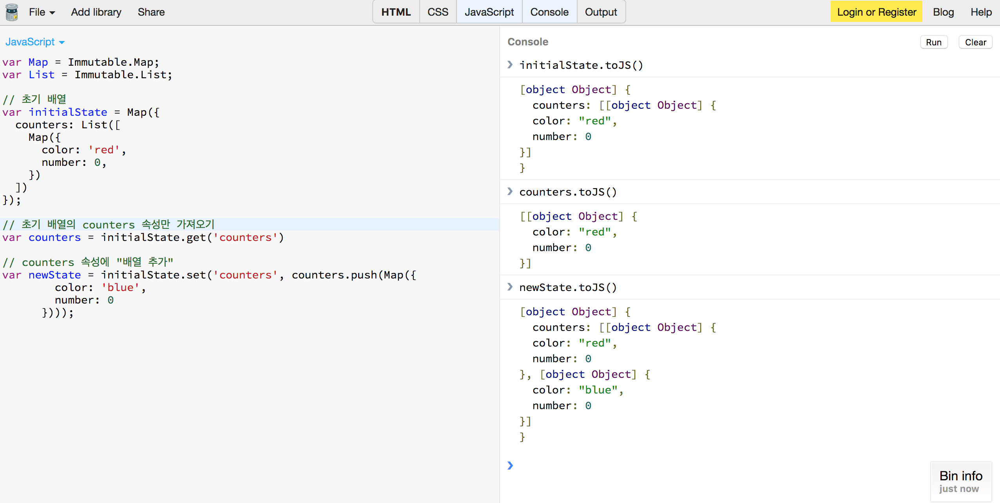

# Ducks 구조

리덕스를 사용하기 위해서 `reducer`(액션함수정의), `actionType`(액션정의), `action`(액션객체생성), `container`(dipatch로 액션함수 붙이기, connect로 프레젠테이셔널 컴포넌트와 연결)을 수행해야 합니다. **액션함수가 많아지면 수많은 폴더를 돌아다니면서 모든 것을 수정해야하는 불편함이 있습니다. 이 불편함을 해소하기 위해서 하나의 파일 안에 액션타입과 객체생성자 함수를 모두 집어넣고습니다. 이를 `Ducks 구조`라고 부릅니다.** 

bubble counter 프로젝트를 Ducks 구조로 바꾸고 `redux-actions` 라이브러리를 사용(*https://github.com/jsstar522/javascript_basic/blob/master/Reactjs/08_reactRedux.md 참고*)하겠습니다.

```bash
$ yarn add redux-actions
```

`src/modules/index.js`를 만들어 Ducks 구조로 리듀서와 액션을 구현하겠습니다. **Ducks 구조에서 액션타입을 정의할 때는 `counter/INCREMENT`와 같은 형식으로 만들어야 다른 액션객체와 겹칠 위험이 없습니다.**

```javascript
// modules/index.js

import { createAction, handleActions } from 'redux-actions';
import { Map, List } from 'immutable';

// 액션타입정의
const CREATE = 'counter/CREATE';
const REMOVE = 'counter/REMOVE';
const INCREMENT = 'counter/INCREMENT';
const DECREMENT = 'counter/DECREMENT';
const SET_COLOR = 'counter/SET_COLOR';\

// 액션객체생성자정의
export const create = createAction(CREATE);         //받아야하는 인자 color
export const remove = createAction(REMOVE);
export const increment = createAction(INCREMENT);   //받아야하는 인자 index
export const decrement = createAction(DECREMENT);   //받아야하는 인자 index
export const setColor = createAction(SET_COLOR);   //받아야하는 인자 index, color

// 리듀서정의

// initial state
const initialState = Map({
  counters: List([
    Map({
      color: 'red',
      number: 0,
    })
  ])
});
// reducer
export default handleActions({
  [CREATE]: (state, action) => {
    const counters = state.get('counters');
    return state.set('counters', counters.push(
      Map({
        color: action.payload,
        number: 0,
      })
    ));
  },
  [REMOVE]: (state, action) => {
    const counters = state.get('counters');
    return state.set('counters', counters.pop());
  },
  [INCREMENT]: (state, action) => {
    const counters = state.get('counters');
    return state.set('counters', counters.update(
      actions.payload,
      (counter) => counter.set('number', counter.get('number') + 1)
    ));
  },
  [DECREMENT]: (state, action) => {
    const counters = state.get('counters');
    return state.set('counters', counters.update(
      actions.payload,
      (counter) => counter.set('number', counter.get('number') - 1)
    ));
  },
  [SET_COLOR]: (state, action) => {
    const counters = state.get('counters');
    return state.set('counter', counters.update(
      action.payload.index,
      (counter) => counter.set('color', action.payload.color)
    ));
  },
}, initialState);
```

전에 사용했던 `reducers/index.js`의 리듀서와 비교해보겠습니다.

```javascript
// reducers/index.js

import { createAction, handleActions } from 'redux-actions';
import { Map, List } from 'immutable';

// 액션타입정의
const CREATE = 'counter/CREATE';
const REMOVE = 'counter/REMOVE';
const INCREMENT = 'counter/INCREMENT';
const DECREMENT = 'counter/DECREMENT';
const SET_COLOR = 'counter/SET_COLOR';

// 액션객체생성자정의
export const create = createAction(CREATE);         //받아야하는 인자 color
export const remove = createAction(REMOVE);
export const increment = createAction(INCREMENT);   //받아야하는 인자 index
export const decrement = createAction(DECREMENT);   //받아야하는 인자 index
export const setColor = createAction(SET_COLOR);   //받아야하는 인자 index, color

// 리듀서정의

// initial state
const initialState = Map({
  counters: List([
    Map({
      color: 'red',
      number: 0,
    })
  ])
});
// reducer
export default handleActions({
  [CREATE]: (state, action) => {
    const counters = state.get('counters');
    return state.set('counters', counters.push(
      Map({
        color: action.payload,
        number: 0,
      })
    ));
  },
  [REMOVE]: (state, action) => {
    const counters = state.get('counters');
    return state.set('counters', counters.pop());
  },
  [INCREMENT]: (state, action) => {
    const counters = state.get('counters');
    return state.set('counters', counters.update(
      action.payload,
      (counter) => counter.set('number', counter.get('number') + 1)
    ));
  },
  [DECREMENT]: (state, action) => {
    const counters = state.get('counters');
    return state.set('counters', counters.update(
      action.payload,
      (counter) => counter.set('number', counter.get('number') - 1)
    ));
  },
  [SET_COLOR]: (state, action) => {
    const counters = state.get('counters');
    return state.set('counter', counters.update(
      action.payload.index,
      (counter) => counter.set('color', action.payload.color)
    ));
  },
}, initialState);

```

* `액션타입별 case` : 이제 액션타입 앞에 `counter/`가 붙어 있으므로 `[INCREMENT]`와 같은 형식으로 사용합니다. 
* `const counters = state.get('counetrs')` : `handleAction`을 사용하기 전에는 case 안에 각자 counters를 선언하면 중복선언으로 에러가 발생했습니다. 이렇게 되면 **나중에 counters 속성 뿐만아닌 다른 많은 속성을 바꿔주는 액션함수를 선언할 때, 각 액션함수안에서 변수를 따로 선언해서 사용할 수 없습니다.** `handleAction`는 이러한 scope 문제를 해결해줍니다.
* `action.payload` : `redux-actions` 라이브러리를 사용해서 액션객체를 생성하면 속성이 payload 형태로 저장됩니다. 인자를 하나만 받는 액션함수(`CREATE`, `INCREMENT`, `DECREMENT`)는 payload의 depth가 1이므로 그대로 사용하고 인자를 두개 받는 액션함수(`SET_COLOR`)는 payload의 depth가 2이므로 `action.payload.index`, `action.payload.color`의 형태로 사용합니다.

state는 다음과 같이 변경됩니다. `CREATE` 액션함수를 예로 들었습니다.



`counters` 속성만 가져와 배열을 추가하고 배열 안에 있는 값을 바꾸고 있습니다.

이제 **최상위 컴포넌트(`src/index.js`)에 `reducers/index.js` 대신 `modules/index.js`로 바꿔줍니다.**

```javascript
// src/index.js
// ...
import reducers from './modules'
// ...
```

**프레젠테이셔널 컴포넌트와 액션객체 생성자가 연결되어 있는 컨테이너 컴포넌트(`containers/CounterListContainer.js`)에도 반영해줍니다.**

```javascript
// containers/CounterListContainer.js
//...
import * as actions from '../modules';
//...
```

**props로 전달 받는 컴포넌트(`components/App.js`)에도 반영합니다.**

```javascript
// components/App.js
//...
import * as actions from '../modules';
//...
```