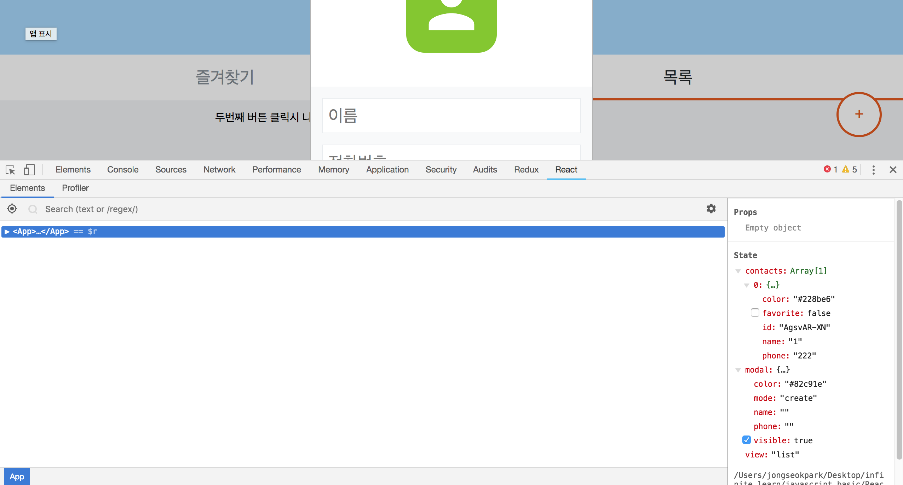

# 바이어 프로필 화면 만들기

*https://gist.github.com/vlpt-playground/593da90702641de2564430e2a4161eb8을 참고해서 만들었습니다.*


## 프로젝트 준비

```bash
$ create-react-app buyer-profile
```

프로젝트를 만들고 `App.css`, `logo.svh`, `App.test.js`를 지웁니다. 의존 모듈을 설치합니다.

```bash
$ yarn add open-color prop-types react-icons react-onclickoutside react-transition-group@1.x shortid styled-components
```


## 컴포넌트 만들기

### 헤더 만들기

`components/Header.js` 컴포넌트를 만듭니다.

```javascript
// components/Header.js

import React from 'react';
import styled from 'styled-components';
import oc from 'open-color';

// styled-components 라이브러리는 자바스크립트 내부에서 css를 정의할 수 있게 해준다.
// open-color는 다양한 색상을 편하게 사용할 수 있다.
const Wrapper = styled.div`
	height: 5rem;
    background: ${oc.blue[2]};
    border-bottom: 1px solid ${oc.blue[1]};
    /* 폰트 설정 */
    color: ${oc.blue[9]};
    font-weight: 600;
    font-size: 2.5rem;
    /* 가운데로 정렬 */
    display: flex;
    align-items: center; /* 세로 정렬 */
    justify-content: center; /* 가로 정렬 */
`;

const Header = () => (
    <Wrapper>
        프로필
    </Wrapper>
);

export default Header;
```

*(open-color에서 사용할 수 있는 색상 https://yeun.github.io/open-color/)*

렌더링 되는 가장 높은 컴포넌트인 `App.js`에서 `<div>~</div>`안에 **헤더 컴포넌트를 넣어줍니다.**

```javascript
// src/App.js

import React, { Component } from 'react';
import Header from './components/Header';

class App extends Component {
    render() {
        return (
            <div>
              <Header />
            </div>
        );
    }
}
export default App; 
```

### 내용란 만들기

Header 컴포넌트 아래에 들어갈 내용란을 만들겠습니다. 메뉴는 `즐겨찾기`, `목록`으로 나뉘고 해당 메뉴버튼을 누르면 `즐겨찾기`나 `목록`을 보여주는 곳입니다. 먼저 `component/Container.js`를 만듭니다.

```javascript
import React from 'react';
import styled from 'styled-components';
import oc from 'open-color';
// 화면별 스타일 모듈화
import { media } from '../lib/style-utils';
import PropTypes from 'prop-types';

const Wrapper = styled.div`
    width: 700px;
    margin: 0 auto; /* 가운데 정렬 */
    padding: 1rem;
    background: black; /* 테스트용 색상, 추후 지워짐 */
    
    /* 모바일 크기 */
    ${media.mobile`
        width: 100%;    
    `}
`;

 const Container = ({children}) => (
   <Wrapper>
       {children}
   </Wrapper>
 );

export default Container;
```

`src/App.js`에 추가합니다.

```javascript
// App.js
import Container from './components/Container';
//...
            <div>
              <Header />
              <Container />
            </div>
//...
```

### 메뉴창/ 메뉴선택 표시바 만들기

이제 어떤 메뉴를 눌렀는지 알 수 있도록 메뉴창 아래에 움직이는 표시바을 만들어 보겠습니다.

```javascript
// components/ViewSelector.js

import React from 'react';
import styled from 'styled-components';
import oc from 'open-color';

const Wrapper = styled.div`
  height: 4rem;
  background: white;
  width: 100%;
  display: flex;

  position: relative;
`;

// 메뉴
const StyledItem = styled.div`
  height: 100%;

  flex: 1;

  display: flex;
  align-items: center;
  justify-content: center;

  color: ${oc.gray[6]};

  font-size: 1.5rem;
  cursor: pointer;

  /* 마우스 올려놓았을 때 */
  &:hover{
    background: ${oc.gray[0]};
  }
`;

// 메뉴선택 표시바
const Bar = styled.div`
  position: absolute;
  bottom: 0px;
  height: 3px;
  width: 50%;

  background: ${oc.pink[6]};
`;

// 여러개의 메뉴를 만들 수 있도록 변수에 저장
// 변수에 따로 저장하면 추가 옵션을 달기도 쉽다
const Item = ({children}) => (
  <StyledItem>
    {children}
  </StyledItem>
);

// 렌더링
const ViewSelector = () => (
  <Wrapper>
    <Item>즐겨찾기</Item>
    <Item>메뉴</Item>
    <Bar/>
  </Wrapper>
);

export default ViewSelector;
```

이제 `App.js`에 적용시켜줍니다.

```javascript
// App.js
//...
import ViewSelector from './components/ViewSelector';
//...
            <div>
                <Header/>
                <ViewSelector/>
                <Container>
                </Container>
            </div>
//...
```

이제 이런화면이 나타납니다. 

이제 메뉴에 따라서 다른 화면을 보여주게끔 장치를 만들어줘야합니다. 위에서 만들었던 `Container` 컴포넌트를 수정합니다.

```javascript
// components/Container.js

import React from 'react';
import styled from 'styled-components';
import oc from 'open-color';
// 화면별 스타일 모듈화
import { media } from '../lib/style-utils';
import PropTypes from 'prop-types';

const Wrapper = styled.div`
    width: 700px;
    margin: 0 auto; /* 가운데 정렬 */
    padding: 1rem;
    background: black; /* 테스트용 색상, 추후 지워짐 */
    
    /* 모바일 크기 */
    ${media.mobile`
        width: 100%;    
    `}
`;

// // 바로 나오도록 테스트
// const Container = ({children}) => (
//   <Wrapper>
//       {children}
//   </Wrapper>
// );

// visible을 props로 받아서 화면을 보여줄지 null을 반환할지 구분
const Container = ({visible, children}) => visible ? (
  <Wrapper>
      {children}
  </Wrapper>
) : null;

// PropTypes 설정
Container.propTypes = {
  visible: PropTypes.bool
};

export default Container;
```

이제 `App.js`에서 어떤 `state`를 가지고 있느냐에 따라 다른 `props`를 전달해주고 Container에 다른 내용을 띄웁니다. **그 전에 글자가 보이도록 `Container.js`의 background 색을 없앱니다.**

```javascript
// App.js

import React, { Component } from 'react';
import Header from './components/Header';
import Container from './components/Container';
import ViewSelector from './components/ViewSelector';

class App extends Component {
    // state 정의
    state = {
        view: 'favorite'
    }
    // 즐겨찾기/목록 선택시 state 업데이트
    handleSelectView = (view) => this.setState({view})

    render() {
        const { handleSelectView } = this;
        const { view } = this.state
        return (
            <div>
              <Header />
              <ViewSelector onSelect={handleSelectView} selected={view}/>
              <Container visible={view==='favorite'}>첫번째 버튼 클릭시 나타나는 텍스트입니다</Container>
              <Container visible={view==='list'}>두번째 버튼 클릭시 나타나는 텍스트입니다</Container>
            </div>
        );
    }
}
export default App;
```

`view`에 따라서 어떤 Container를 렌더링할지 정의했습니다. 그리고 `<ViewSelector onSelect={handleSelectView} selected={view}/>` 부분을 통해 어떤 `ViewSelector`를 누르냐에 따라(다른 `props`를 전달해주냐에 따라) 다른 모양을 보여주도록 설정하겠습니다. 

```javascript
// components/ViewSelector.js

import React from 'react';
import styled from 'styled-components';
import oc from 'open-color';

import PropTypes from 'prop-types';

const Wrapper = styled.div`
  height: 4rem;
  background: white;
  width: 100%;
  display: flex;

  position: relative;
`;

// 메뉴
const StyledItem = styled.div`
  height: 100%;

  flex: 1;

  display: flex;
  align-items: center;
  justify-content: center;

  /* active 값에 따라 다른 색상을 보여줌 */
  color: ${ props => props.active ? oc.gray[9] : oc.gray[6] };

  font-size: 1.5rem;
  cursor: pointer;

  /* 마우스 올려놓았을 때 */
  &:hover{
    background: ${oc.gray[0]};
  }
`;

StyledItem.propTypes = {
  active: PropTypes.bool
};

// 메뉴선택 표시바
const Bar = styled.div`
  position: absolute;
  bottom: 0px;
  height: 3px;
  width: 50%;

  background: ${oc.orange[8]};

  /* 애니메이션 */
  transition: ease-in .25s;

  /* right 값에 따라 우측으로 이동 */
  transform: ${props => props.right ? 'translateX(100%)' : 'none'};
`;

Bar.propTypes = {
  right: PropTypes.bool
};

// 여러개의 메뉴를 만들 수 있도록 변수에 저장
// 변수에 따로 저장하면 추가 옵션을 달기도 쉽다
const Item = ({children, selected, name, onSelect}) => (
  <StyledItem>
    {children}
  </StyledItem>
);

Item.propTypes = {
  selected: PropTypes.string,
  name: PropTypes.string,
  onSelect: PropTypes.func
};

// 렌더링
const ViewSelector = ({selected, onSelect}) => (
  <Wrapper>
    <Item>즐겨찾기</Item>
    <Item>목록</Item>
    <Bar/>
  </Wrapper>
);

ViewSelector.propTypes = {
  selected: PropTypes.string,
  onSelect: PropTypes.string
}

export default ViewSelector;
```

`propTypes`를 각각 정의하고 `props`를 받는 부분은 인자로 추가했습니다. 그리고 **`styled-component`는 css안에 코드를 넣을 수 있으므로 props에 따라 다른색으로 표현하는 등의 효과를 낼 수 있습니다. Bar에서는 props에 따라 다른 위치를 가지도록 했습니다.** 

**이제 `ViewSelector 컴포넌트`에서 어떤 `Item`을 누르냐에 따라 하위컴포넌트에 다른 `selected`와 `onSelect`, `name`을 보내주도록 합니다.**

```javascript
// components/ViewSelector.js
//...
const Item = ({children, selected, name, onSelect}) => (
  <StyledItem onClick={() => onSelect(name)} active={selected===name}>
    {children}
  </StyledItem>
);
//...
```

```javascript
// components/ViewSelector.js
//...
const ViewSelector = ({selected, onSelect}) => (
  <Wrapper>
    <Item
      selected={selected}
      name="favorite"
      onSelect={onSelect}>
      즐겨찾기
    </Item>
    <Item
      selected={selected}
      name="list"
      onSelect={onSelect}>
      목록
    </Item>
    <Bar right={selected==='list'}/>
  </Wrapper>
);
//...
```

이제 메뉴버튼에 따라 다른 텍스트 (`첫번째 버튼 클릭시 나타나는 텍스트입니다`,`두번째 버튼 클릭시 나타나는 텍스트입니다`)가 나타납니다.

#### (참고) 지금까지의 state 변화와 props 전달과정

1. `App.js`에서 초기 state를 정의하고, handleSelectView 함수를 만들어서 이벤트리스너에 붙입니다.

   ```javascript
   //...
   class App extends Component {
       // state 정의
       state = {
           view: 'favorite'
       }
       // 즐겨찾기/목록 선택시 state 업데이트
       handleSelectView = (view) => this.setState({view})
   //...
   			<Header />
               <ViewSelector onSelect={handleSelectView} selected={view}/>
               <Container visible={view==='favorite'}>첫번째 버튼 클릭시 나타나는 텍스트입니다				</Container>
               <Container visible={view==='list'}>두번째 버튼 클릭시 나타나는 텍스트입니다					</Container>
   //...
   ```

   `ViewSelector`에 onSelect를 통해 `handleSelectView`를 전달하고 selected를 통해 `view`를 전달합니다.

2. `components/ViewSelector.js`에서 전달받은 `onSelect(handleSelectView)`와 `selected(view)`는 ViewSelector 컴포넌트가 1차적으로 받아서 **다른 목록(Item)에 따라 다시 props로 전달해줍니다.**

   ```javascript
   //...
   const ViewSelector = ({selected, onSelect}) => (
     <Wrapper>
       <Item
         selected={selected}
         name="favorite"
         onSelect={onSelect}>
         즐겨찾기
       </Item>
       <Item
         selected={selected}
         name="list"
         onSelect={onSelect}>
         목록
       </Item>
       <Bar right={selected==='list'}/>
     </Wrapper>
   );
   //...
   ```

3. `components/ViewSelector.js`의 `Item` 컴포넌트에서 `selected`와 `onSelect`, `name`을 전달받았습니다. 클릭을 하면 onSelect 함수를 실행합니다 (이는 `App.js`에서 내려온 handleSelectView 함수를 실행하는 것입니다). handleSelectView 함수는 인자를 받아서 state를 바꾸는 함수입니다(setState). active에 값이 들어가면 메뉴의 색이 진한 회색으로 바뀝니다.

   ```javascript
   //...
   const Item = ({children, selected, name, onSelect}) => (
     <StyledItem onClick={() => onSelect(name)} active={selected===name}>
       {children}
     </StyledItem>
   );
   //...
   ```

4. 다시 `App.js`로 돌아가서 state(view)가 list냐 favorite냐에 따라서 다른 `Container.js` 보여주도록 합니다.


### 추가버튼 만들기

메인화면에 추가버튼을 만듭니다.

```javascript
// componentsFloatingButton.js

import React from 'react';
import styled from 'styled-components';
import oc from 'open-color';
import PropTypes from 'prop-types';

const Wrapper = styled.div`
  position: fixed;
  bottom: 2rem;
  right: 2rem;
  width: 4rem;
  height: 4rem;

  background: white;
  border: 3px solid ${oc.orange[8]};
  color: ${oc.orange[8]};

  border-radius: 2rem;
  font-size: 1.5rem;
  cursor: pointer;

  /* 중앙 정렬 */
  display: flex;
  align-items: center;
  justify-content: center;

  /* 에니메이션 */
  transition: all .15s;

  /* 마우스 오버 */
  &:hover {
    transform: translateY(-0.5rem);
    color: white;
    background: ${oc.orange[8]};
  }
  /* 마우스 클릭 */
  &:active {
    background: ${oc.orange[9]};
  }
`;

const FloatingButton = ({onClick}) => (
  <Wrapper onClick={onClick}>
    +
  </Wrapper>
);

FloatingButton.propTypes = {
  onClick: PropTypes.func
}

export default FloatingButton;
```

`App.js`에 적용합니다.

```javascript
// App.js
//...
import FloatingButton from './components/FloatingButton';
//...


//...
```


### 모달(Modal) 만들기

모달을 위한 state와 이벤트리스너에 등록할 함수를 정의합니다. 그리고 색상이 다양하게 나올 수 있도록 랜덤색상을 정의합니다.

```javascript
// App.js
//...
import oc from 'open-color';
// 랜덤색상
function generateRandomColor() {
    const colors = [
        'gray',
        'red',
        'pink',
        'grape',
        'violet',
        'indigo',
        'blue',
        'cyan',
        'teal',
        'green',
        'lime',
        'yellow',
        'orange'
    ];

    // 0 부터 12까지 랜덤 숫자
    const random = Math.floor(Math.random() * 13);

    return oc[colors[random]][6];
}
//...
class App extends Component {
    // state 정의
    state = {
        view: 'favorite',
        madal: {
            visible: false,
            mode: null  // 생성(create) 혹은 수정(modify) 모드
        }
    }
    // 즐겨찾기/목록 선택시 state 업데이트
    handleSelectView = (view) => this.setState({view})

    // 모달 메서드
    modalHandler = {
        show: (mode, payload) => {
            this.setState({
                modal: {
                    mode,
                    visible: true,
                    ...payload
                }
            })
        },
        hide: () => {
            this.setState({
                modal: {
                    ...this.state.modal,
                    visible: false
                }
            })
        },
        change: null,
        action: {
            create: null,
            modify: null,
            remove: null,
        }
    }

    render() {
//...
```

이제 버튼을 클릭하거나 목록에 있는 itme을 눌렀을 때, 삭제버튼을 눌렀을 때 다른 mode를 가지고 다른 함수가 실행되도록 합니다.

```javascript
// App.js
//...
// state 정의
    state = {
        view: 'favorite',
        modal: {
            visible: false,
            mode: null  // 생성(create) 혹은 수정(modify) 모드
        }
    }
//...
    // 모달 메서드
    modalHandler = {
        show: (mode, payload) => {
            this.setState({
                modal: {
                    mode,
                    visible: true,
                    ...payload
                }
            })
        },
        hide: () => {
            this.setState({
                modal: {
                    ...this.state.modal,
                    visible: false
                }
            })
        },
        change: null,
        action: {
            create: null,
            modify: null,
            remove: null,
        }
    }

    // FloatingButton을 클릭했을 때
    handleFloatingButtonClick = () => {
        const { view } = this.state;
        // 현재 view list 바꾸기
        if(view !== 'list')
            this.setState({view: 'list'});
        // 목록 추가 모달 띄우기
        this.modalHandler.show(
            'create',   //mode
            {
                name: '',
                phone: '',
                color: generateRandomColor()
            }
        );
    }
//...
```

이제 FloatingButton 컴포넌트 이벤트리스너에 이 함수를 붙입니다.

```javascript
// App.js
//...
    render() {
        const { handleSelectView, handleFloatingButtonClick } = this;
//...
              <FloatingButton onClick={handleFloatingButtonClick}/>
            </div>
        );
    }
}
```

`+` 버튼을 누르면 기존 state에 다른 속성들이 추가되는 것을 확인할 수 있습니다. 그리고 view가 list로 바뀝니다.


이제 각 속성에 따라 등록(create)하는 창을 만듭니다. 모달에 관련된 파일은 세가지로 나뉩니다. `Modal.js`는 **visible이 true일 때 띄워지는 창입니다.** `ContactModal.js`은 모달안에 들어가는 버튼과 내용, 인풋을 추가할 수 있는 컴포넌트 입니다.  `Dimmed.js`는 모달이 띄워졌을 때 화면이 어두워지게 합니다.

#### Modal.js

모달 컴포넌트를 만들고 `react-onclickoutside`라이브러리를 이용해 컴포넌트 외부를 클릭하면 어떤 함수가 실행되는지 정의합니다.

```javascript
// components/Modal.js

import React, { Component } from 'react';
import styled from 'styled-components';
//컴포넌트의 외부를 클릭하는 이벤트 리스너
import onClickOutside from 'react-onclickoutside';
import { media } from '../lib/style-utils';
import PropTypes from 'prop-types';

const Wrapper = styled.div`
  position: fixed;
  top: 50%;
  left: 50%;
  transform: translate(-50%, -50%);

  z-index: 10;

  width: ${ props => props.width };

  ${media.mobile`
    width: calc(100% - 2rem);
  `}
`;

Wrapper.propTypes = {
  width: PropTypes.string
};

const ModalBox = styled.div`
  background: white;
  border: 1px solid rgba(0,0,0,0.3);
`

class Modal extends Component {
  static propTypes = {
    visible: PropTypes.bool,
    onHide: PropTypes.func,
    width: PropTypes.string,
  }
  static defaultProps = {
    width: '400px'
  }

  // 컴포넌트 외부 클릭시 실행되는 메서드(onClickoutside에 적용시킬 메서드)
  handleClickOutside = (e) => {
    const { visible, onHide } = this.props;
    //visible이 false 일 때
    if(!visible) return null;
    onHide();
  }
  // esc 키 눌렀을 때 onHide
  handleKeyUp = (e) => {
    const { onHide } = this.props;
    if(e.keyCode === 27) {
      onHide();
    }
  }
  // lifeCycle 메서드
  // esc 감지
  componentDidUpdate(prevProps, prevState) {
    if(prevProps.visible !== this.props.visible){
      if(this.props.visible){
        document.body.addEventListener('keyup', this.handleKeyPress);
      }else {
        document.body.removeEventListener('keyup', this.handleKeyPress);
      }
    }
  }

  render(){
    const { visible, children, width } = this.props;
    return (
      <div>
        <Wrapper width={width}>
          {
            visible && (<ModalBox>{children}</ModalBox>)
          }
        </Wrapper>
      </div>
    );
  }
}

// 컴포넌트를 onClickOutside 라이브러리로 감싸주면
// 컴포넌트 외부를 클릭할 때, handleClickOutside 함수가 실행된다.
export default onClickOutside(Modal);
```

#### ContactModal.js

```javascript
// components/ContactModal.js

import React, { Component } from 'react';
import styled from 'styled-components';
import oc from 'open-color';
import Modal from './Modal';
import PropTypes from 'prop-types';

class ContactModal extends Component {
  static propTypes = {
    visible: PropTypes.bool,
    mode: PropTypes.oneOf(['create', 'modify']),
    name: PropTypes.string,
    phone: PropTypes.string,
    color: PropTypes.string,
    onHide: PropTypes.func,
    onAction: PropTypes.func,
    onRemove: PropTypes.func,
  }

  render(){
    const { visible, onHide } = this.props;
    return(
      <Modal visible={visible} onHide={onHide}>
        모달입니다.
      </Modal>
    );
  }
  
}

export default ContactModal;
```

여기까지 `App.js`에 추가하고 창이 잘 띄워지는지 확인합니다.

```javascript
// App.js
//...
import ContactModal from './components/ContactModal';
//...
    render() {
        const { handleSelectView, handleFloatingButtonClick, modalHandler } = this;

        const { view, modal } = this.state
        return (
            <div>
              <Header />
              <ViewSelector onSelect={handleSelectView} selected={view}/>
              <Container visible={view==='favorite'}>첫번째 버튼 클릭시 나타나는 텍스트입니다</Container>
              <Container visible={view==='list'}>두번째 버튼 클릭시 나타나는 텍스트입니다</Container>
              <ContactModal {...modal} onHide={modalHandler.hide}/>
              <FloatingButton onClick={handleFloatingButtonClick}/>
            </div>
        );
    }
//...
```

`{...modal}`은 modal 안에 있는 모든 값을 props로 전달한다는 뜻입니다. 이제 모달이 띄워지는지 확인해보겠습니다. 

모달이 잘 띄워지면 모달이 띄워졌을 때, 화면이 어두워지도록 하는 `Dimmed.js` 컴포넌트를 작성합니다.

#### Dimmed.js

`visible`이 **true**값이면 모달이 띄워지므로 이때 컴포넌트 주변 화면을 어둡게 해줍니다. 

```javascript
// components/Dimmed.js

import React from 'react';
import styled from 'styled-components';
import oc from 'open-color';
import PropTypes from 'prop-types';

const Black = styled.div`
  position: fixed;
  top: 0px;
  left: 0px;
  right: 0px;
  bottom: 0px;

  z-index: 5;

  background: rgba(0,0,0,0.3);
`;

const Dimmed = ({visible}) => (
  <div>
    {visible && <Black/>}
  </div>
);

Dimmed.propTypes = {
  visible: PropTypes.bool
};

export default Dimmed;
```

`visible`이 **true**면 Black 컴포넌트로 덮어줍니다. 모달 컴포넌트는 visible을 가지고 있지 않기 때문에 검정색으로 보이지 않습니다. 이제 `App.js`에 적용해줍니다.

```javascript
// App.js
//...
import Dimmed from './components/Dimmed';
//...
	return(
      //...
      <Dimmed visible={modal.visible}/>
//...
```


#### (추가) 애니메이션 적용하기

CSSTransitionGroup라는 에드온을 이용해서 간편하게 애니메이션을 적용합니다. 이 에드온에 들어갈 설정들은 `lib/style-utils.js`에 미리 정리해놓습니다. 

```javascript
// lib/style-utils.js
//...
export const transitions = {
    slideDown: keyframes`
        0% {
            opacity: 0;
            transform: translateY(-100vh);
        }
        75% {
            opacity: 1;
            transform: translateY(25px);
        }
        100% {
            transform: translateY(0px);
        }
    `,
    slideUp: keyframes`
        0% {
            transform: translateY(0px);
            opacity: 1;
        }
        25% {
            opacity: 1;
            transform: translateY(25px);
        }
        100% {
            opacity: 0;
            transform: translateY(-100vh);
        }
    `
};
```

그리고 **`Modal.js` 컴포넌트에서 위의 설정들을 가져와 클래스로 등록하고 CSSTransitionGroup와 함께 Modalbox를 감싸줍니다.**

```javascript
// components/Modal.js
//...
import { media, transitions } from '../lib/style-utils';
import CSSTransitionGroup from 'react-transition-group/CSSTransitionGroup';
//...
const Wrapper = styled.div`
  position: fixed;
  top: 50%;
  left: 50%;
  transform: translate(-50%, -50%);

  z-index: 10;

  width: ${ props => props.width };

  /* 모바일 환경 화면 고정 */
  ${media.mobile`
    width: calc(100% - 2rem);
  `}

  /* CSSTransitionGroup 애니메이션 */
  .modal-enter {
    animation: ${transitions.slideDown} .5s ease-in-out;
    animation-fill-mode: forwards;
  }

  .modal-leave {
    animation: ${transitions.slideUp} .5s ease-in-out;
    animation-fill-mode: forwards;
  }
`;
//...
	render(){
    	const { visible, children, width } = this.props;
    	return (
      	  <div>
        	<Wrapper width={width}>
          	  <CSSTransitionGroup
            	transitionName="modal"
            	transitionEnterTimeout={500}
            	transitionLeaveTimeout={500}>
            	{visible && (<ModalBox>{children}</ModalBox>)}
          	  </CSSTransitionGroup>
        	</Wrapper>
      	  </div>
    	);
  	}
//...
```


#### 모달 안에 들어갈 내용 만들기

`components/ModalContact.js`에서 들어갈 값들 중에서 이름과 전화번호는 다른 컴포넌트에서도 적용시켜야 하므로 props로 설정해 놓았습니다. 그리고 버튼은 모달안에서만 사용하므로 props로 등록하지 않습니다. 

썸네일을 넣을 틀(`ThumbnailWrapper`)을 만들기전에 이 안에 들어갈 컴포넌트를 만듭니다.

```javascript
// components/Thumbnail.js

import React from 'react';
import styled from 'styled-components';
import oc from 'open-color';
import Person from 'react-icons/lib/md/person';
import PropTypes from 'prop-types';

const Wrapper = styled.div`
    width: ${props => props.size };
    height: ${props => props.size };
    display: flex;
    align-items: center;
    justify-content: center;

    /* calc에서 이미지에 곱하는 숫자가 높아질수록 원에 가까워짐 */
    border-radius: calc(${props => props.size} * 0.2); 
    
    font-size: calc(${props => props.size} * 0.75);

    background: ${props => props.color};
    color: white;
`;

Wrapper.propTypes = {
    size: PropTypes.string,
    color: PropTypes.string
};

const Thumbnail = ({size, color}) => (
    <Wrapper size={size} color={color}>
        <Person/>
    </Wrapper>
);

Thumbnail.propTypes = {
    size: PropTypes.string,
    color: PropTypes.string
};


Thumbnail.defaultProps = {
    size: '8rem',
    color: '#000'
};

export default Thumbnail;
```

이제 내용을 받을 Input 컴포넌트를 만듭니다.

```javascript
// components/Input.js

import React from 'react';
import styled from 'styled-components';
import oc from 'open-color';
import PropTypes from 'prop-types';

const Input = styled.input`
    width: 100%;
    padding: 0.5rem;

    border: 1px solid ${oc.gray[2]};

    font-size: 1.5rem;
    line-height: 2rem;
    transition: all .25s;

    /* 입력중 */
    &:focus {
        outline: none;
        border: 1px solid ${oc.orange[3]};
        color: ${oc.orange[6]};
    }

    /* 컴포넌트 사이 간격 */
    & + & {
        margin-top: 1rem;
    }
`;

Input.propTypes = {
    name: PropTypes.string,
    value: PropTypes.string,
    placeholder: PropTypes.string,
    onChange: PropTypes.func
};

export default Input;
```

틀을 새롭게 만들어서 위의 **두개의 컴포넌트를 넣어줍니다.** 받아오는 props값도 정의합니다.

```javascript
// components/ModalContact.js
//...
import Thumbnail from './Thumbnail';
import Input from './Input';
//...
const ThumbnailWrapper = styled.div`
  padding-top: 3rem;
  padding-bottom: 3rem;
  display: flex;
  justify-content: center;

  background: white;
`;

const Form = styled.div`
  padding: 1rem;

  background: ${oc.gray[0]};
`;

const ButtonsWrapper = styled.div`
  display: flex;
`;

const Button = styled.div`
    /* 레이아웃 */
    padding-top: 1rem;
    padding-bottom: 1rem;
    flex: 1;
    display: inline-block;
    
    /* 기타 */
    cursor: pointer;
    text-align: center;
    font-weight: 500;
    font-size: 1.2rem;
    transition: all .3s;

    /* 색상 */
    color: white;
    background: ${props => oc[props.color][7]};

    /* 마우스가 위에 있을 때 */
    &:hover {
        background: ${props => oc[props.color][6]};
    }

    /* 클릭 될 때 */
    &:active {
        background: ${props => oc[props.color][8]};
    }
`;

//...
  render() {
    const { visible, onHide, mode, name, phone, color } = this.props;

    return (
      <Modal visible={visible} onHide={onHide}>
        <ThumbnailWrapper>
          <Thumbnail size="8rem" color={color} />
        </ThumbnailWrapper>
        <Form>
          <Input
            name="name"
            placeholder="이름"
          />
          <Input
            name="phone"
            placeholder="전화번호"
          />
        </Form>
        <ButtonsWrapper>
          <Button color="teal">
            { mode === 'create'? '추가' : '수정'}
          </Button>
          <Button color="gray">
            취소
          </Button>
        </ButtonsWrapper>
      </Modal>
    );
  }

}
//...
```

* `color` : `App.js`에서 정의한 generateRandomColor()를 props로 받아옵니다. 그리고 `Thumbnail` 컴포넌트로 전달합니다.
* `name`, `phone` : props로 `Input` 컴포넌트로 전달합니다.
* `<Button> 모드` : mode를 props로 받아와서 create이면 `추가` 텍스트를 띄우고 아니면 `수정` 텍스트를 띄웁니다.


### Input 값 연동하기

이제 틀은 완성했습니다. 모달 인풋값을 받을 수 있도록 합니다.  `App.js`에서 정의한 `modalHandler`의 change를 수정합니다.

```javascript
// App.js
//...
    modalHandler = {
	//...
        change: ({name, value}) => {
            this.setState({
                modal: {
                    ...this.state.modal,
                    [name]: value
                }
            })
        },

//...
```

`modalHandler.change`를 이벤트리스너에 연결하면 state를 바꿉니다. name을 value(받아온 값)로 바꾸고, 나머지는 그대로 유지하면서 modal 상태를 바꿉니다. 이제 모달 컴포넌트에 이벤트리스너로 연결합니다.

```javascript
// App.js
//...
    render() {
        const { handleSelectView, handleFloatingButtonClick, modalHandler } = this;
        const { view, modal } = this.state
        return (
				//...
                <ContactModal {...modal} onHide={modalHandler.hide} onChange={modalHandler.change} />
                <FloatingButton onClick={handleFloatingButtonClick} />
				//...
        );
    }
```

이제 모달 Input에서 텍스트를 입력하면 name과 value를 정의하는 메서드를 모달컴포넌트에서 정의하겠습니다.

```javascript
// components/ContactModal.js
//...
handleChange = (e) => {
    const { onChange } = this.props;
    onChange({
      name: e.target.name,
      value: e.target.value
    });
  }

  render() {
    const { visible, onHide, mode, name, phone, color } = this.props;
    const { handleChange } = this;
    return (
      <Modal visible={visible} onHide={onHide}>
        <ThumbnailWrapper>
          <Thumbnail size="8rem" color={color} />
        </ThumbnailWrapper>
        <Form>
          <Input
            name="name"
            placeholder="이름"
			value={name}
            onChange={handleChange}
          />
          <Input
            name="phone"
            placeholder="전화번호"
			value={phone}
            onChange={handleChange}
          />
 //...
```

**이제 모달 인풋창 안에서 `handleChange`에 의해 name과 value를 가져오고 `onChange={handlerModal.change}`에 의해 데이터가 변경됩니다.**


### 목록 추가하기

`App.js`에서 state에 목록이 들어갈 배열을 정의합니다. 목록에 부여할 `shortid`도 불러옵니다.

```javascript
// App.js
//...
import shortid from 'shortid';
//...
	state = {
        view: 'favorite',
        modal: {
            visible: false,
            mode: null  // 생성(create) 혹은 수정(modify) 모드
        },
        contacts: []
    }
//...
```

이제 데이터가 들어가는 것을 정의합니다. `App.js`에서 `modalHandler.action.create`이 새로운 배열을 만드는 역할을 합니다.

```javascript
// App.js
//...
        action: {
            create: () => {
                const id = shortid.generate();
                const { contacts, modal: { name, phone, color } } = this.state;
                const contact = {
                    id,
                    name,
                    phone,
                    color,
                    favorite: false
                };
                this.setState({
                    // 불변성 유지. concat으로 해도 상관없다.
                    contacts: [...contacts, contact]
                });
                //작업이 완료되면 창 닫기
                this.modalHandler.hide();
            },
            modify: null,
            remove: null,
        }
//...
```

이제 모달 컴포넌트에 `onAction 이벤트리스너`에 붙입니다.

```javascript
// App.js

//...
    render() {
        const { handleSelectView, handleFloatingButtonClick, modalHandler } = this;

        const { view, modal } = this.state
        return (
            <div>
                <Header />
                <ViewSelector onSelect={handleSelectView} selected={view} />
                <Container visible={view === 'favorite'}>첫번째 버튼 클릭시 나타나는 텍스트입니다</Container>
                <Container visible={view === 'list'}>두번째 버튼 클릭시 나타나는 텍스트입니다</Container>
                <Dimmed visible={modal.visible} />
                <ContactModal 
                    {...modal} 
                    onHide={modalHandler.hide} 
                    onChange={modalHandler.change} 
                    onAction={modalHandler.action[modal.mode]}
                />
                <FloatingButton onClick={handleFloatingButtonClick} />
            </div>
        );
    }
//...
```

`onAction`은 props로 받는 mode에 따라서 `create`, `modify`, `remove`가 실행됩니다. 버튼을 누르면 `onAction`이 실행될 수 있도록 이벤트리스너에 등록합니다.

```javascript
// components/ContactModal.js
//...
  render() {
    const { visible, onHide, mode, name, phone, color, onAction } = this.props;
//...
      <Button color="teal" onClick={onAction}>
            { mode === 'create'? '추가' : '수정'}
          </Button>
//...
```

이제 contacts 배열이 생기고 내용을 넣고 추가버튼을 누르면 배열에 값이 들어갑니다.




### 목록 렌더링하기

배열로 만들어지는 contacts를 렌더링하면 됩니다. 렌더링되는 목록은 첫부분에서 만들었던 Container 컴포넌트에 넣습니다. 목록을 렌더링하는 컴포넌트를 생성합니다.

```javascript
// components/ContactList.js

import React, { Component } from 'react';
import styled from 'styled-components';
import PropTypes from 'prop-types';

class ContactList extends Component {
  static propTypes = {
    contacts: PropTypes.arrayOf(PropTypes.object),
    search: PropTypes.string,           // 검색키워드에 사용
    onToggleFavorite: PropTypes.func,   // 즐겨찾기 버튼
    onOpenModify: PropTypes.func        // 수정 버튼
  }

  render() {
    const { contacts } = this.props;
    const contactList = contacts.map(
      (contact) => (
        <div key={contact.id}>
          {JSON.stringify(contact)}
        </div>
      )
    );
    return (
      <div>
        {contactList}
      </div>
    );
  }
}

export default ContactList;
```

일단 JSON형태로 출력할 수 있도록 `JSON.stringify`를 사용했습니다. map을 통해 contacts 배열에 있는 요소들을 JSON형태로 바꾸고 id를 가진 div로 렌더링합니다. 이제 `App.js`에서 Container 컴포넌트 안에 위 컴포넌트를 넣어줍니다.

```javascript
// App.js
//...
import ContactList from './components/ContactList';
//...
render() {
		//...
        const { view, modal, contacts } = this.state
		return (
            <div>
                //...
                <Container visible={view === 'list'}>
                    <ContactList contacts={contacts}/>
                </Container>
//...
```

이제 목록이 렌더링되는 것을 확인할 수 있습니다.


### 목록 틀 만들기

JSON 형식으로 렌더링했던 부분을 깔끔한 창을 만들어서 정리하겠습니다. 새 컴포넌트를 만듭니다.

```javascript
// components/ContactItem.js

import React, { Component } from 'react';
import styled from 'styled-components';
import oc from 'open-color';
import PropTypes from 'prop-types';
import Thumbnail from './Thumbnail';

const Wrapper = styled.div`
    /* 레이아웃 */
    padding: 1rem;
    position: relative;
    overflow: hidden;
    display: flex;

    /* 색상 */
    background: ${oc.gray[0]};
    border: 1px solid ${oc.gray[2]};

    /* 애니메이션 */
    transition: all .25s;

    /* 사이 간격 */
    & + & {
        margin-top: 1rem;   
    }

    /* 커서를 올려두면 작동 */
    .actions {
        /* 레이아웃 */
        position: absolute;
        top: 0;
        right: -3rem; /* 기본적으로는 숨겨있음 */
        width: 3rem;
        height: 100%;
        display: flex;
        align-items: center;
        justify-content: center;
        flex-direction: column; /* 세로로 나열 */

        /* 색상 */
        background: ${oc.gray[1]};
        border-left: 1px solid ${oc.gray[2]};
        opacity: 0; /* 기본적으론 투명함 */

        /* 애니메이션 */
        transition: all .4s;
    }

    /* 커서가 위에 있으면 */
    &:hover {
        border: 1px solid ${oc.gray[4]};
        background: white;

        /* actions 를 보여준다 */
        .actions {
            opacity: 1;
            right: 0rem;
        }
    }
`

const Info = styled.div`
    /* 레이아웃 */
    margin-left: 1rem;
    flex: 1;
    display: flex;
    justify-content: center;
    flex-direction: column; 
`;

const Name = styled.div`
    font-size: 1.25rem;
    color: ${oc.gray[9]};
    font-weight: 500;
`;

const Phone = styled.div`
    color: ${oc.gray[6]}
    margin-top: 0.25rem;
`;

class ContactItem extends Component {
  static propTypes = {
    contact: PropTypes.shape({
      id: PropTypes.string,
      name: PropTypes.string,
      phone: PropTypes.string,
      color: PropTypes.string,
      favorite: PropTypes.bool,
    }),
    onToggleFavorite: PropTypes.func,
    onOpenModify: PropTypes.func,
  }

  render() {
    const {
      contact: { name, phone, favorite, id, color }
    } = this.props;

    return (
      <Wrapper>
        <Thumbnail color={color}/>
        <Info>
          <Name>{name}</Name>
          <Phone>{phone}</Phone>
        </Info>
        <div className="actions">Button</div>
      </Wrapper>
    );
  }
}
export default ContactItem;
```

props로 name, phone, favorite, id, color를 받아와서 컴포넌트에 넣어주고 Wrapper로 감싸줍니다. `actions class`는 마우스를 올려놓으면 활성화 되는 버튼입니다. 이제 `ContactList.js` 컴포넌트에 적용시킵니다.

```javascript
// components/ContactList.js
//...
import ContactItem from './ContactItem';
//...
  render() {
    const { contacts } = this.props;
    const contactList = contacts.map(
      (contact) => (
        <ContactItem
          key={contact.id}
          contact={contact}
        />
      )
    );
    return (
      <div>
        {contactList}
      </div>
    );
  }
//...
```


### 목록 틀에 수정 버튼 추가/구현

렌더링되는 목록에 마우스를 올려놓으면 나오는 수정/즐겨찾기 버튼을 추가합니다.

```javascript
// components/ContactItem.js
//...
import styled, { css } from 'styled-components';
//...
import StarIcon from 'react-icons/lib/md/star';
import EditIcon from 'react-icons/lib/md/edit';
//...
const CircleButton = styled.div`
  /* 레이아웃 */
  height: 2rem;
  width: 2rem;
  display: flex;
  align-items: center;
  justify-content: center;
  margin: 0.25rem;

  /* 색상 */
  background: white;
  border: 1px solid ${oc.gray[4]};
  color: ${oc.gray[4]};

  /* 기타 */
  border-radius: 1rem;
  font-size: 1.15rem;

  /* 마우스 커서가 위에 있을 때*/
  &:hover {
      border: 1px solid ${oc.gray[7]};
      color: ${oc.gray[9]};
  }

  /* 즐겨찾기 - 노란색 */
  ${ props => props.favorite && css`
      &:active {
          border: 1px solid ${oc.yellow[6]};
          color: ${oc.yellow[6]};
      `}
`;


```

버튼틀을 넣기 전에 버튼을 누르면 실행되는 내용을 작성합니다.

```javascript
// App.js
//...
    itemHandler = {
        toggleFavorite: null,
        openModify: (id) => {
            const { contacts } = this.state;
            const index = contacts.findIndex(contact => contact.id === id);
            const item = this.state.contacts[index];

            this.modalHandler.show(
                'modify',
                {
                    ...item,
                    index
                }
            );
        }
    }
//...
    render() {
        const { handleSelectView, handleFloatingButtonClick, modalHandler, itemHandler } = this;

		//...
        return (
            <div>
				//...
                    <ContactList 
                        contacts={contacts}
                        onOpenModify={itemHandler.openModify}
                    />
//...
```

`toggleFavorite`는 즐겨찾기이고 나중에 구현합니다. contacts를 가져온 뒤, id를 받아서 index에 저장합니다. `modalHandler`에서 show의 mode를 modify로 전달합니다. 이제 `ContactList` 컴포넌트에 props로 전달합니다.

```javascript
// components/ContactList.js
//...
  render() {
    const { contacts, onOpenModify } = this.props;
    const contactList = contacts.map(
      (contact) => (
        <ContactItem
          key={contact.id}
          contact={contact}
          onOpenModify={onOpenModify}
//...
```

이제 `ContactList`를 타고 `ContactItem`까지 props가 전달되도록 합니다.

```javascript
// components/ContactItem.js

  render() {
    const {
      contact: { name, phone, favorite, id, color },
      onOpenModify
    } = this.props;

    return (
      <Wrapper>
        <Thumbnail color={color} />
        <Info>
          <Name>{name}</Name>
          <Phone>{phone}</Phone>
        </Info>
        <div className="actions">
          <CircleButton favorite><StarIcon/></CircleButton>
          <CircleButton onClick={() => onOpenModify(id)}><EditIcon/></CircleButton>
        </div>
      </Wrapper>
    );
  }
//...
```

List를 클릭하고 수정버튼을 누르면 mode가 `modify`로 변하고 `index`를 정확하게 받아오는 것을 확인할 수 있습니다. 하지만 수정버튼을 누르면 아무일도 일어나지 않습니다. `App.js`에 있는 `modalHandler.action.modify`메서드를 정의하면 됩니다. 

```javascript
// App.js
//...
			modify: () => {
                const {
                    modal: { name, phone, index },
                    contacts
                } = this.state;

                const item = contacts[index];
                
                this.setState({
                    contacts: [
                        ...contacts.slice(0, index),
                        {
                            ...item,
                            name,
                            phone
                        },
                        ...contacts.slice(index+1, contacts.length)
                    ]
                });

                this.modalHandler.hide();
            },
            remove: () => {
                // 레퍼런스 준비
                const {
                    modal: { index },
                    contacts
                } = this.state;

                // 상태 변경
                this.setState({
                    contacts: [
                        ...contacts.slice(0, index),
                        ...contacts.slice(index + 1, contacts.length) 
                    ]
                });

                // 모달 닫기
                this.modalHandler.hide();
            }
//...
```

**불변성 유지를 위해** 바뀌는 부분만 `slice`로 자르고 붙여서 새로운 contacts를 생성해 `setState`를 실행합니다. 이번에는 삭제버튼을 만들어서 메서드를 적용시키겠습니다.

```javascript
// components/ContactModal.js

//...
const RemoveButton = styled.div`
    /* 레이아웃 */
    position: absolute;
    right: 1rem;
    top: 1rem;

    /* 색상 */
    color: ${oc.gray[6]};

    /* 기타 */
    cursor: pointer;
    font-size: 2rem;

    /* 마우스 커서 위에 있을 때 */
    &:hover {
        color: ${oc.red[6]};
    }
    /* 마우스 커서 클릭 시 */
    &:active {
        color: ${oc.red[7]}
    }

    ${props => !props.visible && 'display: none;'}
`

RemoveButton.propTypes = {
    visible: PropTypes.bool
};
//...
  render() {
    const { visible, onHide, mode, name, phone, color, onAction, onRemove } = this.props;
    const { handleChange } = this;
    return (
      <Modal visible={visible} onHide={onHide}>
        <RemoveButton
          visible={mode==='modify'}
          onClick={onRemove}>-</RemoveButton>
        <ThumbnailWrapper>
          <Thumbnail size="8rem" color={color} />
//...
```


### 검색 및 정렬


