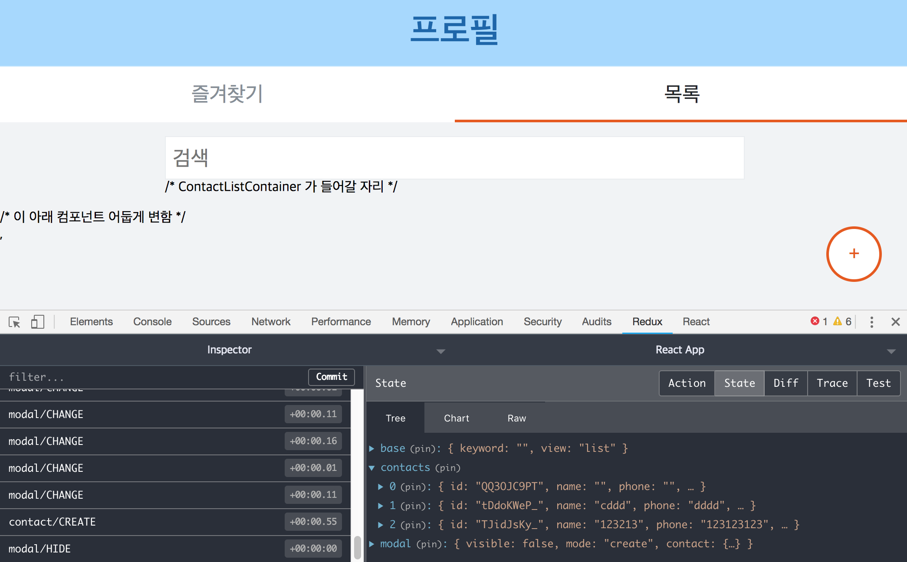

# 바이어 프로필 리덕스 적용하기

바이어 프로필 리액트 앱에서 `App.js` 파일을 보면 코드가 굉장히 깁니다. 이는 리덕스를 사용하지 않았기 때문에 하위 컴포넌트를 사용하려면 컴포넌트를 계속 타고 내려가야하기 때문에 그렇습니다. 리덕스를 이용해서 앱을 더 간결하게 표현할 수 있습니다. 또한 `immutable`을 이용해 액션함수를 더 쉽게 표현합니다.

## modules 폴더

`modules` 폴더에는 액션 정의, 액션 생성자, 리듀서를 하나로 모아놓은(Ducks 구조) 파일을 넣어두는 곳입니다.

### modules/base.js

두개로 나눠진 화면 중에서 어떤 화면을 보여줄지 `view`를 전달하고 검색어를 전달하는 `keyword`를 전달하는 모듈을 작성합니다.

```javascript
import { createAction, handleActions } from 'redux-actions';
import { Map } from 'immutable';

// 액션 정의
const CHANGE_SEARCH = 'base/CHANGE_SEARCH';
const SET_VIEW = 'base/SET_VIEW';

// 액션 생성자 함수
export const changeSearch = createAction(CHANGE_SEARCH);
export const setView = createAction(SET_VIEW);

const initialState = Map({
  keyword: '',
  view: 'favorite'
})

// 리듀서
export default handleActions({
  [CHANGE_SEARCH]: (state, action) => state.set('keyword', action.payload),
  [SET_VIEW]: (state, action) => state.set('view', action.payload)
}, initialState)
```

### modules/modal.js

이 파일에는 모달이 `보여지는 것(show)`와 `사라지는 것(hide)`, `값을 변경하는 것(change)`를 포함하고 있습니다. 

```javascript
import { createAction, handleActions } from 'redux-actions';
import { Map } from 'immutable';

// 액션정의
const SHOW = 'modal/SHOW';
const HIDE = 'modal/HIDE';
const CHANGE = 'modal/CHANGE';

// 액션 생성자 함수
export const show = createAction(SHOW);
export const hide = createAction(HIDE);
export const change = createAction(CHANGE);

// immutable Map = 객체생성
const initialState = Map({
  visible: false,
  mode: null,
  contact: Map({
    id: null,
    name: '',
    phone: '',
    color: 'red'
  })
});

// 리듀서
export default handleActions({
  [SHOW]: (state, action) => {
    const { mode, contact } = action.payload;
    return state.set('visible', true)
                .set('mode', mode)
                .set('contact', Map(contact))
  },
  [HIDE]: (state, action) => state.set('visible', false),
  [CHANGE]: (state, action) => {
    const { name, value } = action.payload;

    return state.setIn(['contact', name], value);
  }
}, initialState)
```

### modules/contacts.js

메인 화면상에서 활성화될 수 있는 작업들이 들어가 있습니다. `목록이 생성`되고 `목록이 수정`되고 `목록이 삭제`되고 `즐겨찾기로 목록 이동`하는 액션이 정의되고 리듀서로 등록됩니다.

```javascript
import { createAction, handleActions } from 'redux-actions';
import { Map, List } from 'immutable';

// 액션정의
const CREATE = 'contact/CREATE';
const MODIFY = 'contact/MODIFY';
const REMOVE = 'contact/REMOVE';
const TOGGLE_FAVORITE = 'contact/TOGGLE_FAVORITE';

// 액션 생성자 함수
export const create = createAction(CREATE);
export const modify = createAction(MODIFY);
export const remove = createAction(REMOVE);
export const toggleFavorite = createAction(TOGGLE_FAVORITE);

// immutable 배열생성
const initialState = List([
]);

// 리듀서
export default handleActions({
  [CREATE]: (state, action) => {
    return state.push(Map(action.payload));
  },
  [MODIFY]: (state, action) => {
    const index = state.findIndex(contact => contact.get('id') === action.payload.id);
    return state.mergeIn([index], action.payload.contact);
  },
  [REMOVE]: (state, action) => {
    const index = state.findIndex(contact => contact.get('id') === action.payload);
    return state.delete(index);
  },
  [TOGGLE_FAVORITE]: (state, action) => {
    const index = state.findIndex(contact => contact.get('id') === action.payload);
    return state.update(index, contact => contact.set('favorite', !contact.get('favorite')));
  },
}, initialState)
```


### modules 폴더에 있는 파일을 하나로 합치기

modules에서 생성한 `서브 리듀서`들을 `combineReducers`를 이용해 하나로 합칩니다. 

```javascript
// modules/index.js

import { combineReducers } from 'redux';

import base from './base';
import contacts from './contacts';
import modal from './modal';

export default combineReducers({
  base,
  contacts,
  modal
})
```


## 스토어 생성

스토어를 생성해서 리듀서를 붙입니다. **리덕스 스토어는 렌더링이 되는 최상위(루트) 컴포넌트 `src/index.js`에서 정의하고 리듀서를 붙입니다.**

```javascript
// index.js

import React from 'react';
import ReactDOM from 'react-dom';
import './index.css';
import App from './App';
import * as serviceWorker from './serviceWorker';

import { createStore } from 'redux';
import reducers from './modules';
import { Provider } from 'react-redux';

// 리덕스 스토어
const store = createStore(reducers, window.__REDUX_DEVTOOLS_EXTENSION__ && window.__REDUX_DEVTOOLS_EXTENSION__());

ReactDOM.render(
  <Provider store={store}>
    <App />, 
  </Provider>,
  document.getElementById('root')
);
```

여기까지 진행하면 `액션정의`, `액션 생성자 함수`, `리듀서`를 포함한 modules를 리덕스 스토어에 연결하고 이 스토어를 리액트 앱에 연결한 것입니다. 하지만 아직 리듀서를 스토어에서 꺼내오는 방식으로 작동되고 있진 않습니다. 리덕스를 쓰지 않았을 때, 예를들어 전화번호부 목록중 하나를 클릭해서 `모달을 켜는` 메서드를 사용하기 위해서는 다음과 같은 방식으로 진행됩니다. 

**이제 메서드를 props로 계속 내려보내지 않고 `리덕스 스토어에 있는 리듀서`에 넣어뒀으므로 꺼내서 사용할 수 있습니다.** 리덕스 스토어를 `App.js`에 연결해뒀으므로 **이제 `App.js`에서 컨테이너 컴포넌트(리덕스와 컴포넌트를 연동)를 렌더링하면 됩니다.** 


## 컨테이너 컴포넌트

컨테이너 컴포넌트를 만들기 전에 자리만 잡아두겠습니다.

```javascript
// App.js

import React, { Component } from 'react';
import Header from './components/Header';
import Container from './components/Container';

// 모두 컨테이너 컴포넌트로 대체
// import ViewSelector from './components/ViewSelector';
// import FloatingButton from './components/FloatingButton';
// import ContactModal from './components/ContactModal';
// import Dimmed from './components/Dimmed';
// import shortid from 'shortid';
// import ContactList from './components/ContactList';
// import Input from './components/Input';
// import FavoriteList from './components/FavoriteList';

class App extends Component {
  render() {
    const { view } = this.props;
    return(
      <div>
        <Header />
        <Container visible={view==='favorite'}>
        /* FavoriteListContainer 가 들어갈 자리 */
        </Container>
        <Container visible={view==='list'}>
        /* InputContainer(검색) 가 들어갈 자리 */
        /* ContactListContainer 가 들어갈 자리 */
        </Container>
        /* ContactModalContainer 가 들어갈 자리 */
        /* FloatingButtonContainer 가 들어갈 자리 */
      </div>
    );
  }
}

export default connect(
  (state) => ({
    view: state.base.get('view')
  })
)(App);
```

**`App.js`에서는 view의 상태를 감지해서 어떤 화면을 보여주는지 결정하므로 마지막 문단에 리덕스에 연결했습니다.** 우리가 만들어야 하는 컨테이너 컴포넌트는 총 6가지입니다. 이제 컨테이너 컴포넌트를 만들겠습니다. 

### ViewSelectorContainer

```javascript
// containers/ViewSelectorContainer.js

import React, { Component } from 'react';
import { connect } from 'react-redux';
import { bindActionCreators } from 'redux';
import * as baseActions from '../modules/base';
import ViewSelector from '../components/ViewSelector';

class ViewSelectorContainer extends Component {
  handleSelect = (view) => {
    const { BaseActions } = this.props;
    BaseActions.setView(view);
  }

  render(){
    const { view } = this.props;
    const { handleSelect } = this;

    return(
      <ViewSelector selected={view} onSelect={handleSelect} />
    );
  }
}

// 리덕스 연결
export default connect(
  (state) => ({
    view: state.base.get('view')
  }),
  (dispatch) => ({
    BaseActions: bindActionCreators(baseActions, dispatch)
  })
)(ViewSelectorContainer);
```

**`bindActionCreators`를 사용하면 외부에서 정의한 여러 리듀서를 한번에 dispatch 할 수 있습니다.** 위에서는 `base/SET_VIEW`와 `base/CHANGE_SEARCH`를 한번에 연결한 것입니다. 이제 `App.js`에서 컨테이너 컴포넌트를 렌더링하면 초기화면이 보이고 메뉴를 클릭할 수 있습니다.

```javascript
// App.js
//...
import ViewSelectorContainer from './containers/ViewSelectorContainer';
//...
      <div>
        <Header />
        <ViewSelectorContainer/>
        //...

```

### InputContainer

검색하는 Input 창을 컨테이너 컴포넌트로 만들겠습니다.

```javascript
// containers/InputContainer.js

import React, { Component } from 'react';
import { connect } from 'react-redux';
import { bindActionCreators } from 'redux';
import * as baseActions from '../modules/base';
import Input from '../components/Input';

class InputContainer extends Component {
  handleChange = (e) => {
    const { BaseActions } = this.props;
    BaseActions.changeSearch(e.target.value);
  }

  render() {
    const { keyword } = this.props;
    const { handleChange } = this;
    
    return (
      <Input onChange={handleChange} value={keyword} placeholder="검색" />

    );
  }
}

export default connect(
  (state) => ({
    keyword: state.base.get('keyword')
  }),
  (dispatch) => ({
    BaseActions: bindActionCreators(baseActions, dispatch)
  })
)(InputContainer);
```

### FloatingButtonContainer

랜덤으로 색상을 정해주는 함수를 이 컴포넌트에 넣어주고, 클릭 이벤트에 모달 show 액션을 연결합니다.

```javascript
import React, { Component } from 'react';
import FloatingButton from '../components/FloatingButton';
import { connect } from 'react-redux';
import * as modalActions from '../modules/modal';
import * as baseActions from '../modules/base';
import { bindActionCreators } from 'redux';
import oc from 'open-color';

function generateRandomColor() {
  const colors = [
    'gray',
    'red',
    'pink',
    'grape',
    'violet',
    'indigo',
    'blue',
    'cyan',
    'teal',
    'green',
    'lime',
    'yellow',
    'orange'
  ];
  const random = Math.floor(Math.random() * 13);
  return oc[colors[random]][4];
}

class FloatingButtonContainer extends Component {
  handleClick = () => {
    const { ModalActions, BaseActions } = this.props;
    BaseActions.setView('list');
    // show 액션
    ModalActions.show({
      mode: 'create',
      contact: {
        name: '',
        phone: '',
        color: generateRandomColor()
      }
    });
  }
  render() {
    const { handleClick } = this;
    return (
      <FloatingButton onClick={handleClick}/>
    )
  }
}

export default connect(
  null,
  (dispatch) => ({
    ModalActions: bindActionCreators(modalActions, dispatch),
    BaseActions: bindActionCreators(baseActions, dispatch)
  })
)(FloatingButtonContainer);
```


이제 메인화면에 기본적으로 뜨는 컴포넌트는 모두 완성됐습니다. `App.js`에서 컴포넌트를 렌더링 해보겠습니다.

```javascript
// App.js
// ...
import ViewSelectorContainer from './containers/ViewSelectorContainer';
import InputContainer from './containers/InputContainer';
//...
class App extends Component {
  render() {
    const { view } = this.props;
    return(
      <div>
        <Header/>
        <ViewSelectorContainer/>
        <Container visible={view==='favorite'}>
        /* FavoriteListContainer 가 들어갈 자리 */
        </Container>
        <Container visible={view==='list'}>
          <InputContainer/>
        /* ContactListContainer 가 들어갈 자리 */
        </Container>
        /* ContactModalContainer 가 들어갈 자리 */
        <FloatingButtonContainer/>
      </div>
//...
```

### ContactModalContainer

이제 모달화면 컨테이너 컴포넌트를 만들겠습니다. 모달 안에는 **다섯가지 기능**이 들어가고 각각 다음과 같은 액션과 대입됩니다.

* 값 변화감지(전달) => `modal/CHANGE`
* 모달화면 숨기기 => `modal/HIDE`
* 목록 생성 => `contact/CREATE`
* 목록 수정 => `contact/MODIFY`
* 목록 삭제 => `contact/REMOVE`

이 액션들을 가져와서 컨테이너에 넣어줍니다.

```javascript
// containers/ContactModalContainer.js

import React, { Component } from 'react';
import { connect } from 'react-redux';
import { bindActionCreators } from 'redux';

import ContactModal from '../components/ContactModal';
//모달이 켜지면 주변이 어둡게 변함
import Dimmed from '../components/Dimmed';

import * as modalActions from '../modules/modal';
import * as contactsActions from '../modules/contacts';

import shortid from 'shortid';

class ContactModalContainer extends Component {
  
  // modal 값 변화 감지
  handleChange = ({name, value}) => {
    const { ModalActions } = this.props;
    ModalActions.change({
      name,
      value
    });
  }
  
  // modal 창 숨기기
  handleHide = () => {
    const { ModalActions } = this.props;
    ModalActions.hide();
  }

  // 해당목록 삭제
  handleRemove = () => {
    const { ContactActions, modal } = this.props;
    const id = modal.getIn(['contact', 'id']);

    ContactActions.remove(id);
    this.handleHide();
  }

  // 해당목록 생성, 수정
  // handleAction 객체에 두 함수를 넣음.
  handleAction = {
    create: () => {
      const { ContactActions, modal } = this.props;
      // immutable로 받아오기 때문에 toJS() 실행
      const { name, phone, color } = modal.get('contact').toJS();
      const id = shortid.generate();

      ContactActions.create({
        id,
        name,
        phone,
        color,
      });

      this.handleHide();
    },

    modify: () => {
      const { ContactActions, modal } = this.props;
      const { id, name, phone } = modal.get('contact').toJS();

      ContactActions.modify({
        id,
        contact: {
          name,
          phone
        }
      });
      this.handleHide();
    }
  }

  render(){
    const { modal } = this.props;
    const { visible, mode, contact } = modal.toJS();

    const {
      handleHide,
      handleAction,
      handleChange,
      handleRemove
    } = this;

    return (
      <div>
        <ContactModal
          visible={visible}
          mode={mode}
          name={contact.name}
          phone={contact.phone}
          color={contact.color}
          onHide={handleHide}
          onAction={handleAction[mode]}
          onRemove={handleRemove}
          onChange={handleChange}
        />
        /* 이 아래 컴포넌트 어둡게 변함 */
        <Dimmed visible={visible}/>
      </div>
    );
  }
}

export default connect(
  (state) => ({
    modal: state.modal
  }),
  (dispatch) => ({
    ContactActions: bindActionCreators(contactsActions, dispatch),
    ModalActions: bindActionCreators(modalActions, dispatch),
  })
)(ContactModalContainer);
```

여기까지 만들면 모든 기능이 구현됩니다. 목록이 렌더링되지는 않지만 목록 생성, 수정 등 모든 기능이 구현됐습니다.



이제 본격적으로 목록이 렌더링되는 FavoriteListContainer와 ContactListContainer를 만들어보겠습니다.

### ContactListContainer

목록을 렌더링하는 `ContactListContainer` 컴포넌트를 만들기 전에 프레젠테이셔널 컴포넌트(compoenents/ContactList.js)에서 `immutable`의 `Map`, `List`를 사용할 수 있도록 수정해야합니다. `immutable`이 props로 전달될 때는 `react-immutable-proptypes` 라이브러리를 사용합니다.

* Map : `ImmutablePropTypes.mapContains()`
* List : `ImmutablePropTypes.listOf()`

```javascript
// components/ContactItem.js
//...
import ImmutablePropTypes from 'react-immutable-proptypes';
//...
class ContactItem extends Component {
    static propTypes = {
        contact: ImmutablePropTypes.mapContains({
            id: PropTypes.string,
            name: PropTypes.string,
            phone: PropTypes.string,
            color: PropTypes.string,
            favorite: PropTypes.bool,
        }),
        onToggleFavorite: PropTypes.func,
        onOpenModify: PropTypes.func,
    }
//...
	render() {
        const {
            contact,
            onOpenModify,
            onToggleFavorite,
        } = this.props;

        const { name, phone, favorite, id, color } = contact.toJS();
```

```javascript
// components/ContactList.js
//...
import ImmutablePropTypes from 'react-immutable-proptypes';
//...
class ContactList extends Component {
  static propTypes = {
    contacts: ImmutablePropTypes.listOf(
      ImmutablePropTypes.mapContains({
        id: PropTypes.string,
        name: PropTypes.string,
        phone: PropTypes.string,
        color: PropTypes.string,
        favorite: PropTypes.bool
      })
    ),
    search: PropTypes.string,           // 검색키워드에 사용
    onToggleFavorite: PropTypes.func,   // 즐겨찾기 버튼
    onOpenModify: PropTypes.func        // 수정 버튼
//...
//그냥 name이 아닌 get('name')으로 가져와야 한다. (immutalbe)
    const contactList = contacts
      .filter(  //검색어로 필터링
        c => c.get('name').indexOf(search) !== -1
      ).sort(   //가나다순 정렬
        (a, b) => {
          if (a.get('name') > b.get('name')) return 1;
          if (a.get('name') < b.get('name')) return -1;
          return 0;
        }
      ).map(
        contact => (
          <ContactItem
            key={contact.get('id')}
            contact={contact}
            onOpenModify={onOpenModify}
            onToggleFavorite={onToggleFavorite}
          />
        )
      );
```

이제 `ContactListContainer`를 작성합니다.

```javascript
// containers/ContactListContainer.js

import React, { Component } from 'react';
import ContactList from '../components/ContactList';
import { connect } from 'react-redux';
import { bindActionCreators } from 'redux';

import * as modalActions from '../modules/modal';
import * as contactsActions from '../modules/contacts';

class ContactListContainer extends Component {
  // 수정버튼 활성화
  handleOpenModify = (id) => {
    const { contacts, ModalActions } = this.props;
    const contact = contacts.find(contact => contact.get('id') === id);

    ModalActions.show({
      mode: 'modify',
      contact: contact.toJS()
    });
  }

  // 즐겨찾기버튼 활성화
  handleToggleFavorite = (id) => {
    const { ContactsActions } = this.props;
    ContactsActions.toggleFavorite(id);
  }

  render() {
    const { contacts, keyword } = this.props;
    const {
      handleOpenModify,
      handleToggleFavorite
    } = this;

    return (
      <ContactList
        contacts={contacts}
        onOpenModify={handleOpenModify}
        onToggleFavorite={handleToggleFavorite}
        search={keyword}
      />
    );
  }
}

export default connect(
  (state) => ({
    keyword: state.base.get('keyword'),
    contacts: state.contacts
  }),
  (dispatch) => ({
    ModalActions: bindActionCreators(modalActions, dispatch),
    ContactsActions: bindActionCreators(contactsActions, dispatch)
  })
)(ContactListContainer);
```

이제 ContactList 컴포넌트까지 `App.js`에서 추가해 띄워보겠습니다. 

```javascript
// App.js
//...
        <Header/>
        <ViewSelectorContainer/>
        <Container visible={view==='favorite'}>
        /* FavoriteListContainer 가 들어갈 자리 */
        </Container>
        <Container visible={view==='list'}>
          <InputContainer/>
          <ContactListContainer/>
        </Container>
        <ContactModalContainer/>
        <FloatingButtonContainer/>
//...
```

### FavoriteListContainer

마지막으로 즐겨찾기 목록을 렌더링하겠습니다. 위의 `ContactListContainer`와 마찬가지로 immutable로 배열과 객체가 생성되므로 먼저 프레젠티이셔널 컴포넌트를 바꿔야 합니다.

```javascript
// components/FavoriteList.js
//...
import ImmutablePropTypes from 'react-immutable-proptypes';
//...
class ContactList extends Component {
  static propTypes = {
    contacts: ImmutablePropTypes.listOf(
      ImmutablePropTypes.mapContains({
        id: PropTypes.string,
        name: PropTypes.string,
        phone: PropTypes.string,
        color: PropTypes.string,
        favorite: PropTypes.bool
      })
    ),
    onToggleFavorite: PropTypes.func,   // 즐겨찾기 버튼
    onOpenModify: PropTypes.func        // 수정 버튼
  }
//...
    const favoriteList = contacts
      .filter(  //favorite가 true인것만 필터링
        contact => contact.favorite
      ).sort(   //가나다순 정렬
        (a, b) => {
          if (a.get("name") > b.get("name")) return 1;
          if (a.get("name") < b.get("name")) return -1;
          return 0;
        }
      ).map(
        contact => (
          <ContactItem
            key={contact.get("id")}
            contact={contact}
            onOpenModify={onOpenModify}
            onToggleFavorite={onToggleFavorite}
          />
        )
      );
//...
```

이제 컨테이너를 만들어줍니다. `ContactListContainer`와 거의 비슷합니다. `FavoriteList` 프레젠테이셔널 컴포넌트와 액션함수를 모두 연결해줍니다.

```javascript
// containers/FavoriteListContainer.js

import React, { Component } from 'react';
import FavoriteList from '../components/FavoriteList';
import { connect } from 'react-redux';
import { bindActionCreators } from 'redux';

import * as modalActions from '../modules/modal';
import * as contactsActions from '../modules/contacts';

class FavoriteListContainer extends Component {
  // 수정버튼 활성화
  handleOpenModify = (id) => {
    const { contacts, ModalActions } = this.props;
    const contact = contacts.find(contact => contact.get('id') === id);

    ModalActions.show({
      mode: 'modify',
      contact: contact.toJS()
    });
  }

  // 즐겨찾기버튼 활성화
  handleToggleFavorite = (id) => {
    const { ContactsActions } = this.props;
    ContactsActions.toggleFavorite(id);
  }

  render() {
    const { contacts, keyword } = this.props;
    const {
      handleOpenModify,
      handleToggleFavorite
    } = this;

    return (
      <FavoriteList
        contacts={contacts}
        onOpenModify={handleOpenModify}
        onToggleFavorite={handleToggleFavorite}
        search={keyword}
      />
    );
  }
}

export default connect(
  (state) => ({
    keyword: state.base.get('keyword'),
    contacts: state.contacts
  }),
  (dispatch) => ({
    ModalActions: bindActionCreators(modalActions, dispatch),
    ContactsActions: bindActionCreators(contactsActions, dispatch)
  })
)(FavoriteListContainer);
```

이제 마지막으로 `App.js`에서 모든 컴포넌트를 띄우면 완성입니다.


리덕스를 사용하면 더 많은 컴포넌트가 생성되지만 중간지점(`리덕스 스토어`)에 있는 컨테이너 컴포넌트에서 **액션과 프레젠테이셔널 컴포넌트를 연결하고 있기 때문에 관리가 편해집니다.**

