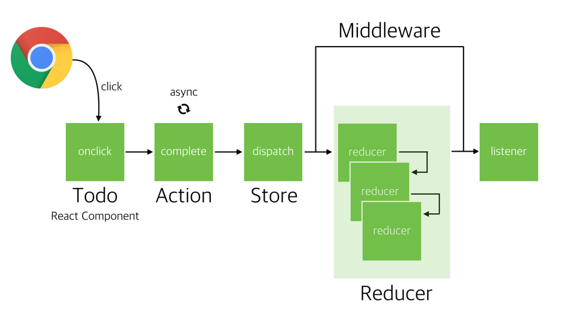
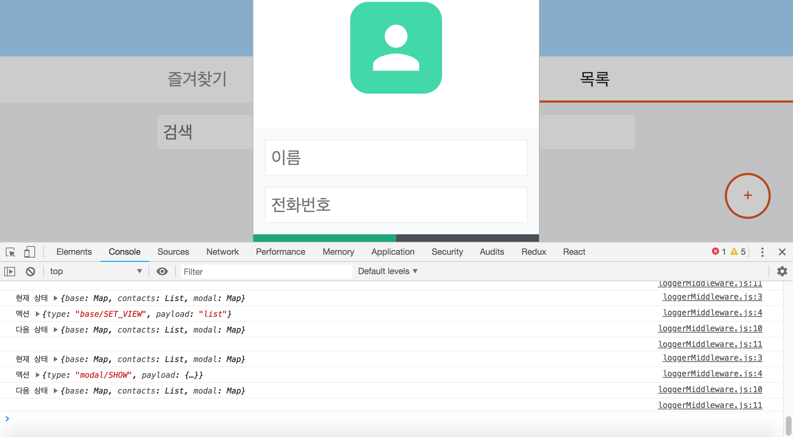
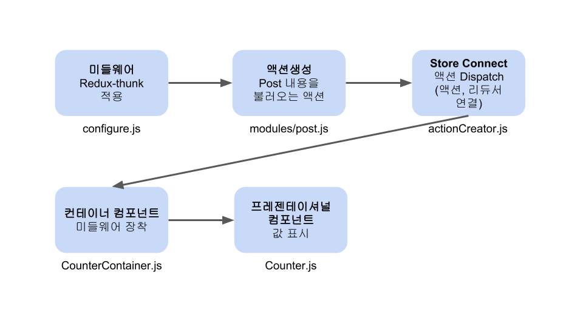
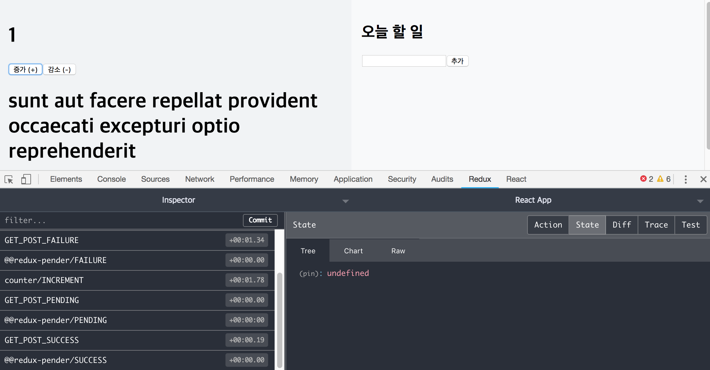

# 리덕스 미들웨어

리덕스 미들웨어는 **리듀서가 액션을 처리하기 전에** 실행되는 작업입니다. 리덕스의 전체 흐름은 다음과 같습니다.



*(참조: https://d2.naver.com/helloworld/1848131)*

액션을 가져와서 리듀서에서 `dispatch()`로 처리하기 전후로 미들웨어를 거칩니다. 미들웨어를 사용하는 용도는 로깅(logging)과 비동기 작업처리 목적이 가장 큽니다. 로깅을 할 수 있다는 것은 에러가 발생했을 때, 어디서 에러가 발생했는지 알 수 있다는 뜻입니다. `buyer-profile_redux` 프로젝트에 미들웨어를 추가해보겠습니다(https://github.com/jsstar522/javascript_basic/tree/master/Reactjs/example/buyer-profile_redux). 


## logger 미들웨어 만들기

로거 미들웨어는 리듀서가 실행될 때마다 액션, 상태 등을 콘솔에 찍어낼 수 있는 미들웨어입니다. 

```javascript
// src/lib/loggerMiddleware.js

const loggerMiddleware = store => next => action => {
  // 현재 상태와 액션
  console.log('현재 상태', store.getState());
  console.log('액션', action);

  // 다음 미들웨어로 넘기기
  const result = next(action);

  // 액션 처리 후의 상태
  console.log('다음 상태', store.getState());
  console.log('\n');

  // next(action)을 반환해야 다음 미들웨어/리듀서가 작업을 이어갈 수 있다.
  return result;
}
export default loogerMiddleware;
```

예를들어 목록추가 버튼(FloatingButton)을 눌렀을 때 이 미들웨어를 거치는 과정을 생각해보죠. 

1. `modal/SHOW 라는 액션객체가 만들어지고 전달`됩니다. 
2. 이 액션은 리듀서에서 처리되기 전에 위와 같은 미들웨어를 거치게 되는데, `store`, `next`, `action`을 인자로 전달받고 있는 미들웨어입니다.
3. `store`에 현재 상태가 들어있습니다. action은 버튼을 눌렀을 때, `modal/SHOW` 액션객체를 만들었습니다. **이 미들웨어에서 이 두 내용을 콘솔에 출력합니다.**
4. next는 다음 미들웨어로 넘기거나 미들웨어가 없다면 다음 리듀서로 넘깁니다.
5. 리듀서로 작업이 처리된 이후에 상태를 출력합니다.
6. 다음 미들웨어/리듀서에서 액션객체를 그대로 사용할 수 있도록 `result`를 반환합니다.

**미들웨어는 스토어에 적용시킵니다.**

```javascript
// index.js

import React from 'react';
import ReactDOM from 'react-dom';
import './index.css';
import App from './App';
import * as serviceWorker from './serviceWorker';

import { createStore, applyMiddleware } from 'redux';
import reducers from './modules';
import { Provider } from 'react-redux';

import loggerMiddleware from './lib/loggerMiddleware';


// 리덕스 스토어
// const store = createStore(reducers, window.__REDUX_DEVTOOLS_EXTENSION__ && window.__REDUX_DEVTOOLS_EXTENSION__());
const store = createStore(reducers, applyMiddleware(loggerMiddleware));

ReactDOM.render(
  <Provider store={store}>
    <App />
  </Provider>,
  document.getElementById('root')
);
```

이제 작업을 할 때마다 콘솔에 액션과 상태가 기록됩니다.




## 미들웨어 라이브러리 사용

`redux-logger`는 로그를 기록해주는 미들웨어 라이브러리입니다. 

```bash
$ yarn add redux-logger
```

```javascript
// index.js

import React from 'react';
import ReactDOM from 'react-dom';
import './index.css';
import App from './App';
import * as serviceWorker from './serviceWorker';

import { createStore, applyMiddleware } from 'redux';
import reducers from './modules';
import { Provider } from 'react-redux';

import { createLogger } from 'redux-logger';

// 리덕스 스토어
// const store = createStore(reducers, window.__REDUX_DEVTOOLS_EXTENSION__ && window.__REDUX_DEVTOOLS_EXTENSION__());
const logger = createLogger();
const store = createStore(reducers, applyMiddleware(logger));

ReactDOM.render(
  <Provider store={store}>
    <App />
  </Provider>,
  document.getElementById('root')
);
```

logger를 사용하는 것은 중요하지만 사실 위 코드에서 주석처리 해놓은 `REDUX DEVTOOLS`가 더 효율적입니다.


## 비동기 작업 처리

미들웨어를 사용하는 또 다른 큰 이유는 비동기 작업을 처리하기 위해서입니다. 비동기 액션을 처리하기 위해서 미들웨어 라이브러리를 사용합니다.

### redux-thunk

이 미들웨어는 액션객체를 생성하지 않고 액션함수를 생성하도록 해줍니다. 액션함수를 생성하면 비동기 처리가 가능합니다. 예를들어 thunk 변수를 선언한다고 가정합시다.

```javascript
const thunk = 1 + 2;
```

이 변수는 선언과 동시에 값이 계산됩니다. 하지만 함수로 만들면 함수를 호출할 때 계산됩니다.

```javascript
const thunk = () => 1 + 2;
```

이렇게 계산을 미루기 위해 함수로 만드는 것을 `thunk`라고 합니다. 먼저 redux-thunk를 설치합니다.

```bash
$ yarn add redux-thunk
```

이제 액션 생성자 함수를 함수자체로 선언해보겠습니다.

```javascript
// modules/modal.js

import { createAction, handleActions } from 'redux-actions';
import { Map } from 'immutable';

// 액션정의
const SHOW = 'modal/SHOW';
const HIDE = 'modal/HIDE';
const CHANGE = 'modal/CHANGE';

// 액션 생성자 함수
export const show = createAction(SHOW);
export const hide = createAction(HIDE);
export const change = createAction(CHANGE);

export const showAsync = () => dispatch => {
  setTimeout(
    () => {dispatch(show(/** 나중에 mode와 contact 속성을 넣어줄 자리 **/))},
    5000
  );
}
//...
```

`showAsync`를 store에 먼저 디스패치(`store.dispatch(showAsync)`)한다면 **1초 뒤에 `show()`를 디스패치하는 비동기 방식입니다.** show 액션은 mode와 contact 속성을 가진 객체를 필요로 하므로 나중에 넣어줘야 합니다.

```javascript
// index.js
//...
import ReduxThunk from 'redux-thunk';
//...
const store = createStore(reducers, applyMiddleware(loggerMiddleware, ReduxThunk));
//...
```

미들웨어를 장착했습니다. 이어서 목록추가버튼을 누르면 5초 뒤에 모달이 보여지도록(`modal/SHOW`) `FloatingButtonContainer.js`에서 액션을 수정합니다.

```javascript
// containers/FloatingButtonContainer.js
//...
class FloatingButtonContainer extends Component {
  handleClick = () => {
    const { ModalActions, BaseActions } = this.props;
    BaseActions.setView('list');
    // showAsync 액션
    ModalActions.showAsync();
  }
//...
```

`show`대신 `showAsync`를 dispatch 했습니다. 이후 show는 속성들과 함께 액션이 전달되므로 `modal.js`에서 show 부분을 다시 바꿔줍니다. 

```javascript
// modules/modal.js

import { createAction, handleActions } from 'redux-actions';
import { Map } from 'immutable';

// 액션정의
const SHOW = 'modal/SHOW';
const HIDE = 'modal/HIDE';
const CHANGE = 'modal/CHANGE';

// 액션 생성자 함수
export const show = createAction(SHOW);
export const hide = createAction(HIDE);
export const change = createAction(CHANGE);

export const showAsync = () => dispatch => {
  setTimeout(
    () => { dispatch(show({
      mode: 'create',
      contact: {
        name: '',
        phone: '',
        // color: generateRandomColor()
      }
    }
    )) },
    5000
  );
}
//...
```

이렇게 하면 먼저 `showAsync가 dispatch`되고, 5초가 지난 뒤 `show가 mode와 contact 속성을 가지고 dispatch` 됩니다. **`추가버튼`을 누르고 다른 작업을 해도 잘 작동하고 5초가 지나면 모달이 뜹니다.**

### 웹요청(HTTP) 처리 

리덕스-리액트 앱에서 HTTP 요청을 할 수 있습니다. https://jsonplaceholder.typicode.com/posts/에 있는 문서의 내용을 리액트 앱에서 숫자를 띄워 해당 postId의 내용을 불러오겠습니다. 숫자를 띄우는 앱, Counter를 불러옵니다(https://github.com/jsstar522/javascript_basic/tree/master/Reactjs/begin-redux).


숫자를 증가시키면 숫자(number)의 state를 받아와서 위 URL에 해당 postid로 요청을 해서 내용을 띄웁니다. **devTools 창을 보면 counter의 number가 바뀌면서 해당 post data를 가져오는 것을 확인할 수 있습니다. 웹요청 처리 과정을 거치다보면 미들웨어가 정확히 어디에 들어가야하는지 감 잡을 수 있습니다.** 

웹요청을 처리하기 위해서 axios 라이브러리를 사용하겠습니다. axios는 HTTP 클라이언트입니다(프로미스 기반).

```bash
$ yarn add axios
```

미들웨어를 붙이기 전에 Redux 구조를 다시 상기시켜볼 겸 흐름을 파악해보겠습니다.



#### 1. 미들웨어 적용

이 프로젝트는 스토어를 `configure.js` 파일을 따로 만들어 선언했습니다. 미들웨어는 스토어를 선언할 때 적용시키면 됩니다.

```javascript
// store/configure.js

import { createStore, applyMiddleware } from 'redux';
import modules from './modules';
import ReduxThunk from 'redux-thunk';

const configure = () => {
  // const store = createStore(modules);
  const devTools = window.__REDUX_DEVTOOLS_EXTENSION__ && window.__REDUX_DEVTOOLS_EXTENSION__()
  const store = createStore(modules, devTools, applyMiddleware(ReduxThunk));

  return store;
}

export default configure;
```

#### 2. 액션생성

해당 URL의 Post 내용을 가져오는 액션을 생성합니다. 이 프로젝트에는 `modules` 폴더에 Ducks구조(액션정의+액션 생성자+ 리듀서)의 파일들을 넣어두었으므로 `modules` 폴더에 새로운 파일을 생성합니다.

```javascript
// store/modules/post.js

import { handleActions } from 'redux-actions';

import axios from 'axios';

function getPostAPI(postId) {
    return axios.get(`https://jsonplaceholder.typicode.com/posts/${postId}`)
}

const GET_POST_PENDING = 'GET_POST_PENDING';
const GET_POST_SUCCESS = 'GET_POST_SUCCESS';
const GET_POST_FAILURE = 'GET_POST_FAILURE';

export const getPost = (postId) => dispatch => {
    // 먼저, 요청이 시작했다는것을 알립니다
    dispatch({type: GET_POST_PENDING});

    // 요청을 시작합니다
    // 여기서 만든 promise 를 return 해줘야, 나중에 컴포넌트에서 호출 할 때 getPost().then(...) 을 할 수 있습니다
    return getPostAPI(postId).then(
        (response) => {
            // 요청이 성공했을경우, 서버 응답내용을 payload 로 설정하여 GET_POST_SUCCESS 액션을 디스패치합니다.
            dispatch({
                type: GET_POST_SUCCESS,
                payload: response
            })
        }
    ).catch(error => {
        // 에러가 발생했을 경우, 에로 내용을 payload 로 설정하여 GET_POST_FAILURE 액션을 디스패치합니다.
        dispatch({
            type: GET_POST_FAILURE,
            payload: error
        });
    })

}

const initialState = {
    pending: false,
    error: false,
    data: {
        title: '',
        body: ''
    }
}

export default handleActions({
    [GET_POST_PENDING]: (state, action) => {
        return {
            ...state,
            pending: true,
            error: false
        };
    },
    [GET_POST_SUCCESS]: (state, action) => {
        const { title, body } = action.payload.data;

        return {
            ...state,
            pending: false,
            data: {
                title, body
            }
        };
    },
    [GET_POST_FAILURE]: (state, action) => {
        return {
            ...state,
            pending: false,
            error: true
        }
    }
}, initialState);
```

리듀서를 Combine 해줍니다.

```javascript
// store/modules/index.js

import { combineReducers } from 'redux';
import counter from './counter';
import todo from './todo';
import post from './post';

export default combineReducers({
  counter,
  todo,
  post
})
```

여기서 export되는 것은 `getPost` 함수입니다. `getPost` 함수를 실행하면 `data`, `pending`, `error`의 state가 변하게 됩니다. 즉, 외부에서 getPost 함수를 불러와 실행하면 되죠. **이 함수는 프레젠테이셔널 컴포넌트에게 변경된 state를 props로 전달해주는 컨테이너 컴포넌트에서 사용되어야 합니다.** 그 전에 액션을 바인딩 해줘야겠죠?

#### 3. Dispatch

보통은 컨테이너 컴포넌트에서 `export default connect`를 통해 state를 받아오고 액션 dispatch를 한번에 하지만 이 프로젝트는 dispatch를 하는 곳이 따로 있습니다. `actionCreator.js`파일을 수정합니다. 

```javascript
// store/actionCreator.js

import { bindActionCreators } from 'redux';
import * as counterActions from './modules/counter';
import * as todoActions from './modules/todo';
import * as postActions from './modules/post';

import store from './index';

const { dispatch } = store;

export const CounterActions = bindActionCreators(counterActions, dispatch);
export const TodoActions = bindActionCreators(todoActions, dispatch);
export const PostActions = bindActionCreators(postActions, dispatch);
```

#### 4. 컨테이너 컴포넌트

이제 스토어를 사용할 준비가 완료되었습니다. 미들웨어는 액션이 생성되고 state가 계산되어 넘어가는 사이에 장착되어야 합니다. **바로 이곳에 미들웨어를 장착시킵니다.** `number`라는 props를 받아오고 이 props를 통해 HTTP 요청을 보내므로 이곳에 미들웨어를 장착하는 것입니다.

*(Post만 보여주는 컨테이너를 따로 만들어서 보여줘도 되지만 여기서는 Counter 컴포넌트 아래에 `<div>`태그로 가볍게 보여줄 예정입니다.)*

```javascript
// containers/CounterContainer.js

import React, { Component } from 'react';
import Counter from 'components/Counter';
import { connect } from 'react-redux';
import { CounterActions } from 'store/actionCreators';
import { PostActions } from 'store/actionCreators';

class CounterContainer extends Component {
  // 증가/감소 메서드
  handleIncrement = () => {
    CounterActions.increment();
  }
  handleDecrement = () => {
    CounterActions.decrement();
  }

  componentDidMount() {
    // 컴포넌트가 처음 마운트 될 때 현재 number 를 postId 로 사용하여 포스트 내용을 불러옵니다.
    const { number } = this.props;
    // const { number, PostActions } = this.props;
    PostActions.getPost(number);
  }

  componentWillReceiveProps(nextProps) {
    // const { PostActions } = this.props;

    // 현재 number 와 새로 받을 number 가 다를 경우에 요청을 시도합니다.
    if (this.props.number !== nextProps.number) {
      PostActions.getPost(nextProps.number)
    }
  }

  render() {
    const { handleIncrement, handleDecrement, handlePost } = this;
    const { number, post, error, loading } = this.props;

    return (
      <Counter
        onIncrement={handleIncrement}
        onDecrement={handleDecrement}
        number={number}
        post={post}
        error={error}
        loading={loading}
      />
    );
  }
}

export default connect(
  (state) => ({
    number: state.counter.number,
    post: state.post.data,
    loading: state.post.pending,
    error: state.post.error
  })
)(CounterContainer)
```

**`number`를 props로 받아오고 이 number는 미들웨어를 통과해 `post`, `error`, `loading` state를 변화시킵니다.** 그리고 프레젠테이셔널 컴포넌트인 `Count` 컴포넌트로 이 모든 값을 props로 보내줍니다.

#### 5. 프레젠테이셔널 컴포넌트

이제 값들을 props로 이어받아 띄워주기만 하면 됩니다.

```javascript
// components/Counter.js

import React, { Component } from 'react';

class Counter extends Component {
  render() {
    const { number, onIncrement, onDecrement, post, error, loading } = this.props;

    return (
      <div>
        <h1>{number}</h1>
        <button onClick={onIncrement}>증가 (+)</button>
        <button onClick={onDecrement}>감소 (-)</button>
        { loading && <h2>로딩중...</h2> }
        { error
          ? <h1>에러발생!</h1>
          : (
            <div>
              <h1>{post.title}</h1>
              <p>{post.title}</p>
            </div>
          ) }
      </div>
    );
  };
}

Counter.defaultProps = {
  number: 0
}

export default Counter;
```


### Redux-promise-middleware

앞에서 웹요청을 처리하는 리듀서를 직접 만들어서 사용했지만 이를 편하게 해주는 라이브러리가 있습니다. `redux-promise-middleware` 라이브러리를 사용하면 값이 전달되면 액션이름 마지막에 시작(`_PENDING`), 성공(`FULFILLED`), 실패(`_REJECTED`)를 함께 반환합니다. 다음과 같이 라이브러리를 설치합니다. 

```bash
$ yarn add redux-promise-middleware
```

위에서 설명한 것처럼 액션은은 `..._PENDING`, `..._FULFILLED`, `..._REJECTED`로 전달됩니다. 그래서 액션이름을 모두 바꿔주고 다음과 같이 편리하게 사용할 수 있습니다. 

*(액션 이름을 커스터마이징 하는 방법이 있으나 지속된 오류를 해결하지 못했음)*

```javascript
import { createStore, applyMiddleware } from 'redux';
import modules from './modules';
import ReduxThunk from 'redux-thunk';
import promiseMiddleware from 'redux-promise-middleware';

const configure = () => {
  const devTools = window.__REDUX_DEVTOOLS_EXTENSION__ && window.__REDUX_DEVTOOLS_EXTENSION__();

  const store = createStore(modules, devTools, applyMiddleware(ReduxThunk, promiseMiddleware()));

  return store;
}

export default configure;
```

이제 액션을 새롭게 정의합니다.

```javascript
// modules/post.js

import { handleActions } from 'redux-actions';

import axios from 'axios';

function getPostAPI(postId) {
    return axios.get(`https://jsonplaceholder.typicode.com/posts/${postId}`)
}

const GET_POST = 'GET_POST'
// redux-promise-middleware 사용시 액션 이름
const GET_POST_PENDING = 'GET_POST_PENDING';
const GET_POST_FULFILLED = 'GET_POST_FULFILLED';
const GET_POST_REJECTED = 'GET_POST_REJECTED';

// // redux-promise-middleware 사용
export const getPost = (postId) => ({
    type: GET_POST,
    payload: getPostAPI(postId)
})

const initialState = {
    pending: false,
    error: false,
    data: {
        title: '',
        body: ''
    }
}

export default handleActions({
    [GET_POST_PENDING]: (state, action) => {
        return {
            ...state,
            pending: true,
            error: false
        };
    },
    // 최초 설정 GET_POST_SUCESS
    // redux-promise-middleware 사용시 GET_POST_FULFILLED
    [GET_POST_FULFILLED]: (state, action) => {
        const { title, body } = action.payload.data;

        return {
            ...state,
            pending: false,
            data: {
                title, body
            }
        };
    },
    // 최초 설정 GET_POST_FAILURE
    // redux-promise-middleware 사용시 GET_POST_REJECTED
    [GET_POST_REJECTED]: (state, action) => {
        return {
            ...state,
            pending: false,
            error: true
        }
    }
}, initialState);
```

`getPost` 부분이 상당히 깔끔해졌습니다. **이는 `GET_POST`만 액션으로 불러오면 나머지(로딩, 성공, 실패)는 액션이름을 자동으로 붙여서 라이브러리에서 처리해주기 때문입니다.**

### Redux-pender

`redux-pender`도 프로미스 기반 액션을 관리하기 편하도록 만든 라이브러리입니다. **위에서 액션을 불러오는 것만 간편화 했다면 `redux-pender`는 리듀서 부분도 간편화 수 있습니다.** 

```bash
$ yarn add redux-pender
```

이제 라이브러리를 적용해보겠습니다. 먼저 스토어에 미들웨어를 적용합니다.

```javascript
// store/configure.js
//...
import penderMiddleware from 'redux-pender';
//...
const store = createStore(modules, applyMiddleware(logger, ReduxThunk, penderMiddleware()));
//...
```

이어서 가볍게 리듀서를 combine하는 부분에 미들웨어를 장착하면 됩니다.

```javascript
// store/modules/index.js

import { combineReducers } from 'redux';
import counter from './counter';
import todo from './todo';
import post from './post';
import { penderReducer } from 'redux-pender';

export default combineReducers({
  counter,
  todo,
  post,
  pender: penderReducer
})
```

액션과 리듀서를 새롭게 정의합니다.

```javascript
// store/modules/post.js

import { createAction, handleActions } from 'redux-actions';

import axios from 'axios';
import { pender } from 'redux-pender/lib/utils';

function getPostAPI(postId) {
    return axios.get(`https://jsonplaceholder.typicode.com/posts/${postId}`)
}

const GET_POST = 'GET_POST'

// redux-pender 사용
// createAction을 이용해서 액션 생성자 함수 정의, 두번째 인자는 프로미스를 반환하는 함수여야 한다.
export const getPost = createAction(GET_POST, getPostAPI);

const initialState = {
    data: {
        title: '',
        body: ''
    }
}

export default handleActions({
    ...pender({
        type: GET_POST,
        onSuccess: (state, action) => {
            const { title, body } = action.payload.data;
            return {
                data: {
                    title,
                    body
                }
            }
        }
        // 실패 요청에 대해서 수행할 작업이 있다면 onPending, onFailure
    })
}, initialState);
```

예시에서는 성공 case만 리듀서를 작성했습니다. 로딩, 실패도 리듀서를 각각 `onPending`, `onFailure`로 달아줄 수 있습니다. 여기까지만 하면 `로딩중`과 `에러발생` 문구가 뜨지 않습니다.

마지막으로 connect하는 부분을 바꿔줍니다. 이 프로젝트는 컨테이너 컴포넌트에서 state를 connect하므로 `CounterContainer.js`파일을 수정하면 됩니다.

```javascript
// containers/CounterContainer.js
//...
export default connect(
  (state) => ({
    number: state.counter.number,
    post: state.post.data,
    loading: state.pender.pending['GET_POST'],
    error: state.pender.failure['GET_POST'],
  })
)(CounterContainer)
```

`pender`는 다음과 같이 접미사를 붙여 액션을 생성합니다.

